# CI_CD

- [CI\_CD](#ci_cd)
  - [配置流程](#配置流程)
    - [1. 安装 runner，并注册到 gitlab 实例](#1-安装-runner并注册到-gitlab-实例)
      - [Windows](#windows)
    - [2. 创建 `.gitlab-ci.yml` 文件](#2-创建-gitlab-ciyml-文件)
    - [3. 测试并查看 pipeline](#3-测试并查看-pipeline)
  - [Runner](#runner)
    - [配置多个 Runner](#配置多个-runner)
    - [Command](#command)
    - [配置](#配置)
    - [工作目录](#工作目录)
  - [CI\_PROJECT\_DIR](#ci_project_dir)
  - [搭配 jekins 使用](#搭配-jekins-使用)

## 配置流程

### 1. 安装 runner，并注册到 gitlab 实例

#### Windows

1. 下载 `GitLab Runner` 安装程序：访问 [windows install 页面](https://docs.gitlab.com/runner/install/windows/) 并下载 `64 bit` 安装程序。
2. 安装 `GitLab Runner`
   1. 双击安装。会自动安装到 `C:\GitLab-Runner` 目录下。会自动启动 `GitLab Runner` 服务。
   2. 命令行安装
      1. 将下载下来的 exe 文件重名为 `gitlab-runner.exe` 并放到某个目录下(例如：`C:\GitLab-Runner`)。
      2. 打开命令提示符（以管理员身份运行）。导航到安装程序所在的目录。
      3. 运行以下命令进行安装并启动服务：

         ```cmd
         .\gitlab-runner.exe install
         .\gitlab-runner.exe start
         ```

   3. 修改 `config.toml` 文件
      - `shell` 默认为填成 `pwsh`，需要改成 `powershell`

        ```toml
        concurrent = 1
        check_interval = 0
        connection_max_age = "15m0s"
        shutdown_timeout = 0
        
        [session_server]
          session_timeout = 1800
        
        [[runners]]
          name = "test"
          url = "https://gitlab.com"
          id = 10279
          token = "glrt-Ez_Uc_JcXZh6MYDuu"
          token_obtained_at = 2026-02-06T02:59:55Z
          token_expires_at = 0001-01-01T00:00:00Z
          executor = "shell"
          <!-- 这里修改成 powershell -->
          shell = "powershell"
          [runners.cache]
            MaxUploadedArchiveSize = 0
            [runners.cache.s3]
            [runners.cache.gcs]
            [runners.cache.azure]
        ```

   - 安装后的文件夹：
    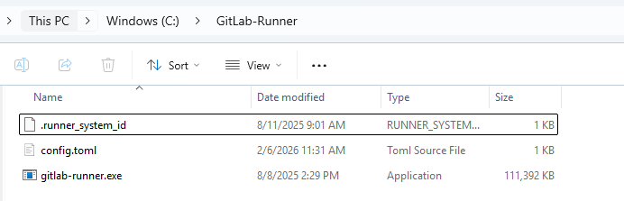

3. `gitlab` 项目创建 `runner`
   1. 导航到项目的主页面
   2. 点击左侧边栏中的 `Settings` 菜单，然后选择 `CI / CD`。点击 `Runners` 部分
      - `Project runners`：配置给当前 Project 的 runner。也可以看到其他 Project 配置的 runner，可以使用这些 runner。
      - `Group runners`：配置给当前 Group 的 runner
        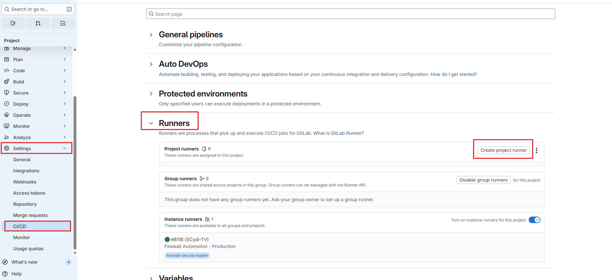
   3. 点击 `Create project runner` 按钮创建 runner
      - `tags`: runner 的标签，可以在 `.gitlab-ci.yml` 文件中指定使用哪个 runner 进行构建。
      - `Run untagged jobs`: 是否允许未标记的 job 使用该 runner 进行构建。
      - `description`: runner 的描述信息，方便识别不同的 runner。
      - `Lock to current project`: 是否将该 runner 锁定到当前项目，防止其他项目使用该 runner。
      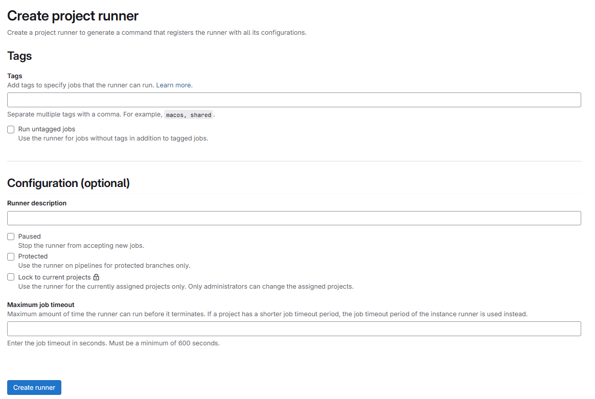
4. 创建好后选择 Platform 为 `windows`，并复制 `Step1` 中的注册命令
    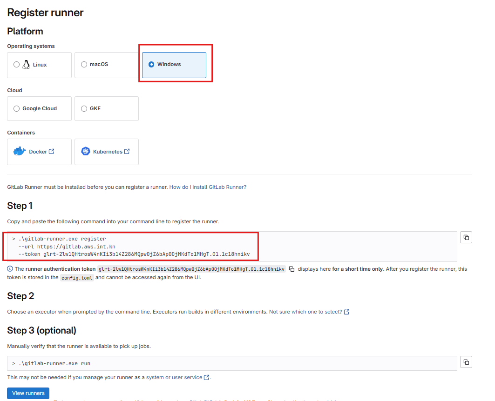
5. 在本地 runner 安装目录（`C:\GitLab-Runner`）打开命令行，运行复制的命令
   1. 输入 GitLab instance URL。这里输入你的 gitlab 实例地址，例如 `http://gitlab.example.com/`
   2. 输入 runner 的名字
   3. 输入 executor，选择 `shell`
   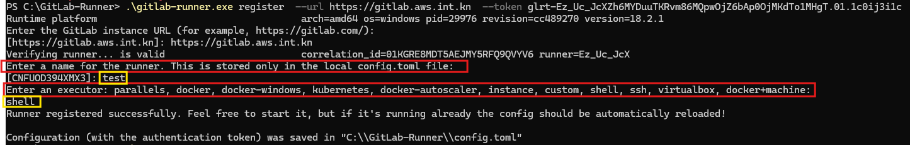
6. 注册成功后，可以在 `gitlab` 界面看到注册的 runner
    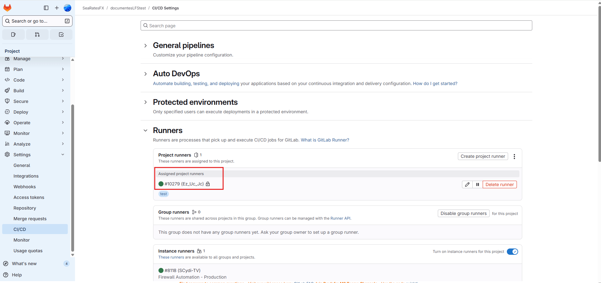

### 2. 创建 `.gitlab-ci.yml` 文件

两种方式：

1. 在项目根目录创建 `.gitlab-ci.yml` 文件
   1. 注意文件名必须是 `.gitlab-ci.yml` 。`gitlab-ci.yml` 或其他名称均无效。
   2. `push` 完代码后， `gitlab` 会自动识别到 `.gitlab-ci.yml` 文件，并根据文件内容执行 `pipeline`。
2. 或者在 `gitlab` 界面中创建 `.gitlab-ci.yml` 文件
   1. 导航到项目的主页面。
   2. 点击左侧边栏中的 `Build` 菜单中的的 `Pipeline editor`。
   3. 点击 `Configure pipeline` 按钮。
   4. 在编辑器中编写 `.gitlab-ci.yml` 文件内容。
   5. 点击 `Commit changes` 按钮保存文件，会直接在仓库创建 `commit` 。

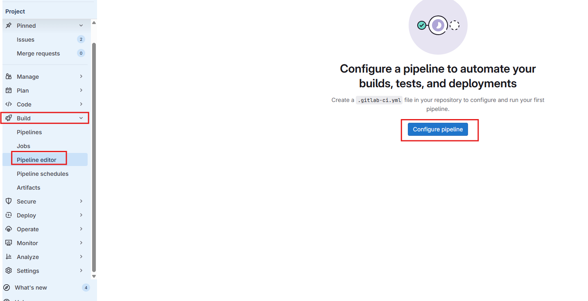
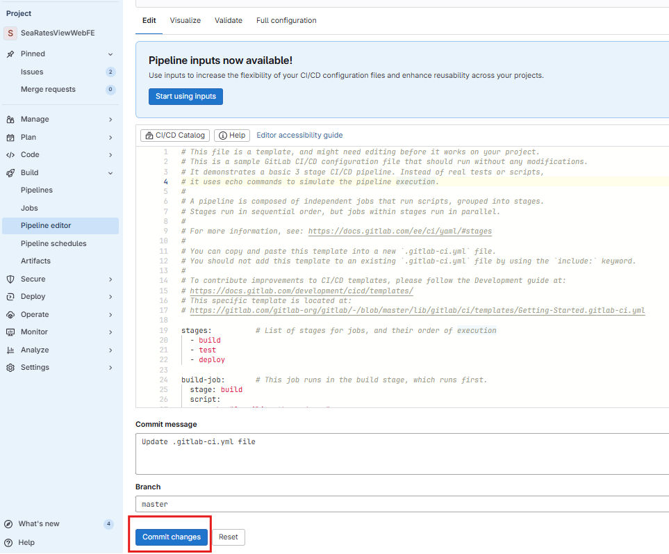

文件例子：

```yml
job_build:
  stage: build
  tags: 
    - test
  script:
    - echo "Building the project..."

job_test:
  stage: test
  tags: 
    - test
  script:
    - echo "Running tests..."

job_test1:
  stage: test
  script:
    - echo "Running tests1..."
```

tags:

- 用于指定使用哪个 runner 进行构建。需要和注册 runner 时设置的 tags 一致。
- 如果不指定 tags，则会使用没有配置 `Lock to current project` 选项的 runner 进行构建。

### 3. 测试并查看 pipeline

做完上面的两个步骤就可以测试了：

1. 提交代码到 gitlab 仓库。
2. 导航到项目的主页面，点击左侧边栏中的 `Build` 菜单，然后选择 `Pipelines`。
3. 可以看到刚刚触发的 pipeline。点击 pipeline 的 ID 查看详细信息。
   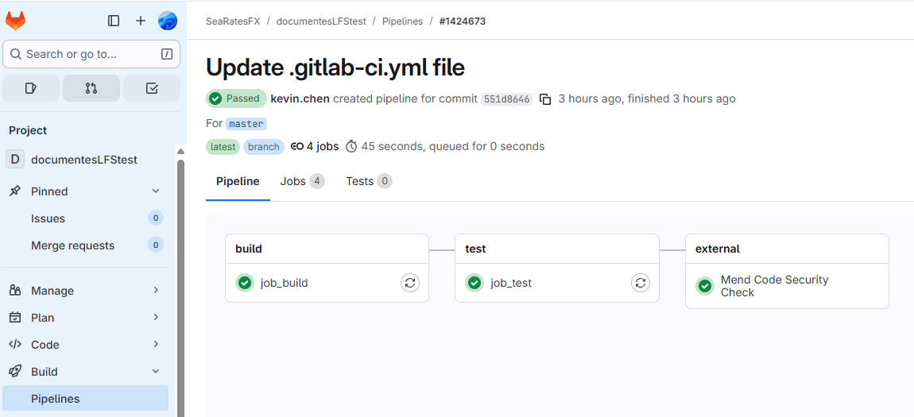
4. 点击某个 job 可以查看该 job 的执行日志。
   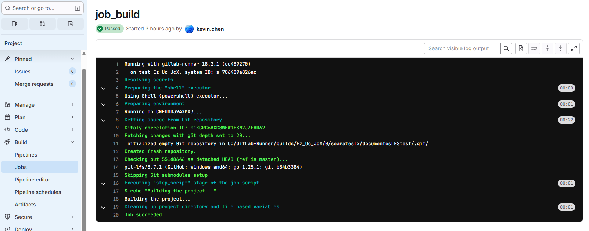

## Runner

### 配置多个 Runner

可以在本地创建多个 runner 来处理不同的任务。重复上面的注册步骤就能在本地创建多个 runner。 `name` 需要不一样。

`config.toml` 文件会自动更新，会给新增的 runner 添加一个新的 `[[runners]]`。下面新增了一个 `test1` 的 `runner`：

```toml
concurrent = 1
check_interval = 0
connection_max_age = "15m0s"
shutdown_timeout = 0

[session_server]
  session_timeout = 1800

[[runners]]
  name = "test"
  url = "https://gitlab.com"
  id = 10279
  token = "glrt-Ez_Uc_JcXZh6MY"
  token_obtained_at = 2026-02-06T02:59:55Z
  token_expires_at = 0001-01-01T00:00:00Z
  executor = "shell"
  shell = "powershell"
  [runners.cache]
    MaxUploadedArchiveSize = 0
    [runners.cache.s3]
    [runners.cache.gcs]
    [runners.cache.azure]

[[runners]]
  name = "test1"
  url = "https://gitlab.com"
  id = 10299
  token = "glrt-Idl-kt5Umjg"
  token_obtained_at = 2026-02-06T08:52:26Z
  token_expires_at = 0001-01-01T00:00:00Z
  executor = "shell"
  shell = "powershell"
  [runners.cache]
    MaxUploadedArchiveSize = 0
    [runners.cache.s3]
    [runners.cache.gcs]
    [runners.cache.azure]
```

### Command

要用管理员身份打开 CMD，然后导航到 `C:\GitLab-Runner` 目录，运行以下命令来管理 runner：

```cmd
<!-- 停止服务 -->
.\gitlab-runner.exe stop

<!-- 启动服务 -->
.\gitlab-runner.exe start

<!-- 重启服务 -->
.\gitlab-runner.exe restart

<!-- 验证服务 -->
.\gitlab-runner.exe verify

<!-- 查看所有 Runner -->
.\gitlab-runner.exe list

<!-- 删除无效 Runner -->
<!-- 如果 Gitlab 已经删除了 runner，这个命令会运行错误，直接删除 config.toml 里面的 runner 配置就好 -->
.\gitlab-runner.exe unregister --name "runner-name"
```

### 配置

buidls_dir: 用于指定构建目录的位置。默认情况下，GitLab Runner 会在其安装目录下创建一个名为 `builds` 的文件夹来存储构建文件。如果你希望将构建文件存储在其他位置，可以通过修改 `config.toml` 文件中的 `builds_dir` 参数来实现。例如：

```toml
[[runners]]
  name = "test"
  url = "https://gitlab.com"
  id = 10279
  token = "glrt-Ez_Uc_JcXZh6MY"
  token_obtained_at = 2026-02-06T02:59:55Z
  token_expires_at = 0001-01-01T00:00:00Z
  executor = "shell"
  shell = "powershell"
  builds_dir = "C:\\GitLab-Runner\\builds"
```

### 工作目录

默认情况下：

1. **项目根目录**：Runner 会自动克隆代码到构建目录，然后进入该项目目录
2. **目录结构**：通常是 `C:\GitLab-Runner\builds\<runner-token>\<project-name>`

## CI_PROJECT_DIR

在 GitLab CI/CD 中，`CI_PROJECT_DIR` 是一个预定义的环境变量，它表示当前项目的完整路径。这个路径因不同的运行器环境和操作系统而有所差异。

`powershell` 里使用 `$env:CI_PROJECT_DIR` 来访问这个环境变量，而在 `cmd` 里使用 `%CI_PROJECT_DIR%`。

`powershell` 里访问 `CI_PROJECT_DIR`：

```yml
job:
  script:
    - echo $env:CI_PROJECT_DIR  # PowerShell 语法
    - cd $env:CI_PROJECT_DIR
    - Get-ChildItem $env:CI_PROJECT_DIR
```

`cmd` 里访问 `CI_PROJECT_DIR`：

```yml
job:
  script:
    - echo %CI_PROJECT_DIR%  # CMD/Batch 语法
    - cd %CI_PROJECT_DIR%
    - dir %CI_PROJECT_DIR%
```

## 搭配 jekins 使用

简单来说，流程是这样的：当代码推送到 GitLab 后，GitLab 会主动通知 Jenkins，Jenkins 随后拉取代码并执行你定义好的构建、测试、部署等任务。

下图清晰地展示了从代码提交到自动化部署的完整过程：

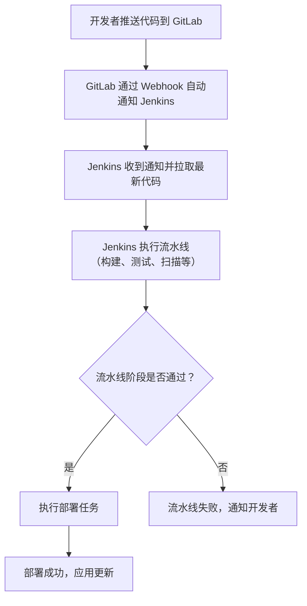

要将两者结合，你需要完成以下几个核心配置步骤：

1. **环境与权限准备**
    - 确保 Jenkins 服务器能够访问 GitLab 仓库（通常需要网络互通）。
    - 在 GitLab 中创建一个**访问令牌（Access Token）**，并授予 `api` 等权限，以便 Jenkins 能读取仓库信息。

2. **安装 Jenkins 插件**
    - 在 Jenkins 的插件管理中，安装 **GitLab** 和 **Git** 插件。这是实现集成的关键。

3. **在 Jenkins 中配置 GitLab 连接**
    - 在 Jenkins 的系统设置中，添加 GitLab 服务器地址和上一步创建的访问令牌。

4. **创建 Jenkins 任务并关联 GitLab**
    - 新建一个流水线任务，在“源码管理”部分配置 GitLab 仓库的地址和凭证。
    - 在“构建触发器”中，勾选类似 **“Build when a change is pushed to GitLab”** 的选项，并记下系统提供的 Webhook URL。

5. **在 GitLab 中配置 Webhook**
    - 进入你的 GitLab 项目，依次点击 **设置（Settings） -> 集成（Integrations）**。
    - 将上一步获得的 Jenkins Webhook URL 填入，并选择触发事件（如代码推送、合并请求等）。
    - 保存后，可点击“测试”来验证连接是否成功。

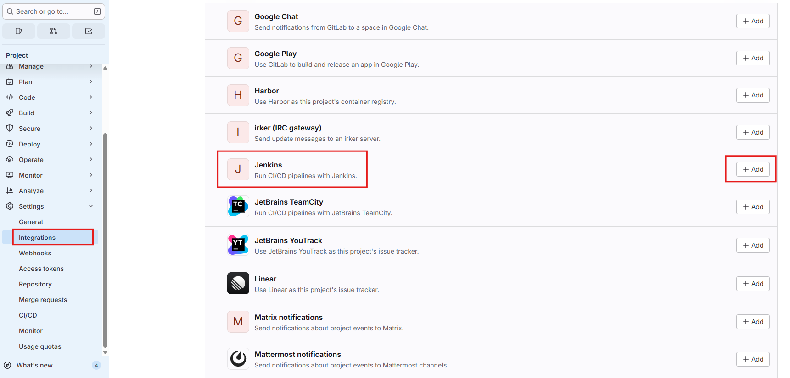
