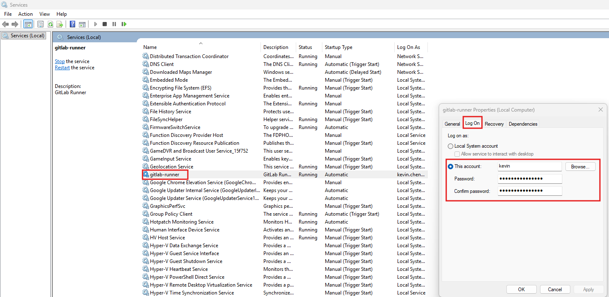
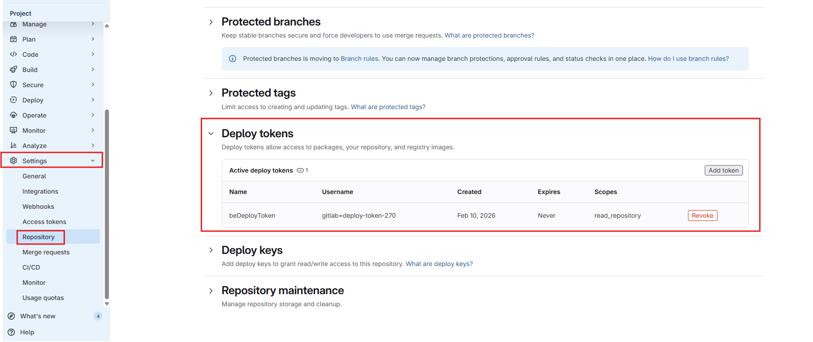
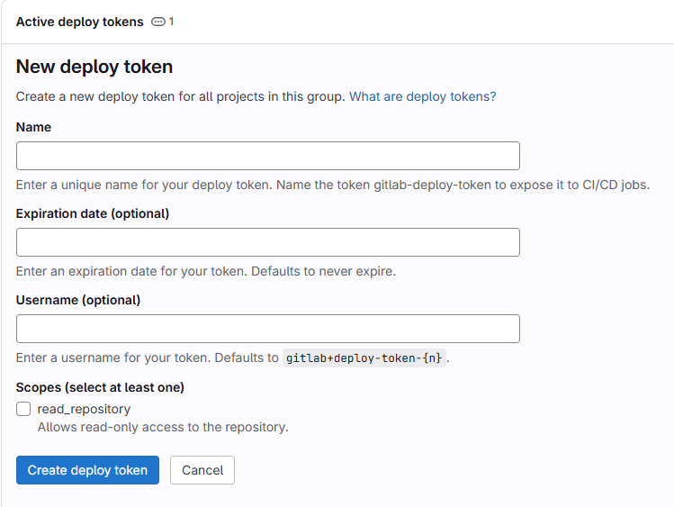

# Django

- [Django](#django)
  - [更新](#更新)
    - [更新 git 文件](#更新-git-文件)
      - [1. 设置 Runner 服务的账号为 git 账号](#1-设置-runner-服务的账号为-git-账号)
      - [2. git 命令添加安全目录](#2-git-命令添加安全目录)
      - [3. 使用 PAT 执行 git 操作](#3-使用-pat-执行-git-操作)
    - [更新 conda 环境](#更新-conda-环境)
  - [构建（收集 static 文件）](#构建收集-static-文件)
  - [部署（重启 apache）](#部署重启-apache)
  - [完整 yml 文件](#完整-yml-文件)

分为三个阶段： 更新、构建、部署

因为每个 job 都要在项目文件夹下执行命令，所以在 `before_script` 里设置好项目目录，并且切换到项目目录。

```yml
variables:
  PROJECT_DIR: "C:\\Projects\\django-project"

default:
  tags:
    - windows
  before_script:
    - 'if (-Not (Test-Path "$env:PROJECT_DIR")) { throw "PROJECT_DIR not found: $env:PROJECT_DIR" }'
    - 'Set-Location "$env:PROJECT_DIR"'
```

## 更新

### 更新 git 文件

因为 Runner 的账号为 SYSTEM 账号，与 git 账号不一样，所以执行 git 命令时都会报 `fatal: detected dubious ownership in repository` 错误，错误信息如下：

```log
$ git pull
fatal: detected dubious ownership in repository at 'C:\\Projects\\django-project' is owned by:
	SomeDomain/userName (S-1-5-21)
but the current user is:
	NT AUTHORITY/SYSTEM (S-1-5-18)
To add an exception for this directory, call:
	git config --global --add safe.directory 'C:/Projects/django-project'
```

**解决方法**：

1. 设置 Runner 服务的账号为 git 账号
2. 在 yml 文件里执行 `git config --global --add safe.directory 'C:/Projects/django-project'` 命令，添加安全目录。
3. 使用 PAT 执行 git 操作

#### 1. 设置 Runner 服务的账号为 git 账号

1. 打开 `services.msc`，找到 `GitLab Runner` 服务，右键选择 `属性`。
2. 切换到 `Log On` 标签页，选择 `This account`，输入 git 账号的用户名和密码，点击 `OK`。



yml 文件直接调用 `git pull`：

```yml
update_git:
  stage: update
  script:
    - git pull
```

> 以窗口模式运行 `Runner` 服务，执行 `git` 操作时会用本机的账号，所以不会报 `fatal: detected dubious ownership in repository` 错误。`script` 也是可以直接调用 `git pull`。

#### 2. git 命令添加安全目录

runner 全局添加安全目录：

```yml
update_git:
  stage: update
  script:
    - git config --global --add safe.directory 'C:/Projects/django-project'
```

或者只在 git 命令里添加安全目录：

```yml
update_git:
  stage: update
  script:
    - 'git -c safe.directory="$env:PROJECT_DIR" pull'
```

虽然添加安全目录可以解决问题。但是 `git pull` 时还是会报错，因为没有给 `SYSTEM` 账号配置私钥。错误信息：

```log
$ git -c safe.directory="$env:PROJECT_DIR" pull
Host key verification failed.
fatal: Could not read from remote repository.
Please make sure you have the correct access rights
and the repository exists.
Cleaning up project directory and file based variables
00:00
ERROR: Job failed: exit status 1
```

**解决方法**：

1. 在 GitLab 上创建一个 Deploy Token，给这个 Deploy Token 赋予 `read_repository` 权限
   1. 主界面：
    
   2. 创建 Deploy Token：
    
    `Name` 可以随便取。`Scopes` 勾选 `read_repository` 权限。创建后会显示这个 `Deploy Token` 的用户名和密码，记下来。

2. 然后在 yml 文件里设置 `GIT_HTTP_USER` 变量（`Deploy Token` 的 `Username`），使用 `HTTPS` 和 `Deploy Token` 来执行 `git pull`。

```yml
variables:
  GIT_HTTP_USER: "gitlab+deploy-token-270"

update_git:
  stage: update
  script:
    - 'git -c safe.directory="$env:PROJECT_DIR" remote set-url origin https://$env:GIT_HTTP_USER:$env:beDeployToken@gitlab.aws.int.kn/kevin.chen/searatesviewwebbetest.git'
    - 'git -c safe.directory="$env:PROJECT_DIR" pull'
```

#### 3. 使用 PAT 执行 git 操作

做法：

1. 在 GitLab 项目的 `Settings > CI/CD > Variables` 新增一个变量，
   1. 变量名可为 `GITLAB_PAT`，变量值为 PAT（PAT 至少要有 `read_repository` 权限）
   2. Visibility 选择 `Masked and hidden`，保护变量
2. 在 `job` 里通过环境变量使用它，不要把 `token` 写死在 `.gitlab-ci.yml`

```yml
update_git:
  stage: update
  script:
    - '$pair = "oauth2:$env:GITLAB_PAT"'
    - '$basicAuth = [Convert]::ToBase64String([Text.Encoding]::ASCII.GetBytes($pair))'
    - 'git -c safe.directory="$env:PROJECT_DIR" -c http.extraHeader="Authorization: Basic $basicAuth" pull origin $env:CI_COMMIT_REF_NAME'
```

说明：

- `oauth2` 是 GitLab 用 PAT 做 HTTPS 认证时常用的用户名
  - 不需要改成拥有 PAT 的账户的用户名，没有关系
- `$env:GITLAB_PAT` 是你在 GitLab CI/CD Variables 里配置的 PAT
- `http.extraHeader` 只对这一次命令生效，不会把 token 写入本地 git 配置
- `$env:CI_COMMIT_REF_NAME` 会拉当前 pipeline 对应的分支

### 更新 conda 环境

思路：

1. 当 `environment.yml` 才更新 `conda` 环境
2. `activate` `conda` 环境
3. 根据 `environment.yml` 更新 `conda` 环境

```yml
variables:
  CONDA_ACTIVATE: "C:\\Users\\CurrentUser\\AppData\\Local\\miniforge3\\Scripts\\activate.bat"

update_conda_env:
  stage: update
  rules:
    - changes:
        - environment.yml
  script:
    - 'cmd /c "call ""%CONDA_ACTIVATE%"" && conda activate %CONDA_ENV% && conda env update -f environment.yml --prune"'
```

## 构建（收集 static 文件）

思路：

1. 依赖更新 `git` 和 `conda` 环境的 `job`
2. `activate` `conda` 环境
3. 执行 `python manage.py collectstatic --noinput` 命令收集 `static` 文件

```yml
variables:
  CONDA_ACTIVATE: "C:\\Users\\CurrentUser\\AppData\\Local\\miniforge3\\Scripts\\activate.bat"
  CONDA_ENV: "CondaEnvName"

collect_static:
  stage: build
  needs:
    - job: update_git
    - job: update_conda_env
      optional: true
  script:
    - 'cmd /c "call ""%CONDA_ACTIVATE%"" && conda activate %CONDA_ENV% && python manage.py collectstatic --noinput"'
```

## 部署（重启 apache）

思路：

1. 依赖收集 `static` 文件的 `job`
2. 执行重启 `apache` 的命令：`httpd.exe -k restart`

```yml
APACHE_HTTPD: "C:\\Apache24\\bin\\httpd.exe"

restart_apache:
  stage: deploy
  needs:
    - collect_static
  script:
    - 'cmd /c """%APACHE_HTTPD%"" -k restart"'
```

## 完整 yml 文件

```yml
stages:
  - update
  - build
  - deploy

variables:
  PROJECT_DIR: "C:\\Projects\\django-project"
  CONDA_ACTIVATE: "C:\\Users\\CurrentUser\\AppData\\Local\\miniforge3\\Scripts\\activate.bat"
  CONDA_ENV: "CondaEnvName"
  APACHE_HTTPD: "C:\\Apache24\\bin\\httpd.exe"

default:
  tags:
    - windows
  before_script:
    - 'if (-Not (Test-Path "$env:PROJECT_DIR")) { throw "PROJECT_DIR not found: $env:PROJECT_DIR" }'
    - 'Set-Location "$env:PROJECT_DIR"'

# update_git:
#   stage: update
#   script:
#     - git pull

update_git:
  stage: update
  script:
    - '$pair = "oauth2:$env:GITLAB_PAT"'
    - '$basicAuth = [Convert]::ToBase64String([Text.Encoding]::ASCII.GetBytes($pair))'
    - 'git -c safe.directory="$env:PROJECT_DIR" -c http.extraHeader="Authorization: Basic $basicAuth" pull origin $env:CI_COMMIT_REF_NAME'

update_conda_env:
  stage: update
  rules:
    - changes:
        - environment.yml
  script:
    - 'cmd /c "call ""%CONDA_ACTIVATE%"" && conda activate %CONDA_ENV% && conda env update -f environment.yml --prune"'

collect_static:
  stage: build
  needs:
    - job: update_git
    - job: update_conda_env
      optional: true
  script:
    - 'cmd /c "call ""%CONDA_ACTIVATE%"" && conda activate %CONDA_ENV% && python manage.py collectstatic --noinput"'

restart_apache:
  stage: deploy
  needs:
    - collect_static
  script:
    - 'cmd /c """%APACHE_HTTPD%"" -k restart"'
```
