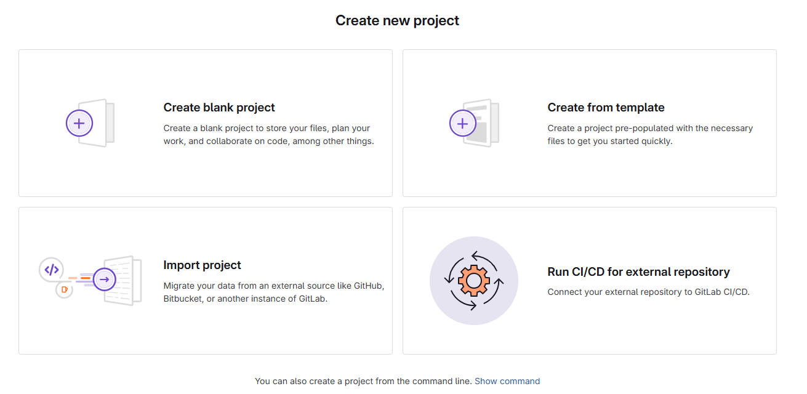
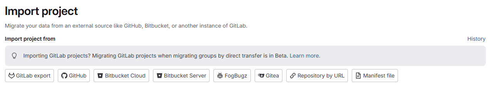
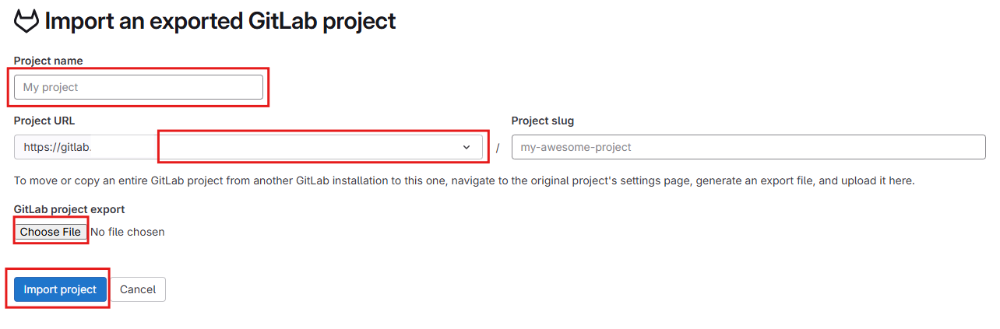
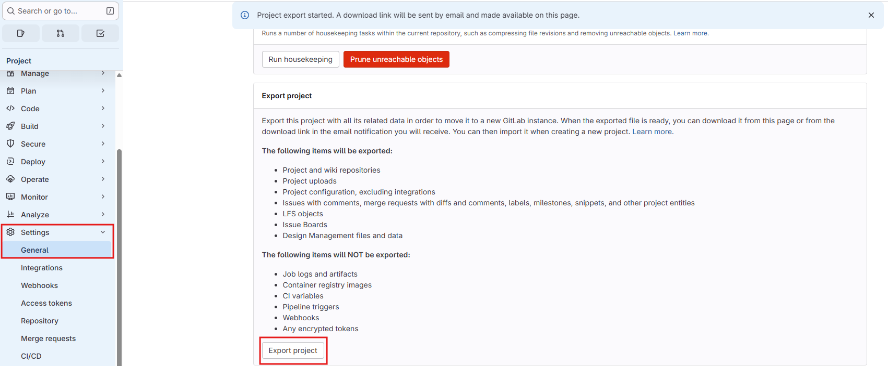

# Create project

- [Create project](#create-project)
  - [Import project](#import-project)
    - [GitLab export](#gitlab-export)

在下面的界面点击 `New Project` 按钮创建项目：

点击后会有四个选项：

## Import project

选择 `Import project` 可以从其他平台导入项目，例如 GitHub、Bitbucket 等。也可以选择从 GitLab 仓库导入项目。

### GitLab export

点击 `GitLab export` 选项后，界面如下

1. `Project name` 填写项目名称
2. `Project URL` 点击下拉框选择项目的归属者
3. 到要导出的项目的 `Settings -> General -> Advanced` 中找到 `Export project`，点击 `Export project` 按钮导出项目。`GitLab` 会发送邮件，邮件有一个下载链接，下载文件，文件名类似 `2026-02-09_01-23-652_owner_projectName_export.tar.gz`。
    
4. 点击 `Choose File` 按钮选择下载的 `tar.gz` 文件。
5. 点击 `Import project` 按钮导入项目。
