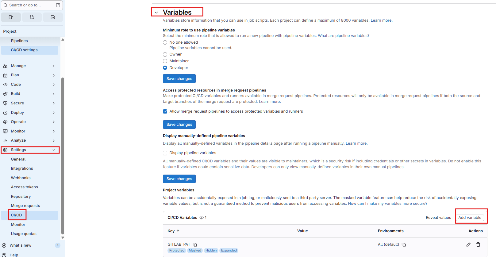
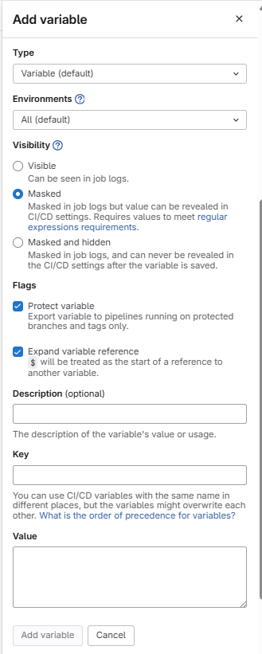

# project guide

- [project guide](#project-guide)
  - [搜索代码](#搜索代码)
  - [Settings](#settings)
    - [Repository](#repository)
      - [Branch defaults](#branch-defaults)
    - [CI/CD](#cicd)
      - [Variables](#variables)

## 搜索代码

要在项目中搜索代码：

1. 在左侧边栏中选择 **搜索或前往** 并找到您的项目。
2. 再次选择 **搜索或前往** 并输入您要搜索的代码。
3. 按 Enter 键进行搜索，或从列表中选择。

代码搜索仅显示文件中的第一个结果。  
可以在 Project 选择 Any 搜索全部项目的代码

## Settings

### Repository

#### Branch defaults

作用：更改仓库的默认分支

在 `Default branch` 的下拉框选择默认分支，点击 `Save changes` 保存。

### CI/CD

#### Variables

在 `Settings` > `CI/CD` > `Variables` 页面，可以添加 CI/CD 变量。

点击 `Add variable`，填好信息后，最后点击 `Add variable` 添加变量。

参数说明：

- `Type`：变量类型，选择 `Variable`。
- `Environments`：环境范围，选择变量适用的环境。默认是 `All`，表示在所有环境中都可用。
- `Visibility`：变量可见性
  - `Visible`：可以在 job 日志中可以看到变量值，适用于不包含敏感信息的变量。
  - `Masked`：在 job 日志中会被掩码处理，变量值会被替换为 `****`，适用于包含敏感信息的变量。但是变量值在 GitLab UI 中仍然可见。
  - `Masked and hidden`：在 job 日志中会被掩码处理，并且在 GitLab UI 中也不可见，适用于高度敏感的变量。
- `Key`：变量名，必填。
- `Value`：变量值，必填。
- `Protect variable`：如果选中，变量仅在受保护的分支或标签上可用。

