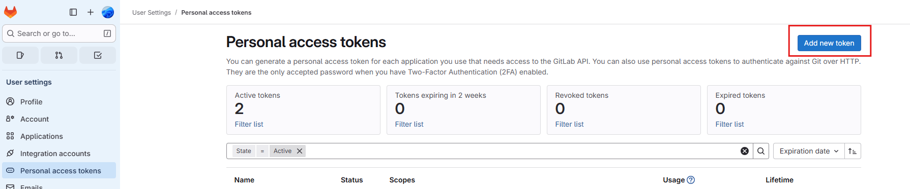
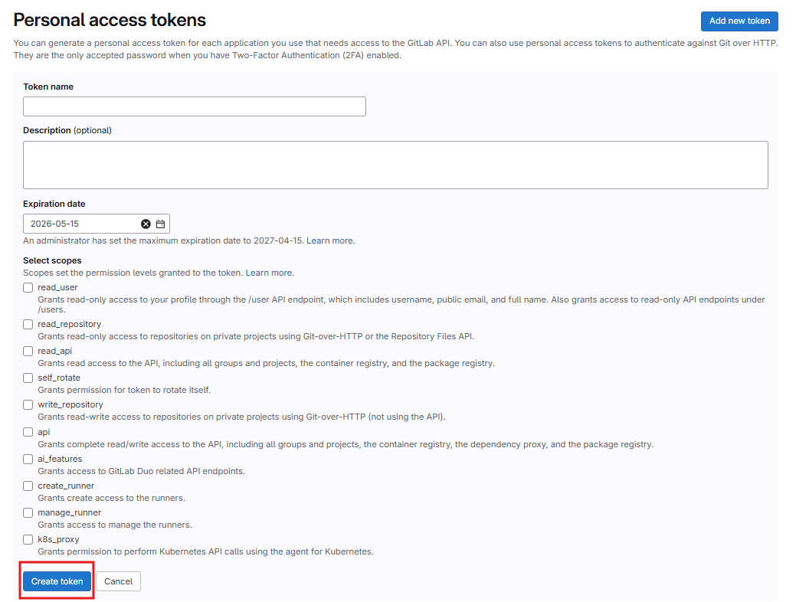

# User Settings

- [User Settings](#user-settings)
  - [Personal Access Tokens](#personal-access-tokens)
    - [核心用途：什么时候会用到PAT？](#核心用途什么时候会用到pat)
    - [创建与管理令牌](#创建与管理令牌)
    - [权限详解](#权限详解)

## Personal Access Tokens

GitLab 的个人访问令牌（Personal Access Token, PAT）是一种用于身份验证的安全凭证，相当于您 GitLab 账户密码的专用、可控替代品。

### 核心用途：什么时候会用到PAT？

`PAT` 主要用于以下三种场景：

- **GitLab API 认证**：在编写脚本或集成第三方工具（如 Jenkins）时，用它代替密码来调用 GitLab API。
- **Git 操作认证**：在使用 `HTTPS` 协议克隆、拉取或推送代码时，可用 `PAT` 代替密码。
- **CI/CD 流程**：在 GitLab CI/CD 流水线中，实现跨项目访问、触发下游流水线或访问受保护的资源。

### 创建与管理令牌

创建 PAT 的步骤：

1. 登录 GitLab 后，点击右上角的头像，选择“偏好设置”（`Preferences`）。
2. 进入用户设置界面，在左侧边栏中选择“访问令牌”（`Personal access tokens`）。
3. 点击“添加新令牌”（`Add new token`）。

创建时需要配置以下关键信息：

- **Token name**：给令牌起一个描述性的名字。必填
- **Expiration date**：为令牌设置一个有效期，到期后自动失效。必填
- **Scopes**：这是 PAT 安全机制的核心。您需要根据实际用途，勾选令牌所需的权限。

创建 PAT 后请务必**立即复制并保存令牌**，因为它只会显示一次，之后便无法再查看。

### 权限详解

GitLab 提供了多种权限范围供您选择，遵循“最小权限原则”是保障安全的关键。

| 权限范围 (Scope) | 主要用途 |
| :--- | :--- |
| **`api`** | 授予对 GitLab API 的完全访问权限，权限较大，请谨慎使用。 |
| **`read_user`** | 仅允许读取用户资料信息。 |
| **`read_api`** | 仅允许对 API 进行读取操作，适用于无需写入的场景。 |
| **`read_repository`** | 仅允许通过 Git 协议读取仓库内容。 |
| **`write_repository`** | 允许通过 Git 协议读取和写入（推送）仓库内容。 |
| **`read_registry`** | 允许读取 GitLab 容器镜像仓库中的镜像。 |
| **`write_registry`** | 允许推送和拉取 GitLab 容器镜像仓库中的镜像。 |
| **`sudo`** | (管理员专用) 允许令牌执行操作时“模拟”其他用户。 |
