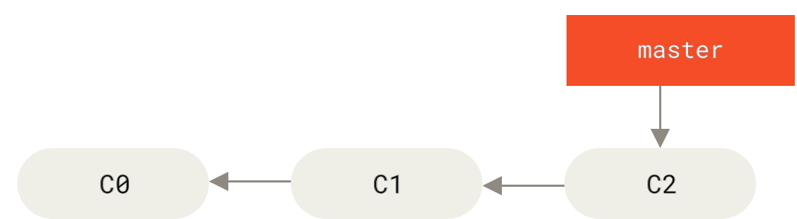
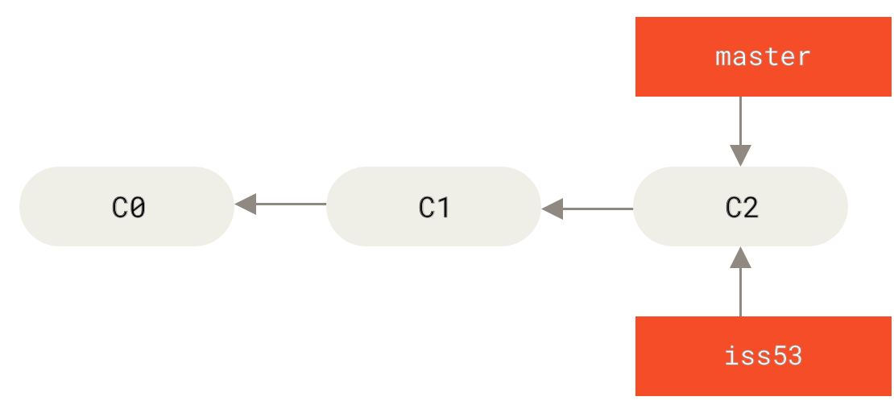
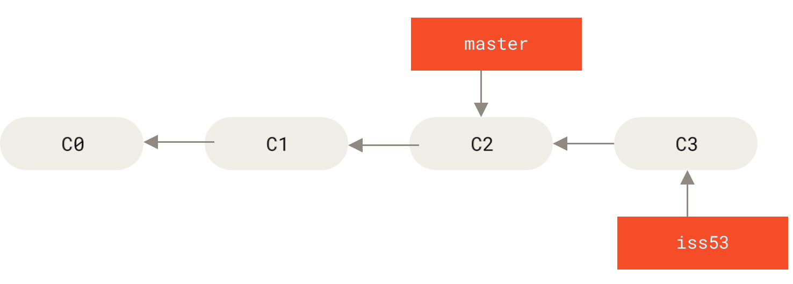
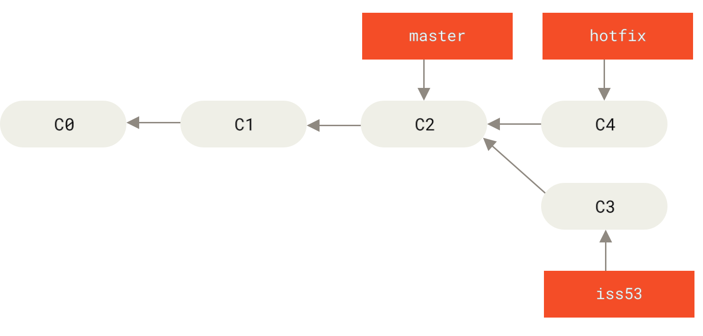
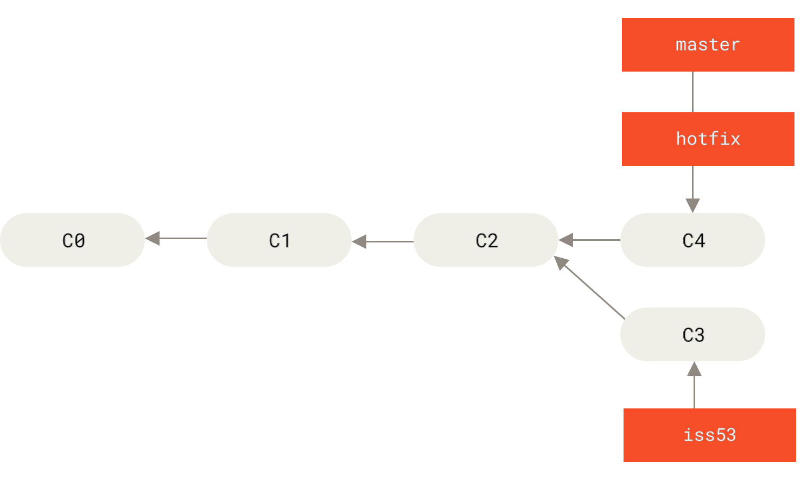
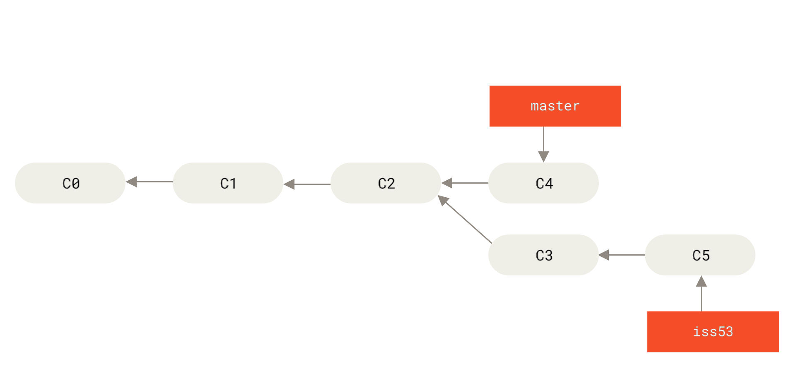
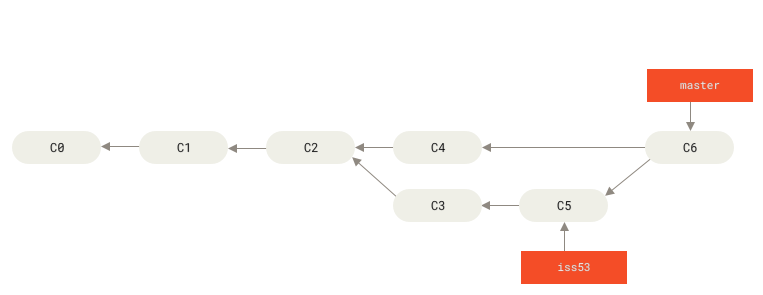

# 分支的新建与合并

- [分支的新建与合并](#分支的新建与合并)
  - [新建分支](#新建分支)
  - [分支的合并](#分支的合并)
  - [遇到冲突时的分支合并](#遇到冲突时的分支合并)

## 新建分支

假设现在有个 master 分支：



然后现在要解决一个 #53 的问题，使用 `git checkout -b` 命令创建新分支并切换到新分支：

```sh
$ git checkout -b iss53
Switched to a new branch "iss53"
```

它是下面两条命令的简写:

```sh
$ git branch iss53
$ git checkout iss53
```



在 iss53 分支上进行一些修改并提交：

```sh
$ git commit -a -m 'added a new footer [issue 53]'
```



但是现在有个更紧急的问题解决，需要新建一个分支解决。

如果此时工作目录和暂存区里有还没有被提交的修改，它可能会和你即将检出的分支产生冲突从而阻止 Git 切换到该分支。最好的方法是先**把这些修改提交到当前分支上**，或者**使用 `git stash` 命令把它们暂存起来**。

当切换分支的时候，Git 会重置工作目录，使其看起来像回到了你在切换的分支上最后一次提交的样子。

为了解决问题，新建一个 hotfix 分支：

```sh
# 在 master 分支上创建 hotfix 分支并切换
$ git checkout -b hotfix
Switched to a new branch 'hotfix'
# 提交
$ git commit -a -m 'fixed the broken email address'
[hotfix 1fb7853] fixed the broken email address
 1 file changed, 2 insertions(+)
```



使用 `git merge` 命令将 hotfix 分支合并到 master 分支：

```sh
$ git checkout master
$ git merge hotfix
Updating f42c576..3a0874c
Fast-forward
 index.html | 2 ++
 1 file changed, 2 insertions(+)
```

`Fast-forward` 合并是指目标分支（master）没有任何新的提交，当前分支（hotfix）上的提交是在目标分支（master）的基础上进行的，所以 Git 只需要把目标分支（master）的指针移动到当前分支（hotfix）的最新提交即可。



hotfix 分支的问题解决了，可以删除 hotfix 分支：

```sh
$ git branch -d hotfix
Deleted branch hotfix (3a0874c).
```

然后在 iss53 分支上继续工作并提交：

```sh
$ git checkout iss53
Switched to branch "iss53"

$ git commit -a -m 'finished the new footer [issue 53]'
[iss53 ad82d7a] finished the new footer [issue 53]
1 file changed, 1 insertion(+)
```



## 分支的合并

当 iss53 分支上的修改完成后，现在把它合并到 master 分支上。

```sh
# 切换到 master 分支
$ git checkout master
Switched to branch 'master'
# 合并 iss53 分支
$ git merge iss53
Merge made by the 'recursive' strategy.
index.html |    1 +
1 file changed, 1 insertion(+)
```

可以看到此时没有 Fast-forward 合并了，因为，master 分支所在提交并不是 iss53 分支所在提交的直接祖先，此时 Git 会使用两个分支的末端所指的快照（C4 和 C5）以及这两个分支的公共祖先（C2），做一个简单的三方合并，生成一个新的合并提交（C6）。

这个被称作一次**合并提交**。



## 遇到冲突时的分支合并

如果你在两个不同的分支中，对同一个文件的同一个部分进行了不同的修改，Git 就没法干净的合并它们。

如果你对 #53 问题的修改和有关 hotfix 分支的修改都涉及到同一个文件的同一处，在合并它们的时候就会产生合并冲突：

```sh
# master 分支合并 iss53 分支
$ git merge iss53
Auto-merging index.html
CONFLICT (content): Merge conflict in index.html
Automatic merge failed; fix conflicts and then commit the result.
```

此时 Git 做了合并，但是没有自动地创建一个新的合并提交。 Git 会暂停下来，等待你去解决合并产生的冲突。 你可以在合并冲突后的任意时刻使用 `git status` 命令来查看那些因包含合并冲突而处于未合并（unmerged）状态的文件：

```sh
$ git status
On branch master
You have unmerged paths.
  (fix conflicts and run "git commit")

Unmerged paths:
  (use "git add <file>..." to mark resolution)

    both modified:      index.html

no changes added to commit (use "git add" and/or "git commit -a")
```

然后我们需要打开这些包含冲突的文件然后手动解决冲突。文件的内容会包含冲突标记，类似于以下格式：

```txt
<<<<<<< HEAD:index.html
<div id="footer">contact : email.support@github.com</div>
=======
<div id="footer">
 please contact us at support@github.com
</div>
>>>>>>> iss53:index.html
```

`=======` 的上半部分是当前分支（HEAD）的内容，下半部分是要合并的分支（iss53）的内容。

在解决完冲突后使用 `git add` 命令把这些文件标记为已解决：

```sh
$ git add index.html
```

然后使用 `git commit` 命令来完成合并提交：

```sh
$ git commit
[master 3a0874c] Merge branch 'iss53'
```
