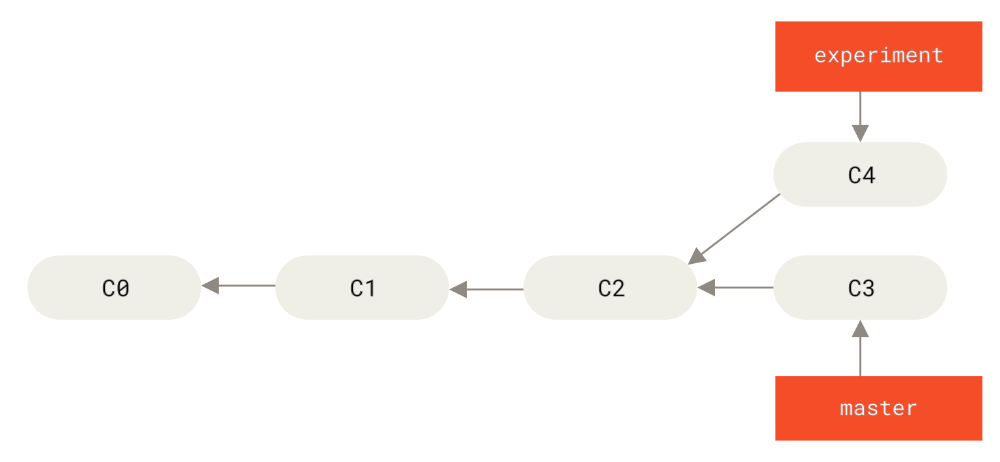
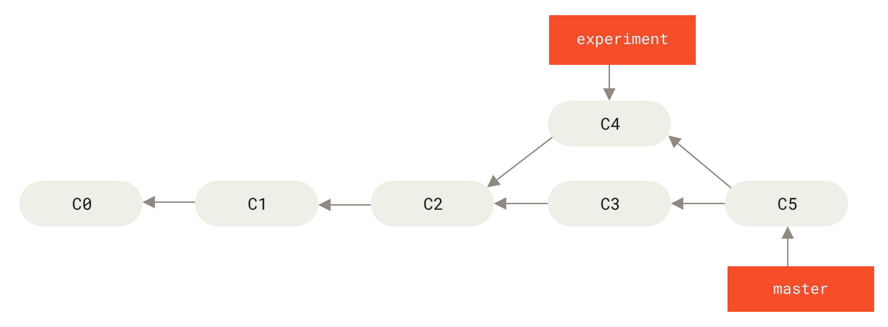
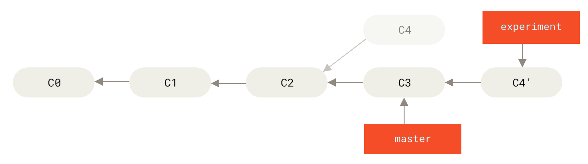
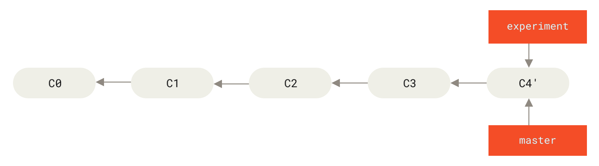
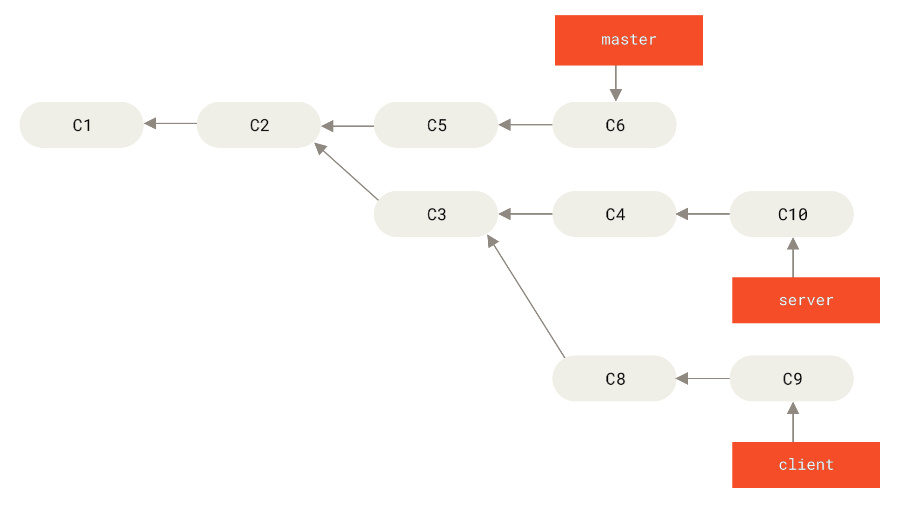
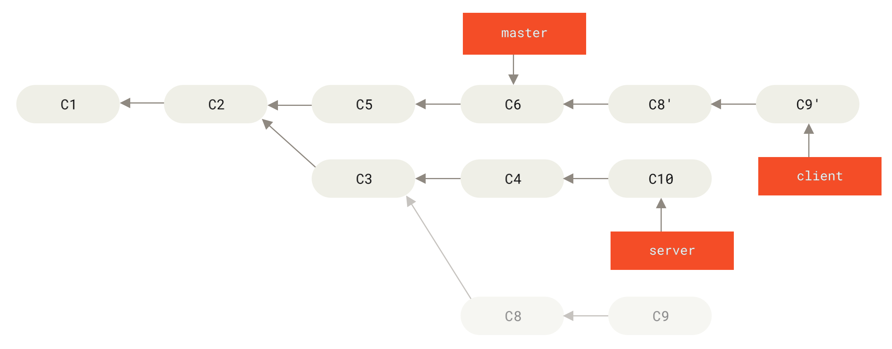
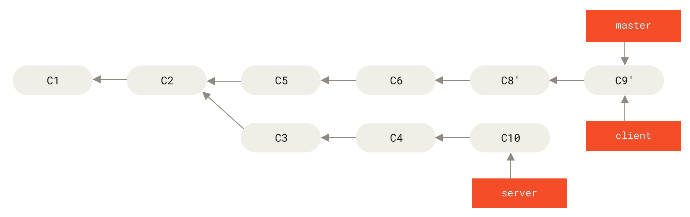
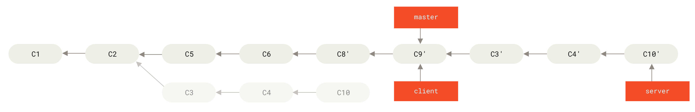
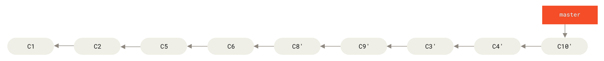

# 变基

- [变基](#变基)
  - [变基的基本操作](#变基的基本操作)
  - [git pull --rebase](#git-pull---rebase)
  - [更复杂的变基例子（多分支之间的变基）](#更复杂的变基例子多分支之间的变基)

在 Git 中整合来自不同分支的修改主要有两种方法：`merge` 以及 `rebase`。

## 变基的基本操作

**1、先看 `merge` 的一个例子**

现在有 master 和 experiment 两个分支，master 分支上有一个提交，experiment 分支上也有一个提交：



然后使用 `merge` 命令，它会把两个分支的最新快照（C3 和 C4）以及二者最近的共同祖先（C2）进行三方合并，合并的结果是生成一个新的快照（并提交）。



***

**2、下面用 `rebase` 合并分支**

使用 **变基（rebase） 命令**，experiment 分支上的提交（`C4`）会被复制到 master 分支上，形成一个新的提交（`C4'`）。

它的**原理**是首先找到这两个分支（即**当前分支 experiment**、变基操作的**目标基底分支 master**） 的最近共同祖先 `C2`，然后对比当前分支相对于该祖先的历次提交，提取相应的修改并存为临时文件， 然后将当前分支指向目标基底 `C3`, 最后以此将之前另存为临时文件的修改依序应用。

```sh
# 先检出 experiment 分支
$ git checkout experiment
# 变基到 master 分支
$ git rebase master
First, rewinding head to replay your work on top of it...
Applying: added staged command
```



然后回到 master 分支，进行一次快进合并。

```sh
# 回到 master 分支
$ git checkout master
# 快进合并 experiment 分支
$ git merge experiment
```



这两种整合方法的最终结果没有任何区别，但是变基使得提交历史更加整洁。

可以使用**更简洁**的命令来完成上面的操作：

```sh
# 直接在 master 分支上执行变基命令
$ git rebase master experiment
# 快进合并 experiment 分支
$ git merge experiment
```

## git pull --rebase

> 在使用 `git pull` 命令从远程仓库拉取更新时，默认会使用 `merge` 的方式将远程分支的修改合并到当前分支上。 但是如果之前使用了 `rebase` 来合并分支，那么后续也应该使用 `rebase` 来合并分支，否则会出现提交历史不整洁的情况。

`--rebase` 的作用是将你在当前分支的本地提交（本地修改）重新应用到从远程仓库拉取的**最新提交之后**。

```sh
# 1. 确保你在正确的分支
git checkout master
 
# 2. 使用 rebase 拉取远程更改
git pull --rebase
 
# 3. 解决任何冲突
# Git 会提示你解决冲突，然后继续
git add <conflicted-files>
git rebase --continue
 
# 4. 完成 rebase 后，推送更改到远程仓库
git push
```

## 更复杂的变基例子（多分支之间的变基）

下面的例子，创建了一个主题分支 server，为服务端添加了一些功能，提交了 `C3`、`C4` 和 `C10`。 然后从 `C3` 上创建了主题分支 client，为客户端添加了一些功能，提交了 `C8` 和 `C9`。



此时，想将 client 中的修改合并到主分支并发布，但暂时并不想合并 server 中的修改，此时可以使用 `git rebase` 命令的 `--onto` 选项，选中在 client 分支里但不在 server 分支里的修改（即 `C8` 和 `C9`，不包括 `C3`），将它们在 master 分支上重放：

```sh
git rebase --onto master server client
```



然后快进合并 master 分支

```sh
git checkout master
git merge client
```



然后再将 server 分支中的修改也整合进来。 使用 `git rebase <basebranch> <topicbranch>` 命令可以直接将主题分支 （即本例中的 server）变基到目标分支（即 master）上。

```sh
git rebase master server
```



快进合并主分支 master

```sh
git checkout master
git merge server
```


