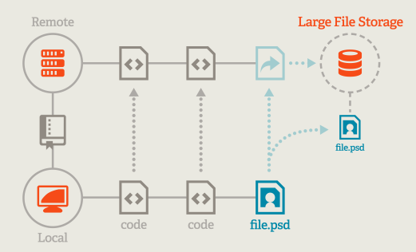

# git lfs

- [git lfs](#git-lfs)
  - [流程](#流程)
  - [命令](#命令)
  - [原理](#原理)
  - [代码托管平台](#代码托管平台)

`LFS` 全称 `Large File Storge` ，即大文件存储，可以帮助我们管理比较大的文件。

对于二进制文件来说，`git lfs` 对于需要追踪的文件只会保存一个指向该文件的指针，而不是在本地仓库中保存每次提交的版本，这节省了本地磁盘空间，同时也缩小 `git` 的传输时间。

**其核心是把需要进行版本控制，但是占用很大空间的文件独立于 `git` 仓库进行管理，进而加快 `git` 速度。**



## 流程

1、远端仓库打开 lfs 设置

2、设置 `git lfs`

```sh
git lfs install
```

3、追踪文件

```sh
git lfs track "*.psd"
```

track 会自动添加 `.gitattributes` 文件，里面记录了追踪的文件的信息，需要将它添加到版本控制。顺便提交一下。

```sh
git add .gitattributes
git commit -m "add Git LFS to the repo"
git push origin main
```

> 如果手动添加 `.gitattributes` ，然后修改里面的内容，没有执行 `git lfs track` 命令可能会不会 `track` 对应的文件，需要测试

## 命令

显示当前被 `lfs` 追踪的文件列表（push 到远端后才会显示）：

```sh
git lfs ls-files 
```

查看现有的文件追踪模式：

```sh
git lfs track
```

取消 `git lfs` 对某文件的追踪：

```sh
git lfs untrack "\*xx.a" 
```

查看当前 `git lfs` 版本：

```sh
git lfs version 
```

取消 `LFS` 的全局配置：

```sh
git lfs uninstall
```

从远程仓库拉取 `Git LFS` 对象：

```sh
git lfs pull
```

将本地的 `Git LFS` 对象推送到远程仓库：

```sh
git lfs push
```

从远程仓库获取 `Git LFS` 对象，但不将它们检出到工作目录：

```sh
git lfs fetch
```

显示有关 `Git LFS` 跟踪文件的信息，例如当前跟踪的文件、未跟踪的文件等：

```sh
git lfs status
```

如果一个仓库中包含 LFS 内容，但是在推送时不想推送这类文件，只要加上 `--no-verify` 选项就行，即：

```sh
git push --no-verify
```

## 原理

`Git LFS` 是基于 `Git` 的 `.gitattributs` 配置文件的特性

- 用 `smudge` 过滤器基于 指针文件寻找大文件内容，
- 用 `clean` 过滤器在对大文件改动时，创建指针文件的新版本。
- 同时还用 `pre-push` 钩子将大文件上传到 `Git LFS` 服务器，即在 `git-push` 时，如果提交中包含被 `LFS` 跟踪的大文件，`pre-push` 钩子会检测到，并执行上传 `Git LFS` 服务器的动作。

前面提到被 LFS 管理的文件，本地仓库中保存的内容实际上是指针文件，其格式类似于下面这样：

```sh
$ git show HEAD:2.svg

version https://git-lfs.github.com/spec/v1
oid sha256:158213f90f8b27012034c6f58db63e1861b12aa122d98910de311bf1cb1e50a0
size 14651
(END)
```

- `version` 表示 LFS 的版本
- `oid` 表示文件对象的唯一 hash 值
- `size` 表示文件的大小

## 代码托管平台

代码托管平台如果支持 Git LFS 的话，需要看平台对于 Git LFS 的政策。Git LFS 服务器是各平台自己实现的。

不同平台有不同的政策，即 可能免费托管 LFS 文件的容量的大小不一样，可能有的平台需要付费才能使用 LFS。
