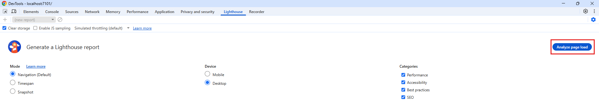
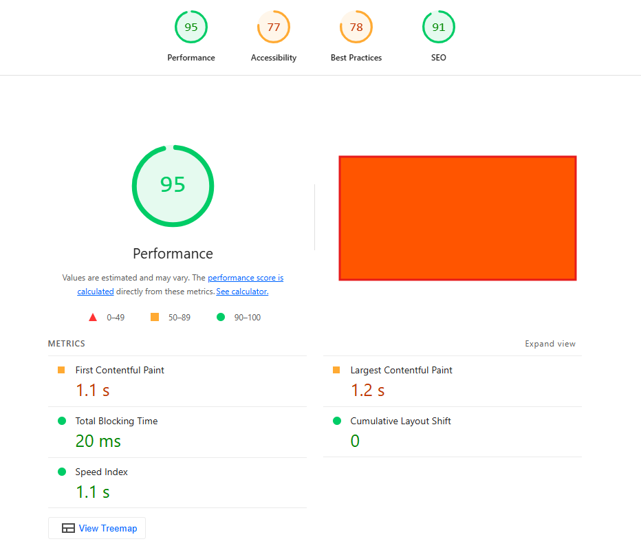
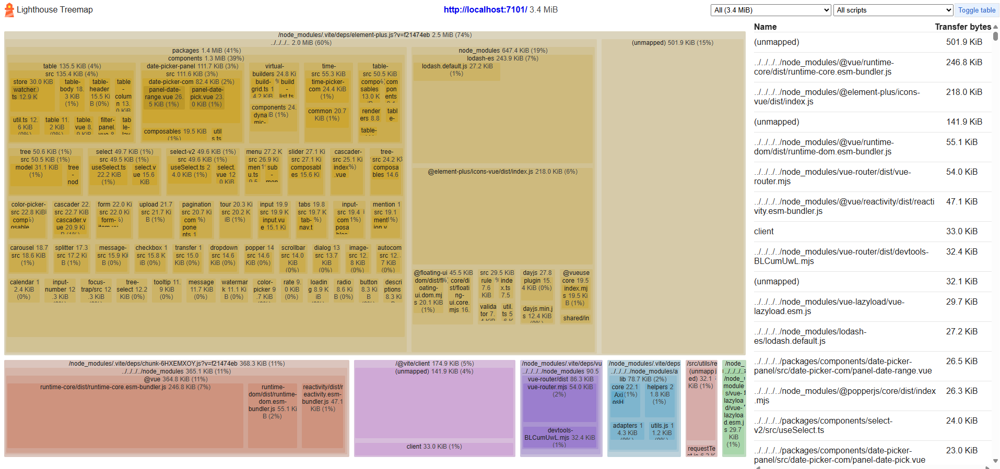

# Lighthouse

- [Lighthouse](#lighthouse)
  - [基本使用](#基本使用)
  - [Peroformance](#peroformance)
    - [Minify JavaScript](#minify-javascript)
    - [Reduce unused JavaScript](#reduce-unused-javascript)
    - [Reduce unused CSS](#reduce-unused-css)

## 基本使用

初始界面：

步骤：

1. 点击 `Lighthouse` tab
2. `Mode` 选择 `Navigation`，`Device` 选择 `Desktop`
3. `Categories` 根据要分析哪一方面进行选择
4. 点击 `Analyze page load` 按钮。注意：要让页面显示出来才能分析成功，如果有其他窗口遮挡它就会分析不出来

分析结果：

怎么看中文的报告：点击右上角的更多图标，点击 `Open in viewer`，在新打开的标签页中的语言选项选择中文即可

报告上面有各个方面的分数总览，报告的下面是各个方面的详细分析

**1. Performance**

|指标|全称|用户感知|
|--|--|--|
|FCP|First Contentful Paint|“页面开始有内容了吗？”|
|LCP|Largest Contentful Paint|“主要内容加载完了吗？”|
|TBT|Total Blocking Time|“页面卡不卡？”|
|CLS|Cumulative Layout Shift|“页面会突然跳动吗？”|
|SI|Speed Index|“整体加载快不快？”|

**1.1 ViewTreeMap**

点击 `ViewTreeMap` 按钮，查看资源加载树状图，显示各个资源的大小。

`dev` 环境会详细显示各个包中的文件及其大小，`prod` 环境只会显示单个文件的大小，看不了文件包含的包及其大小。

`dev` 环境的 `treemap`：

**1.2 Insights**

`Est savings of 888 KiB`：节省 888 KiB

- `Use efficient cache lifetimes`
  - 使用高效的缓存生命周期。给静态资源设置长缓存时间
- `Modern HTTP`
  - 现代 HTTP。使用 HTTP/2 或者 HTTP/3 协议
- `Render blocking requests`
  - 屏蔽了渲染的请求。请求正在屏蔽网页的初始渲染，这可能会延迟 LCP。
- `Forced reflow`
  - 强制自动重排。当 `DOM` 状态发生更改导致样式失效后，如果 `JavaScript` 查询几何属性（例如 `offsetWidth`），会引发强制自动重排
- `Network dependency tree`
  - 网络依赖关系树。分析网络请求的依赖关系，找出可以优化的请求
  - 优化方法有 缩短链长、缩减资源的下载文件大小，或者推迟下载不必要的资源，从而提高网页加载速度。

查看数据分析结果

**1.3 Diagnostics**

查看诊断结果

## Peroformance

下面介绍 Diagnostics 出现的一些常见问题及其解决方法。

### Minify JavaScript

含义：压缩 `JavaScript` 文件可以减少有效负载大小和脚本解析时间

优化方法：

1. 将代码拆分成更小的文件

### Reduce unused JavaScript

含义：减少未使用的 `JavaScript`

优化方法：

1. 代码拆分。将 `node_modules` 里面的包单独分包
2. 懒加载代码。首屏渲染不需要使用的代码懒加载
3. 将有用的代码拆分成另一个文件，那么当前文件的文件大小就会变小，从而减少未使用的代码

### Reduce unused CSS

含义：减少未使用的 `CSS`

优化方法：

1. 删除首屏加载的 CSS 文件中未使用的 CSS 代码
2. 拆分 CSS 文件。将首屏不需要使用的 CSS 代码拆分到另一个文件，首屏只加载需要使用的 CSS 文件
