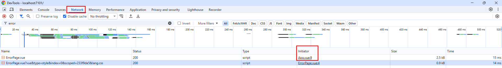
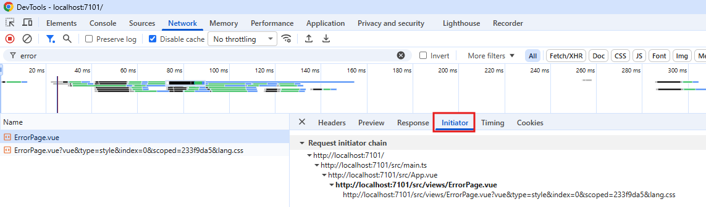

# Network

## 请求 table

**请求 table 的列**：

- `Name`: 请求的名称，通常是资源的文件名或路径。
- `Status`: HTTP 响应状态码，表示请求的结果（如 200 表示成功，404 表示未找到）。
- `Type`: 资源的类型（如 document、script、stylesheet 等）。
- `Initiator`: 发起请求的源头，可能是脚本、用户操作等。
- `Size`: 资源的大小，通常以字节为单位显示。
- `Time`: 请求完成所花费的时间。

***

假设页面请求了一个 `js` 文件，如何分析是哪里请求了 `js` 文件？以 `index.js` 的请求为例：

1. 在 `Network` 查询 `index`，找到查询 `index.js` 的请求
2. 看这个请求的 Initiator，可以知道是哪个文件的哪一行请求 `index.js` 文件
   1. 点击 Initiator 里面的文件链接，可以跳转到 `Sources` 面板对应的文件和行号，查看具体的代码。

    

3. 或者点击请求，在请求详情的 `Initiator` 选项卡，可以看到调用栈

    
