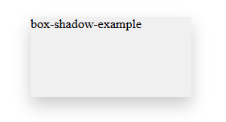
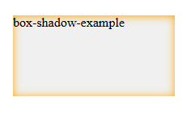
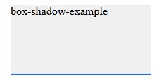
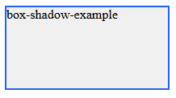
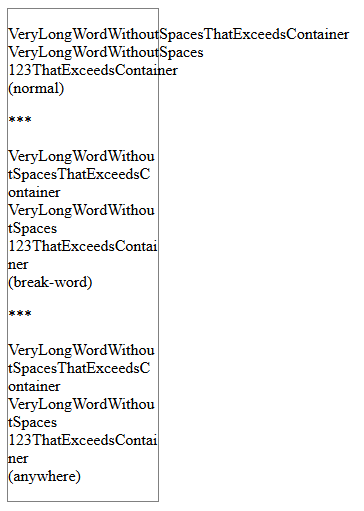
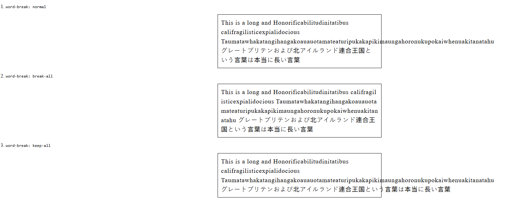

# 属性

- [属性](#属性)
  - [background-\*](#background-)
    - [background-image](#background-image)
    - [background-position](#background-position)
    - [background-size](#background-size)
  - [box-\*](#box-)
    - [box-shadow](#box-shadow)
    - [box-sizing](#box-sizing)
  - [color-\*](#color-)
    - [color-scheme](#color-scheme)
    - [与 prefers-color-scheme 的区别](#与-prefers-color-scheme-的区别)
  - [display](#display)
    - [inline值](#inline值)
  - [filter](#filter)
  - [font-\*](#font-)
    - [font-family](#font-family)
    - [font-style](#font-style)
    - [font-weight](#font-weight)
  - [margin](#margin)
  - [overflow](#overflow)
  - [overflow-\*](#overflow-)
    - [overflow-wrap](#overflow-wrap)
  - [position](#position)
  - [table-layout](#table-layout)
  - [text-\*](#text-)
    - [text-overflow](#text-overflow)
  - [white-space](#white-space)
  - [word-break](#word-break)

## background-*

### background-image

CSS `background-image` 属性用于为一个元素设置一个或者多个背景图像。

可以提供由**逗号**分隔的多个值来指定多个背景图像。

在绘制时，图像以 z 方向堆叠的方式进行。先指定的图像会在之后指定的图像上面绘制。因此指定的第一个图像“最接近用户”。  （**即有多个图像，先声明的图像会在最上方**）

然后元素的边框 `border` 会在它们之上被绘制，而 `background-color` 会在它们之下绘制。

语法：  
`<image>`、`<gradient>` 是数据类型

```text
background-image = 
  <bg-image>#  

<bg-image> = 
  <image>  |
  none     

<image> = 
  <url>       |
  <gradient>  

<url> = 
  url( <string> <url-modifier>* )  |
  src( <string> <url-modifier>* )  
```

例子：

```css
background-image: linear-gradient(to bottom, red, blue),
                  url("../../media/examples/lizard.png");

background-image: url("startransparent.gif"), url("catfront.png");
```

### background-position

`background-position` CSS 属性为每一个背景图片**设置初始位置**。这个位置是相对于由 `background-origin` 定义的位置图层的。

取值：

- `<position>`

  - : 一个 `<position>` 定义一组 x/y 坐标（相对于一个元素盒子模型的边界），来放置项目。它可以使用一到四个值进行定义。

    **一个值的语法：** 值可能是：

    - 关键字 `center`，用来居中背景图片。
    - 关键字 `top`、`left`、`bottom`、`right` 中的一个。用来指定把这个项目（原文为 item）放在哪一个边界。另一个维度被设置成 50%，所以这个项目（原文为 item）被放在指定边界的中间位置。
    - `<length>` 或 `<percentage>`。指定相对于左边界的 x 坐标，y 坐标被设置成 50%。

    **两个值的语法：** 一个定义 x 坐标，另一个定义 y 坐标。每个值可以是：

    - 关键字 `top`、`left`、`bottom`、`right` 中的一个。如果这里给出 `left` 或 `right`，那么这个值定义 x 轴位置，另一个值定义 y 轴位置。如果这里给出 `top` 或 `bottom`，那么这个值定义 y 轴位置，另一个值定义 x 轴位置。
    - `<length>` 或 `<percentage>`。如果另一个值是 `left` 或 `right`，则该值定义相对于顶部边界的 Y。如果另一个值是 `top` 或 `bottom`，则该值定义相对于左边界的 X。如果两个值都是 `<length>` 或 `<percentage>` 值，则第一个定义 X，第二个定义 Y。
    - 注意：如果一个值是 `top` 或 `bottom`，那么另一个值不可能是 `top` 或 `bottom`。如果一个值是 `left` 或 `right`，那么另一个值不可能是 `left` 或 `right`。也就是说，例如，`top top` 和 `left right` 是无效的。
    - 排序：配对关键字时，位置并不重要，因为浏览器可以重新排序，写成 `top left` 或 `left top` 其产生的效果是相同的。使用 `<length>` 或 `<percentage>` 与关键字配对时顺序非常重要，定义 X 的值放在前面，然后是定义 Y 的值， `right 20px` 和 `20px right` 的效果是不相同的，前者有效但后者无效。`left 20%` 或 `20% bottom` 是有效的，因为 X 和 Y 值已明确定义且位置正确。
    - 默认值是 `left top` 或者 `0% 0%`。

    **三个值的语法：** 两个值是关键字值，第三个是前面值的偏移量：

    - 第一个值是关键字 `top`、`left`、`bottom`、`right`，或者 `center`。如果设置为 `left` 或 `right`，则定义了 X。如果设置为 `top` 或 `bottom`，则定义了 Y，另一个关键字值定义了 X。
    - `<length>` 或 `<percentage>`，如果是第二个值，则是第一个值的偏移量。如果是第三个值，则是第二个值的偏移量。
    - 单个长度或百分比值是其前面的关键字值的偏移量。一个关键字与两个 `<length>` 或 `<percentage>` 值的组合无效。

    **四个值的语法：** 第一个和第三个值是定义 X 和 Y 的关键字值。第二个和第四个值是前面 X 和 Y 关键字值的偏移量：

    - 第一个值和第三个值是关键字值 `top`、`left`、`bottom`、 `right` 之一。如果设置为 `left` 或 `right`，则定义了 X。如果设置为 `top` 或 `bottom`，则定义了 Y，另一个关键字值定义了 X。
    - 第二个和第四个值是 `<length>` 或 `<percentage>`。第二个值是第一个关键字的偏移量。第四个值是第二个关键字的偏移量。

例子：

```css
/* Keyword values */
background-position: top;
background-position: bottom;
background-position: left;
background-position: right;
background-position: center;

/* <percentage> values */
background-position: 25% 75%;

/* <length> values */
background-position: 1cm 2cm;
background-position: 10ch 8em;

/* Multiple images */
background-position:
  0 0,
  center;

/* Edge offsets values */
background-position: bottom 10px right 20px;
background-position: right 3em bottom 10px;
```

### background-size

`background-size` 设置背景图片大小。图片可以保有其原有的尺寸，或者拉伸到新的尺寸，或者在保持其原有比例的同时缩放到元素的可用空间的尺寸。

初始值：`auto auto`

属性值：

- `<length>`
  - `<length>` 值，指定背景图片大小，不能为负值。
- `<percentage>`
  - `<percentage>` 值，指定背景图片相对背景区（background positioning area）的百分比。
- auto
  - 以背景图片的比例缩放背景图片。
- cover
  - 缩放背景图片以完全覆盖背景区，可能背景图片部分看不见。和 contain 值相反，cover 值尽可能大的缩放背景图像并保持图像的宽高比例（图像不会被压扁）。该背景图以它的全部宽或者高覆盖所在容器。当容器和背景图大小不同时，背景图的 左/右 或者 上/下 部分会被裁剪。
- contain
  - 缩放背景图片以完全装入背景区，可能背景区部分空白。contain 尽可能的缩放背景并保持图像的宽高比例（图像不会被压缩）。该背景图会填充所在的容器。当背景图和容器的大小的不同时，容器的空白区域（上/下或者左/右）会显示由 background-color 设置的背景颜色。

```css
/* 关键字 */
background-size: cover
background-size: contain

/* 一个值：这个值指定图片的宽度，图片的高度隐式的为 auto */
background-size: 50%
background-size: 12px
background-size: auto

/* 两个值 */
/* 第一个值指定图片的宽度，第二个值指定图片的高度 */
background-size: 50% auto
background-size: 3em 25%
background-size: auto auto

/* 逗号分隔的多个值：设置多重背景 */
background-size: auto, auto     /* 不同于 background-size: auto auto */
background-size: 50%, 25%, 25%
background-size: 6px, auto, contain
```

## box-*

### box-shadow

- CSS box-shadow 属性用于在元素的框架上添加阴影效果。
- 你可以在同一个元素上设置多个阴影效果，并用逗号将他们分隔开。
- 该属性可设置的值包括阴影的 X 轴偏移量、Y 轴偏移量、模糊半径、扩散半径和颜色。

> 注意：`background-color` 会覆盖 `box-shadow` 的阴影效果

**语法：**

```css
box-shadow: [inset] offset-x offset-y blur-radius spread-radius color;
```

```css
/* x 偏移量 | y 偏移量 | 阴影颜色 */
box-shadow: 60px -16px teal;

/* x 偏移量 | y 偏移量 | 阴影模糊半径 | 阴影颜色 */
box-shadow: 10px 5px 5px black;

/* x 偏移量 | y 偏移量 | 阴影模糊半径 | 阴影扩散半径 | 阴影颜色 */
box-shadow: 2px 2px 2px 1px rgba(0, 0, 0, 0.2);

/* 插页 (阴影向内) | x 偏移量 | y 偏移量 | 阴影颜色 */
box-shadow: inset 5em 1em gold;

/* 任意数量的阴影，以逗号分隔 */
box-shadow:
  3px 3px red,
  -1em 0 0.4em olive;
```

- 当给出两个、三个或四个 `<length>`值时。
  - 如果只给出两个值，那么这两个值将会被当作 `<offset-x><offset-y>` 来解释。
  - 如果给出了第三个值，那么第三个值将会被当作`<blur-radius>`解释。
  - 如果给出了第四个值，那么第四个值将会被当作`<spread-radius>`来解释。

**取值说明：**

- `inset`
  - 可选
  - **默认阴影为外阴影**。加上 inset 则变为内阴影，阴影会在边框里面。
- `<offset-x> <offset-y>`
  - 设置阴影偏移量
  - `<offset-x>` 设置水平偏移量，正数使阴影向右，负数向左
  - `<offset-y>` 设置垂直偏移量，正数使阴影向下，负数向上 。
  - 如果两者都是 0，那么阴影位于元素后面。
- `<blur-radius>`
  - 可选，默认 0
  - 模糊半径。值越大，阴影边缘越模糊。不能为负数。
- `<spread-radius>`
  - 可选，默认 0，此时阴影与元素同样大
  - 扩展半径。正数使阴影扩大，负数使阴影收缩。
- `<color>`
  - 可选，默认取决于浏览器，通常为黑色半透明
  - 阴影颜色。支持任何 CSS 颜色格式

**应用场景：**

1、卡片立体感（悬浮效果）

```css
.card {
  transition: box-shadow 0.2s;
}
.card:hover {
  box-shadow: 0 10px 20px rgba(0,0,0,0.2);
}
```



2、内阴影制作“凹陷”效果

```css
.card {
  box-shadow: inset 0 1px 10px orange;
}
```



3、不设置模糊半径，模拟边框

```css
.card {
  box-shadow: inset 0 -2px 0 #2563eb;
}
```



4、不设置阴影偏移，设置扩散半径，模拟边框

```css
.card {
  box-shadow: 0 0 0 2px #2563eb;
}
```



> 调试小技巧：
>
> 1. 打开浏览器开发者工具，在 `Elements` 面板中选中元素
> 2. 在 `Styles` 面板中点击 `box-shadow` 属性值旁的“小圆点”或直接修改数值
> 3. 可以实时调整偏移、模糊、扩展、颜色，即时查看效果。

示例 html

```html
<!DOCTYPE html>
<html lang="en">
<head>
  <meta charset="UTF-8">
  <meta name="viewport" content="width=device-width, initial-scale=1.0">
  <title>Document</title>
  <style>
    .container {
      box-shadow: 0 0 0 2px #2563eb;
      background-color: #f0f0f0;
      width: 200px;
      height: 100px;
      margin: 0 auto;
      margin-top: 20px;
    }
    .card {
      box-shadow: 0 0 0 2px #2563eb;
    }
  </style>
</head>
<body>
<div class="card container">
    box-shadow-example
</div>
</body>
</html>
```

### box-sizing

`box-sizing` 属性可以被用来调整这些表现：

- `content-box`
  - 是默认值。如果你设置一个元素的宽为 100px，那么这个元素的内容区会有 100px 宽，并且任何边框和内边距的宽度都会被增加到最后绘制出来的元素宽度中。
  - 标准盒子模型
- `border-box`
  - 告诉浏览器：你想要设置的边框和内边距的值是包含在 width 内的。也就是说，如果你将一个元素的 width 设为 100px，那么这 100px 会包含它的 border 和 padding，内容区的实际宽度是 width 减去 (border + padding) 的值。大多数情况下，这使得我们更容易地设定一个元素的宽高。
  - IE 盒模型

## color-*

### color-scheme

`color-scheme` 是 CSS 的一个属性，用于**声明元素支持哪些颜色方案**，以便**浏览器**能够相应地调整元素的默认样式。

`color-scheme` 只影响**浏览器默认样式**，不影响自定义样式

语法：

```css
/* 关键字值 */
color-scheme: normal;        /* 默认，使用浏览器的默认方案 */
color-scheme: light;         /* 只支持亮色模式 */
color-scheme: dark;          /* 只支持暗色模式 */
color-scheme: light dark;    /* 支持亮色和暗色模式（推荐） */
color-scheme: only light;    /* 强制亮色，不响应系统变化 */
color-scheme: only dark;     /* 强制暗色，不响应系统变化 */

/* 全局值 */
color-scheme: inherit;
color-scheme: initial;
color-scheme: revert;
color-scheme: revert-layer;
color-scheme: unset;
```

使用示例：

1、**全局设置（推荐）**

```css
:root {
  color-scheme: light dark;
}
```

2、**特定元素设置**

```css
/* 强制某个区域使用暗色 */
.dark-section {
  color-scheme: dark;
}

/* 表单使用系统颜色 */
form {
  color-scheme: light dark;
}
```

### 与 prefers-color-scheme 的区别

```css
/* color-scheme: 告诉浏览器支持的方案 */
:root {
  color-scheme: light dark;
}

/* prefers-color-scheme: 根据用户偏好应用样式 */
@media (prefers-color-scheme: dark) {
  body {
    background-color: #121212;
    color: #ffffff;
  }
}
@media (prefers-color-scheme: light) {
  body {
    background-color: #ffffff;
    color: #000000;
  }
}
```

## display

display 属性设置元素是否被视为块或者内联元素以及用于子元素的布局，例如流式布局、网格布局或弹性布局。  

默认值为 **inline**。不能继承

|值|描述|
|----|----|
|none|此元素不会被显示。|
|block|此元素将显示为块级元素，此元素前后会带有换行符。|
|inline|默认。此元素会被显示为内联元素，元素前后没有换行符。|
|inline-block|行内块元素。（CSS2.1 新增的值）|
|inline-flex|行内弹性盒子布局。|
|inline-grid||
|list-item|此元素会作为列表显示。|
|run-in|此元素会根据上下文作为块级元素或内联元素显示。|
|table|此元素会作为块级表格来显示（类似 `<table>`），表格前后带有换行符。|
|inline-table|此元素会作为内联表格来显示（类似 `<table>`），表格前后没有换行符。|
|table-row-group|此元素会作为一个或多个行的分组来显示（类似 `<tbody>`）。|
|table-header-group|此元素会作为一个或多个行的分组来显示（类似 `<thead>`）。|
|table-footer-group|此元素会作为一个或多个行的分组来显示（类似 `<tfoot>`）。|
|flow-root|**生成一个块级元素盒**，其会建立一个新的**块级格式化上下文**，定义格式化上下文的根元素。|
|table-row|此元素会作为一个表格行显示（类似 `<tr>`）。|
|table-column-group|此元素会作为一个或多个列的分组来显示（类似 `<colgroup>`）。|
|table-column|此元素会作为一个单元格列显示（类似 `<col>`）|
|table-cell|此元素会作为一个表格单元格显示（类似 `<td>` 和 `<th>`）|
|table-caption|此元素会作为一个表格标题显示（类似 `<caption>`）|
|inherit|规定应该从父元素继承 display 属性的值。|
|flex|flex布局|
|grid|grid布局|

### inline值

display: inline：元素为内联，不代表元素内的元素是内联的。该值只针对当前元素。

**inline、block、inline-block的区别**：  

- inline（行内元素）:  
  - 使元素变成行内元素，拥有行内元素的特性，即可以与其他行内元素共享一行，不会独占一行.
  - 不能更改元素的height，width的值，大小由内容撑开.
  - 可以部分设置margin,padding属性：可以设置水平方向上的（left,right），不可以设置垂直方向上的（top,bottom）
  - 常见的行内元素有：span,a,strong,em,input,img,br等
  - 只有设置行高才可以增加行内框的高度（line-height）
- block（块级元素）:  
  - 使元素变成块级元素，独占一行，在不设置自己的宽度的情况下，块级元素会默认填满父级元素的宽度.
  - 能够改变元素的height，width的值.
  - 可以设置padding，margin的各个属性值，top，left，bottom，right都能够产生边距效果.
- inline-block（融合行内于块级）:
  - 结合了inline与block的一些特点，结合了上述inline的第1个特点和block的第2,3个特点。即元素共享一行，但是可以改变元素的 height 、 width 值。
  - 让元素像行内元素一样水平的依次排列，但是框的内容仍然符合块级框的行为。
  - 不独占一行，多个相邻的行内元素仍在一行内排列，直到排列不下才换行。
  - 可以设置width,height。可以设置padding,margin。

## filter

CSS `filter` 属性将**模糊或颜色偏移**等图形效果应用于元素。滤镜通常用于调整图像、背景和边框的渲染。

当单个 `filter` 属性具有多个函数时，滤镜将**按顺序依次应用**。

`filter` 属性可设置为 `none` 或下面列出的一个或多个函数。

- blur()
  - 将高斯模糊应用于输入图像。
  - filter: blur(5px);
- brightness()
  - 将线性乘法器应用于输入图像，以调整其亮度。值为 0% 将创建全黑图像；值为 100% 会使输入保持不变，其他值是该效果的线性乘数。如果值大于 100% 将使图像更加明亮。
  - filter: brightness(2);
- contrast()
  - 调整输入图像的对比度。值是 0% 将使图像变灰；值是 100%，则无影响；若值超过 100% 将增强对比度。
  - filter: contrast(200%);
- drop-shadow()
  - 使用 `<shadow>` 参数沿图像的轮廓生成阴影效果。阴影语法类似于 `<box-shadow>`（在 CSS 背景和边框模块中定义），但不允许使用 inset 关键字以及 spread 参数。与所有 filter 属性值一样，任何在 drop-shadow() 后的滤镜同样会应用在阴影上。
  - filter: drop-shadow(16px 16px 10px black);
- grayscale()
  - 将图像转换为灰度图。值为 100% 则完全转为灰度图像，若为初始值 0% 则图像无变化。值在 0% 到 100% 之间，则是该效果的线性乘数。
  - filter: grayscale(100%);
- hue-rotate()
  - 应用色相旋转。`<angle>` 值设定图像会被调整的色环角度值。值为 0deg，则图像无变化。
  - filter: hue-rotate(90deg);
- invert()
  - 反转输入图像。值为 100% 则图像完全反转，值为 0% 则图像无变化。值在 0% 和 100% 之间，则是该效果的线性乘数。
  - filter: invert(100%);
- opacity()
  - 应用透明度。值为 0% 则使图像完全透明，值为 100% 则图像无变化。
  - filter: opacity(50%);
- saturate()
  - 改变图像饱和度。值为 0% 则是完全不饱和，值为 100% 则图像无变化。超过 100% 则增加饱和度。
  - filter: saturate(200%);
- sepia()
  - 将图像转换为深褐色。值为 100% 则完全是深褐色的，值为 0% 图像无变化。
  - filter: sepia(100%);

## font-*

### font-family

CSS 属性 `font-family` 允许你通过给定一个有先后顺序的，由字体名或者字体族名组成的列表来为选定的元素**设置字体**。

属性值用**逗号**隔开。浏览器会选择列表中第一个该计算机上有安装的字体，或者是通过 `@font-face` 指定的可以直接下载的字体。

属性 `font-family` 列举一个或多个由逗号隔开的字体族。每个字体族由 `<family-name>` 或 `<generic-name>` 值指定。

- `<family-name>`
一个字体族的名字。例如"Times" 和 "Helvetica" 都是字体族名。字体族名可以包含空格，但包含空格时应该用引号。
- `<generic-name>`
通用字体族名是一种备选机制，用于在指定的字体不可用时给出较好的字体。通用字体族名都是关键字，所以不可以加引号。在列表的末尾应该至少有一个通用字体族名。以下是该属性可能的取值以及他们的定义。
  - serif、sans-serif、monospace、cursive、fantasy、system-ui、ui-serif、fangsong 等等

例子：

```css
/* 一个字体族名和一个通用字体族名 */
font-family: "Gill Sans Extrabold", sans-serif;
font-family: "Goudy Bookletter 1911", sans-serif;

/* 仅有一个通用字体族名 */
font-family: serif;
font-family: sans-serif;
font-family: monospace;
```

### font-style

`font-style` CSS 属性允许你选择 `font-family` 字体下的 `italic` 或 `oblique` 样式。

- `Italic` 字体一般是现实生活中的草书，相比无样式的字体，通常会占用较少的水平空间，
- `oblique` 字体一般只是常规字形的倾斜版本。

取值：

- normal
  - 选择 font-family 的常规字体。
- italic
  - 选择 **斜体**，如果当前字体没有可用的斜体版本，会选用倾斜体（oblique ）替代。
- oblique
  - 选择 **倾斜体**，如果当前字体没有可用的倾斜体版本，会选用斜体（italic ）替代。

```css
font-style: normal;
font-style: italic;
font-style: oblique;
```

### font-weight

`font-weight` CSS 属性指定了字体的**粗细程度**。一些字体只提供 `normal` 和 `bold` 两种值。

值

- normal
  - 正常粗细。**与 400 等值**。
- bold
  - 加粗。**与 700 等值**。
- lighter
  - 比从父元素继承来的值更细 (处在字体可行的粗细值范围内)。
- bolder
  - 比从父元素继承来的值更粗 (处在字体可行的粗细值范围内)。
- `<number>`
  - 一个介于 **1 和 1000 (包含)** 之间的 `<number>` 类型值。更大的数值代表字体重量粗于更小的数值 (或一样粗)。\

例子：

```css
/* Keyword values */
font-weight: normal;
font-weight: bold;

/* Keyword values relative to the parent */
font-weight: lighter;
font-weight: bolder;

/* Numeric keyword values */
font-weight: 100;
font-weight: 200;
font-weight: 800;
```

## margin

```css
margin-top: 5%; /* 相对于最近的块容器的宽度 */
margin-right: 5%; /* 相对于最近的块级容器的宽度 */
margin-bottom: 5%; /* 相对于最近的块容器的宽度 */
margin-left: 5%; /* 相对于最近的块级容器的宽度 */
```

注意：**`margin` 设置百分比都是相对于最近的块级容器的宽度**

## overflow

## overflow-*

### overflow-wrap

`overflow-wrap` 是 CSS 中用于控制**长单词或 URL 等不可断行内容**在超出容器宽度时是否允许换行的属性。

**1、基本语法**

```css
overflow-wrap: normal | break-word | anywhere;
```

| 值 | 行为 |
| --- | --- |
| `normal` | **默认值**。浏览器按默认规则断行，**不允许在单词中间断开**，仅允许在空格、连字符等软换行点换行。若出现超过容器宽度的长单词，将溢出。 |
| `anywhere` | 当没有其它合适换行点且内容将溢出时，允许在**任意字符间**断开换行；同时这些断点会计入最小内容宽度计算，因此容器可能被压缩得更小。 |
| `break-word` | 当没有其它合适换行点且内容将溢出时，允许在**任意字符间**断开换行。通常视觉效果与 `anywhere` 接近，但不会把这些断点计入最小内容宽度计算。 |

`anywhere` 和 `break-word` 的区别在于：在 `flex` 布局中，`anywhere` 会正常断开换行，但 `break-word` 可能会被 flex 的最小内容宽度限制而无法断开，导致溢出。

所以在普通布局中可以使用 `anywhere` 或 `break-word`，但在 `flex` 布局中建议使用 `anywhere` 来确保长单词能够正确换行。

**2、示例对比**

```html
<div style="width: 150px; border: 1px solid gray; margin: 10px;">
  <p style="overflow-wrap: normal;">
    VeryLongWordWithoutSpacesThatExceedsContainer
    VeryLongWordWithoutSpaces 123ThatExceedsContainer
    <br>
    (normal)
  </p>
  ***
  <p style="overflow-wrap: break-word;">
    VeryLongWordWithoutSpacesThatExceedsContainer
    VeryLongWordWithoutSpaces 123ThatExceedsContainer
    <br>
    (break-word)
  </p>
  ***
  <p style="overflow-wrap: anywhere;">
    VeryLongWordWithoutSpacesThatExceedsContainer
    VeryLongWordWithoutSpaces 123ThatExceedsContainer
    <br>
    (anywhere)
  </p>
</div>
```



- `normal`：单词整个溢出容器。会在空格处换行，但长单词不允许断开。
- `break-word`：单词在 `VeryLongWordWithou` 和 `tSpacesThatExceedsContainer` 间断开（实际断点取决于宽度与字符排列）。
- `anywhere`：与 `break-word` 效果一样

## position

定位 (positioning) 能够让我们把一个元素从它原本在正常布局流 (normal flow) 中应该在的位置移动到另一个位置。  
position 属性指定了元素的定位类型。  
position 属性的五个值：static、relative、fixed、absolute、sticky。  
**position 属性的默认值为 static**

- static 定位  
HTML 元素的默认值，即没有定位，遵循正常的文档流对象。  
静态定位的元素不会受到 top, bottom, left, right影响。
- fixed 定位  
元素的位置**相对于浏览器窗口**是固定位置。  
即使窗口是滚动的它也不会移动  
**Fixed定位使元素的位置与文档流无关，因此不占据空间。**
Fixed定位的元素和其他元素重叠。
- relative 定位  
相对定位元素的定位是相对其正常位置。  
移动相对定位元素，但它原本所占的空间不会改变。  
**相对定位元素经常被用来作为绝对定位元素的容器块。**  
- absolute 定位  
绝对定位的元素的位置相对于最近的已定位父元素（即非 static 的父元素），如果元素没有已定位的父元素，那么它的位置相对于`<html>`。  
脱离了文档流
- sticky 定位  
sticky 定位可以称之为粘性定位。  
粘性定位的元素是依赖于用户的滚动，在 position:relative 与 position:fixed 定位之间切换。  
**它的行为就像 position:relative; 而当页面滚动超出目标区域时，它的表现就像 position:fixed;，它会固定在目标位置。**  
元素定位表现为在跨越特定阈值前为相对定位，之后为固定定位。  
这个特定阈值指的是 top, right, bottom 或 left 之一，换言之，指定 top, right, bottom 或 left 四个阈值其中之一，才可使粘性定位生效。否则其行为与相对定位相同。

z-index属性：  

- z-index属性指定了一个元素的堆叠顺序（哪个元素应该放在前面，或后面）
- 一个元素可以有正数或负数的堆叠顺序
- 具有更高堆叠顺序的元素总是在较低的堆叠顺序元素的前面。
- 注意： 如果两个定位元素重叠，没有指定z - index，最后定位在HTML代码中的元素将被显示在最前面。

## table-layout

`table-layout` 属性用于控制 HTML `<table>` 元素的布局算法，主要影响表格的列宽分配方式和渲染速度。

**1、语法与取值**

```css
table {
  table-layout: auto;    /* 默认值 */
  table-layout: fixed;   /* 固定布局 */
}
```

`auto`（默认）

- 浏览器先读取整个表格的所有内容，再根据最宽的内容分配列宽。
- 表格的宽度不一定遵守 `width` 属性的设定，内容可能会强制撑开。
- 适合内容量小或表格结构不确定的情况。

`fixed`

- 列宽由**第一行**每个单元格的宽度决定（如果没有显式宽度，则均分表格总宽度）。
- 如果 `<col>` 或 `<colgroup>` 设置了宽度，优先级最高；否则看第一行单元格的 `width` 样式；再否则按内容自动，但之后的行不会改变已确定的宽度。
- 表格整体宽度由 `width` 属性决定（如 `width: 100%`），内容超出列宽时，默认会**溢出**（不换行），除非设置 `word-wrap` 或 `overflow`。
- 渲染速度极快，适合**超大表格**（如几万行数据）。

**2、两种布局模式对比**

| 特性 | `auto`（自动布局） | `fixed`（固定布局） |
| ------ | ------------------- | --------------------- |
| **列宽确定** | 根据单元格内容自动计算，浏览器需要读取整个表格才能确定宽度 | 依赖第一行各列宽度（或 `<col>` / `<colgroup>`），后续行单元格内容不会影响列宽 |
| **渲染速度** | 慢（可能需要多次计算，整个表格加载完才显示） | 快（一次计算，逐行渲染，表格可逐步显示） |
| **内容溢出** | 单元格会根据内容自动撑开 | 固定宽度下，内容可能溢出（可通过 `overflow` / `word-break` 处理） |
| **适用场景** | 内容可变、列宽不确定的小表格 | 大表格、需要快速显示、列宽可预知的数据表 |

**3、示例**

```html
<style>
  .table-fixed {
    table-layout: fixed;
    width: 100%;
  }
  .table-fixed td {
    overflow: hidden;
    text-overflow: ellipsis;
    white-space: nowrap;
  }
</style>

<table class="table-fixed">
  <colgroup>
    <col style="width: 30%">
    <col style="width: 50%">
    <col style="width: 20%">
  </colgroup>
  <thead>
    <tr><th>名称</th><th>描述</th><th>操作</th></tr>
  </thead>
  <tbody>
    <!-- 即使某一行有很长的文本，列宽也不会变化 -->
  </tbody>
</table>
```

**4、注意事项**

- `fixed` 布局下，如果第一行有 `colspan`，浏览器会忽略该列的宽度设置，需要依靠其他方式。
- 为避免内容溢出，常配合 `overflow: auto`、`text-overflow: ellipsis` 或 `word-break: break-word` 使用。
- 对于响应式表格，`fixed` 布局结合 `width: 100%` 能确保列宽按比例缩放。

## text-*

### text-overflow

**1、介绍**

`text-overflow CSS` 属性用于确定如何提示用户**存在隐藏的溢出内容**。其形式可以是裁剪、显示一个省略号（`“…”`）或显示一个自定义字符串。

`text-overflow` 属性并不会强制“溢出”事件的发生，因此**为了能让文本能够溢出容器**，你需要在元素上添加几个额外的属性：`overflow` 和 `white-space`

```css
overflow: hidden;
white-space: nowrap;
```

`text-overflow` 属性只对那些在**块级元素**溢出的内容有效

简单理解：

- 文本有溢出，本属性才会起作用。  
- 要让文本溢出通过 `overflow` 和 `white-space` 实现

**2、语法**

`text-overflow` 属性可能被赋予一个或者两个值。

- 如果赋一个值，指的行末溢出行为（从左至右的文本右末端，从右至左的文本左末端）。
- 如果赋两个值，第一个值指定行左端溢出行为，第二个值指定行右端溢出行为。

```css
text-overflow: clip;
text-overflow: ellipsis ellipsis;
```

取值：

- clip
  - **默认值**。这个关键字会在内容区域的极限处截断文本，因此可能会在单词的中间发生截断。
- ellipsis
  - 这个关键字会用一个省略号（`'…'`）来表示被截断的文本。这个省略号被添加在内容区域中，因此会减少显示的文本。如果空间太小以至于连省略号都容纳不下，那么这个省略号也会被截断。

## white-space

CSS white-space 属性用于设置如何处理元素内的**空白字符**。

```css
/* 单个关键字值 */
white-space: normal;
white-space: nowrap;
white-space: pre;
white-space: pre-wrap;
white-space: pre-line;
white-space: break-spaces;

/* white-space-collapse 和 text-wrap 简写值 */
white-space: collapse balance;
white-space: preserve nowrap;
```

取值：

- normal
  - 连续的空白符会被**合并**。源码中的换行符会被当作空白符来处理。并根据填充行框盒子的需要来换行。
- nowrap
  - 和 normal 一样合并空白符，但**阻止源码中的文本换行**。
- pre
  - 连续的空白符会被**保留**。仅在遇到换行符或 `<br>` 元素时才会换行。
- pre-wrap
  - 连续的空白符会被**保留**。在遇到换行符或 `<br>` 元素时，或者根据填充行框盒子的需要换行。
- pre-line
  - 连续的空白符会被**合并**。在遇到换行符或 `<br>` 元素时，或者根据填充行框盒子的需要换行。

## word-break

`word-break` 是 CSS 中用于控制**文本换行行为**的属性，尤其解决长单词或连续字符（如 URL、长字符串）溢出容器的问题。

**1、常用属性值**

| 值 | 作用 | 典型场景 |
| --- | --- | --- |
| `normal` | **默认值**。按浏览器默认方式换行（通常只在空格、连字符等位置断行）。**CJK（中日韩）文本到达容器边界时会换行** | 普通文本 |
| `break-all` | **彻底允许任意字符间断行**。只要到达容器边界，就在任意字符（包括中文/日文/韩文字符）中间断开 | 防止长单词/URL 撑破容器，但对中文阅读不友好（可能打断完整词语） |
| `keep-all` | 不会在任意字符间断行，只会在段落内的换行点断行。**禁止在 CJK（中日韩）文本中产生断行，即使会造成文本溢出** | 韩文/日文等需保持词语完整性的场景 |
| `break-word` | **已废弃**（但浏览器仍支持）。 | |

**2、完整示例**

```html
<!DOCTYPE html>
<html lang="en">
<head>
    <meta charset="UTF-8">
    <meta name="viewport" content="width=device-width, initial-scale=1.0">
    <title>Document</title>
    <style>
      .narrow {
        padding: 10px;
        border: 1px solid;
        width: 500px;
        margin: 0 auto;
        font-size: 20px;
        line-height: 1.5;
        letter-spacing: 1px;
      }
      
      .normal {
        word-break: normal;
      }
      
      .breakAll {
        word-break: break-all;
      }
      
      .keepAll {
        word-break: keep-all;
      }
    </style>
</head>
<body>
<p>1. <code>word-break: normal</code></p>
<p class="normal narrow">
  This is a long and Honorificabilitudinitatibus califragilisticexpialidocious
  Taumatawhakatangihangakoauauotamateaturipukakapikimaungahoronukupokaiwhenuakitanatahu
  グレートブリテンおよび北アイルランド連合王国という言葉は本当に長い言葉
</p>

<p>2. <code>word-break: break-all</code></p>
<p class="breakAll narrow">
  This is a long and Honorificabilitudinitatibus califragilisticexpialidocious
  Taumatawhakatangihangakoauauotamateaturipukakapikimaungahoronukupokaiwhenuakitanatahu
  グレートブリテンおよび北アイルランド連合王国という言葉は本当に長い言葉
</p>

<p>3. <code>word-break: keep-all</code></p>
<p class="keepAll narrow">
  This is a long and Honorificabilitudinitatibus califragilisticexpialidocious
  Taumatawhakatangihangakoauauotamateaturipukakapikimaungahoronukupokaiwhenuakitanatahu
  グレートブリテンおよび北アイルランド連合王国という言葉は本当に長い言葉
</p>
</body>
</html>
```



效果：  

- `normal` → 会在空格处换行，但长单词不允许断开，CJK（中日韩）文本会在字符边界换行
- `break-all` → 任意位置断开，但可能打乱可读性  
- `keep-all` → 会在空格处换行，但长单词不允许断开，禁止在 CJK（中日韩）文本中产生断行，即使会造成文本溢出

**3、与 `overflow-wrap` 的区别**

1、`word-break: break-all`

- **行为**：在任何字符之间都可以换行，包括单词中间（即使单词本身并不长）。只要到达容器边界，就会立即断开，哪怕断开一个完整的单词。

**示例**：

容器宽度只能容纳 5 个字母。  
文本：`Hello World`  
效果：`Hello` 正常换行，`World` 会被拆成 `Worl` 和 `d`（如果容器不够宽，`Worl` 之后立即断）。

2、`overflow-wrap: break-word`

- **行为**：仅在单词过长且没有合适的断点（如空格、连字符）的情况下，才允许在单词内部换行。优先尝试在正常断点处换行（如空格、标点）。

示例：

容器宽度只能容纳 5 个字母。  
文本：`Hello World`  
效果：`Hello` 正常换行，`World` 会整体移到下一行（如果下一行也放不下整个单词，才会拆成 `Worl` 和 `d`）。

**4、与 `white-space` 的配合**

- `white-space: nowrap` 会**强制不换行**，此时 `word-break` 无效。
- 通常正常文本不需要设置 `word-break`，只有处理**用户生成内容**（长链接、代码片段、长数字串）时才显式使用。

**5、小结**

| 需求 | 推荐方案 |
| --- | --- |
| 保证内容不溢出，可接受打断任意字符 | `word-break: break-all` |
| 优先保持单词完整，只在必要时断字符 | `overflow-wrap: break-word` |
| 日语/韩语中禁止行内打断词语 | `word-break: keep-all` |
| 普通文本 | 默认 `normal` 即可 |

实际开发中，`overflow-wrap: break-word` 比 `word-break: break-all` 更通用且友好；只有在严格需要“每个字符都可能换行”的极窄场景（如某些表单、代码列表）才使用 `break-all`。
