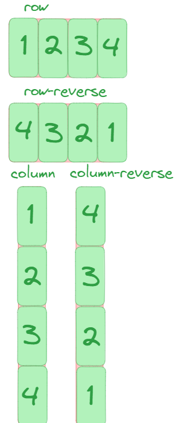
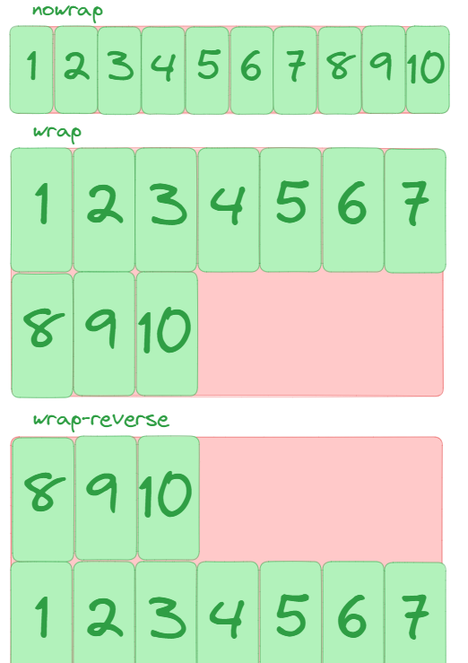
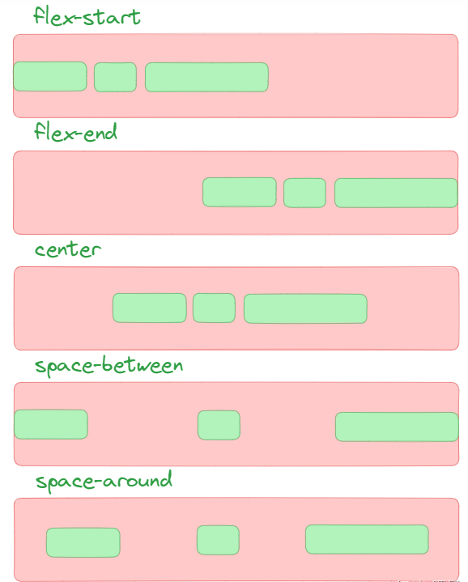
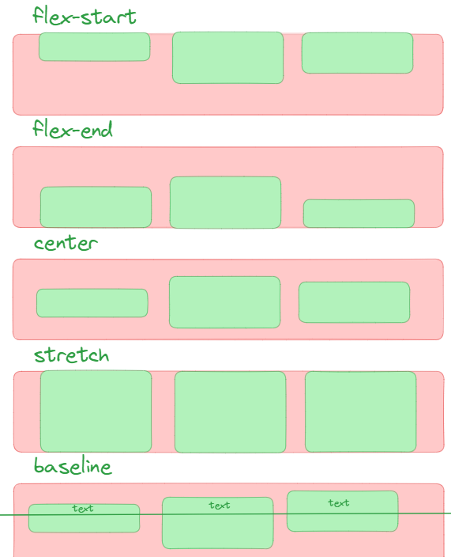
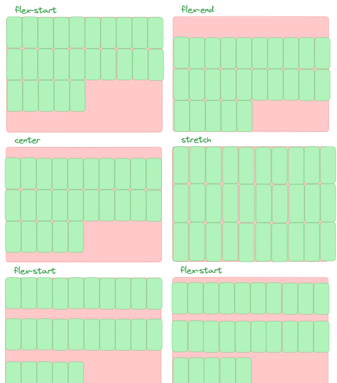
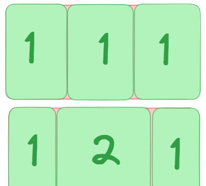
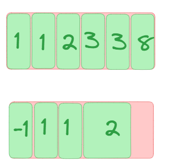

# Flex 布局

- [Flex 布局](#flex-布局)
  - [介绍](#介绍)
  - [Flex 模型](#flex-模型)
  - [flex 容器常用属性](#flex-容器常用属性)
    - [`flex-direction`](#flex-direction)
    - [`flex-wrap`](#flex-wrap)
    - [`flex-flow`](#flex-flow)
    - [`justify-content`](#justify-content)
    - [`align-items`](#align-items)
    - [`align-content`](#align-content)
  - [flex 项常用属性](#flex-项常用属性)
    - [`flex-grow`](#flex-grow)
    - [`flex-shrink`](#flex-shrink)
    - [`flex-basis`](#flex-basis)
    - [`order`](#order)
  - [flex 简写](#flex-简写)
  - [示例](#示例)

## 介绍

当父元素设置 `display: flex` 后，子元素就会变成 flex 项，开始按照 Flex 规则布局。

核心点：

1. `display: flex` 写在父元素上。
2. 默认主轴是横向，因为 `flex-direction: row`。
3. 默认交叉轴会拉伸，因为 `align-items: stretch`。

也就是说，最常见的默认表现是：

- 子元素从左到右排成一行
- 默认不换行
- 如果没有单独设置高度，子元素通常会被拉成一样高

## Flex 模型

相关名词：

- flex 容器（flex container）：设置了 `display: flex` 的父元素。
- flex 项（flex item）：flex 容器里的直接子元素。

Flex 布局主要围绕两条轴来理解：

- 主轴（main axis）：flex 项排列的方向。
  - 该轴的开始和结束被称为 `main start` 和 `main end`。
- 交叉轴（cross axis）：和主轴垂直的方向。
  - 该轴的开始和结束被称为 `cross start` 和 `cross end`。

如果 `flex-direction: row`：

- 主轴是水平的
- 交叉轴是垂直的

如果 `flex-direction: column`：

- 主轴是垂直的
- 交叉轴是水平的

理解 Flex，核心就是先分清楚“主轴”与“交叉轴”。

## flex 容器常用属性

下面这些属性一般写在父元素上。

### `flex-direction`

定义主轴方向。

- `row`：默认值，水平从左到右
- `row-reverse`：水平从右到左
- `column`：垂直从上到下
- `column-reverse`：垂直从下到上



### `flex-wrap`

定义项目是否换行。

- `nowrap`：默认值，不换行
- `wrap`：换行
- `wrap-reverse`：换行，但交叉轴方向相反

如果一行放不下，又希望项目自动换到下一行，就用 `wrap`。



### `flex-flow`

`flex-direction` 和 `flex-wrap` 的简写。

```css
flex-flow: row wrap;
```

### `justify-content`

控制项目在**主轴**上的对齐方式。

- `flex-start`：默认值，从主轴起点开始排
- `flex-end`：靠主轴终点排
- `center`：主轴居中
- `space-between`：两端贴边，中间均匀分布
- `space-around`：每个项目两侧都有间距
- `space-evenly`：所有间距完全相等



### `align-items`

控制项目在**交叉轴**上的对齐方式。

- `stretch`：默认值，拉伸项目
  - 如果父容器有固定高度，项目会被拉伸到和父容器一样高
  - 如果父容器没有固定高度，项目会被拉伸到和最高的项目一样高
- `flex-start`：交叉轴起点对齐
- `flex-end`：交叉轴终点对齐
- `center`：交叉轴居中
- `baseline`：按文字基线对齐



### `align-content`

控制多行项目在**交叉轴**上的整体分布。

注意：只有在“允许换行”且“出现多行”时，这个属性才有效。

- `stretch`：默认值，多行拉伸填满剩余空间
- `flex-start`：多行靠起点排列
- `flex-end`：多行靠终点排列
- `center`：多行居中
- `space-between`：多行两端贴边，行间平均分布
- `space-around`：多行周围保留间距
- `space-evenly`：多行之间间距完全相等



## flex 项常用属性

下面这些属性一般写在子元素上。

### `flex-grow`

定义项目如何分配剩余空间。剩余空间是 flex 容器的大小减去所有 flex 项的大小总和。

- 默认值是 `0`，即默认不会分配剩余空间
- 属性规定为一个 number，负值无效
- 值越大，分到的剩余空间越多
- 如果所有的兄弟项目都有相同的 `flex-grow` 系数，那么所有的项目将剩余空间按相同比例分配

例如 3 个项目分别设置：

```css
flex-grow: 1;
flex-grow: 1;
flex-grow: 3;
```

那么剩余空间会按 `1:1:3` 分配。



### `flex-shrink`

定义空间不够时，项目如何收缩。

- 默认值是 `1`
- 值越大，收缩越明显
- 只有在总宽度或总高度超过容器时才会生效
- 如果值为 `0`，则项目不会收缩

### `flex-basis`

定义项目在主轴上的初始大小。

- 默认值是 `auto`
- 可以写具体长度或百分比或 `content`
- 当 `flex-basis` 不是 `auto` 时，通常会比 `width`/`height` 更优先
- 当值为 `content` 时，大小为项目的内容大小，忽略项目设置的 `width` 和 `height`

示例：

```css
flex-basis: 200px;
flex-basis: 30%;
```

### `order`

控制项目显示顺序。

- 默认值是 `0`
- 值越小越靠前
- 只改变视觉顺序，不改变 DOM 顺序



## flex 简写

`flex` 是下面 3 个属性的简写：

- `flex-grow`
- `flex-shrink`
- `flex-basis`

完整写法：

```css
flex: <grow> <shrink> <basis>;
```

说明：

- 单值
  - `flex: 2`。如果值是一个数字，表示 `flex-grow`。`flex-shrink` 默认为 `1`，`flex-basis` 默认为 `0`
  - `flex: 200px`。如果值是一个长度或百分比，表示 `flex-basis`。`flex-grow` 和 `flex-shrink` 默认为 `1`
  - `flex: auto` 等价于 `1 1 auto`
- 双值
  - `flex: 2 200px`。如果第一个值是数字，第二个值是长度或百分比，表示 `flex-grow` 和 `flex-basis`。`flex-shrink` 默认为 `1`
  - `flex: 2 2`。如果第一个值是数字，第二个值也是数字，表示 `flex-grow` 和 `flex-shrink`。`flex-basis` 默认为 `0`
- 三值：分别表示 `flex-grow`、`flex-shrink` 和 `flex-basis`

常见写法：

```css
flex: 1;
flex: 1 1 auto;
flex: 0 0 200px;
flex: none;
flex: auto;
```

可以这样理解：

- `flex: 1`：项目可以放大，也可以收缩，并按比例分配剩余空间
- `flex: auto`：等于 `flex: 1 1 auto`
- `flex: none`：等于 `flex: 0 0 auto`，既不放大也不收缩
- `flex: 0 0 200px`：固定主轴尺寸为 `200px`

## 示例

```html
<!DOCTYPE html>
<html lang="en">
<head>
    <meta charset="UTF-8">
    <meta name="viewport" content="width=device-width, initial-scale=1.0">
    <title>Flex Demo</title>
    <style>
        .box {
            display: flex;
            height: 200px;
        }

        #box1 {
            background-color: lightpink;
            flex: 1;
        }

        #box2 {
            background-color: lightsalmon;
            flex: 1;
        }

        #box3 {
            background-color: lightslategray;
            flex: 3;
        }
    </style>
</head>
<body>
    <div class="box">
        <div id="box1">box1</div>
        <div id="box2">box2</div>
        <div id="box3">box3</div>
    </div>
</body>
</html>
```

这个例子里：

- 3 个子元素都在同一行，因为父元素设置了 `display: flex`
- 3 个子元素都设置了 `flex` 数值，实际主要比较的是剩余空间分配比例
- `box1 : box2 : box3 = 1 : 1 : 3`
- 所以 `box3` 最宽，`box1` 和 `box2` 平分剩余空间
