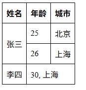
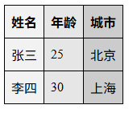
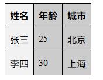
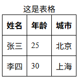
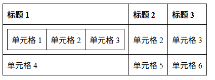

# 表格

- [表格](#表格)
  - [基础的表格](#基础的表格)
  - [单元格跨越多行或多列](#单元格跨越多行或多列)
  - [为表格中的列提供共同的样式](#为表格中的列提供共同的样式)
  - [给表格添加标题](#给表格添加标题)
  - [添加 `<thead>`、`<tbody>` 和 `<tfoot>` 结构](#添加-theadtbody-和-tfoot-结构)
  - [嵌套表格](#嵌套表格)
  - [scope、id、headers 属性](#scopeidheaders-属性)

## 基础的表格

表格由 `<table>` 标签定义，表格行由 `<tr>` 标签定义，表头单元格由 `<th>` 标签定义，表格单元格由 `<td>` 标签定义。

```html
<style>
table {
  border-collapse: collapse;
}
th, td {
  border: 1px solid #000;
  padding: 8px;
  text-align: left;
}
</style>
<body>
<table>
  <caption>这是一个简单的表格</caption>
  <tr>
    <th>姓名</th>
    <th>年龄</th>
    <th>城市</th>
  </tr>
  <tr>
    <td>张三</td>
    <td>25</td>
    <td>北京</td>
  </tr>
  <tr>
    <td>李四</td>
    <td>30</td>
    <td>上海</td>
  </tr>
</table>
</body>
```

**设置行首表头**

- 在第一列的单元格中使用 `<th scope="row">` 来定义行首表头：

```html
<table>
  <tr>
    <th scope="col">姓名</th>
    <th scope="col">年龄</th>
    <th scope="col">城市</th>
  </tr>
  <tr>
    <th scope="row">张三</th>
    <td>25</td>
    <td>北京</td>
  </tr>
  <tr>
    <th scope="row">李四</th>
    <td>30</td>
    <td>上海</td>
  </tr>
</table>
```

## 单元格跨越多行或多列

HTML 表格允许单元格跨越多行或多列，通过 `rowspan` 和 `colspan` 属性实现。

这两个属性接受一个没有单位的数字值，数字决定了它们的宽度或高度是几个单元格。比如，`colspan="2"` 会使单元格横跨两列。

```html
<table>
  <tr>
    <th>姓名</th>
    <th>年龄</th>
    <th>城市</th>
  </tr>
  <tr>
    <td rowspan="2">张三</td>
    <td>25</td>
    <td>北京</td>
  </tr>
  <tr>
    <td>26</td>
    <td>上海</td>
  </tr>
  <tr>
    <td>李四</td>
    <td colspan="2">30, 上海</td>
  </tr>
</table>
```



## 为表格中的列提供共同的样式

如果你想让一列中的每个数据的样式都一样，那么你就要为每个 `th`、`td` 设置 `class` 或者 `style`，这样就很麻烦了。

HTML 提供了 `<colgroup>` 和 `<col>` 标签来为表格中的列提供共同的样式。

`<colgroup>` 标签定义了一组列，而 `<col>` 标签定义了列的属性。你可以在 `<col>` 标签中设置样式，这些样式将应用于该列中的所有单元格。

但是，`<colgroup>` 和 `<col>` 只支持以下样式：

- `width`（定义列宽，支持 px、%、em 等）
- `background`
- `border`（为整列添加边框，但需注意表格边框合并模式 `border-collapse: collapse`）
- `visibility`

例如：

```html
<table>
  <colgroup>
    <col style="background-color: #f2f2f2">
    <col style="background-color: #e6e6e6">
    <col style="background-color: #cccccc">
  </colgroup>
  <tr>
    <th>姓名</th>
    <th>年龄</th>
    <th>城市</th>
  </tr>
  <tr>
    <td>张三</td>
    <td>25</td>
    <td>北京</td>
  </tr>
  <tr>
    <td>李四</td>
    <td>30</td>
    <td>上海</td>
  </tr>
</table>
```



还可以在 `colgroup` 或 `col` 使用 `span` 属性同时给多列设置样式。

在 `col` 上使用 `span`：

```html
<table>
  <colgroup>
    <col style="background-color: #f2f2f2">
    <col style="background-color: #cccccc" span="2">
  </colgroup>
  <tr>
    <th>姓名</th>
    <th>年龄</th>
    <th>城市</th>
  </tr>
  <tr>
    <td>张三</td>
    <td>25</td>
    <td>北京</td>
  </tr>
  <tr>
    <td>李四</td>
    <td>30</td>
    <td>上海</td>
  </tr>
</table>
```



在 `colgroup` 上使用 `span`：

```html
<!-- 第一个 colgroup 控制前两列 -->
<colgroup span="2" style="background: #D4E6F1; width: 30%;"></colgroup>
<!-- 第二个 colgroup 控制接下来的三列 -->
<colgroup span="3" style="background: #D5E8CF; width: 50%;"></colgroup>
```

- 如果 `<colgroup>` 内部没有子 `<col>`，则 `span` 属性直接生效。
- 如果内部有 `<col>` 子元素，则 `<colgroup>` 的 `span` 会被忽略，完全由子 `<col>` 决定。

> 在设置 `table-layout: fixed` 后可以配合 `<col>` 的 `width` 属性更好地控制列宽，实现更精确的布局。

## 给表格添加标题

在 `<table>` 标签下面使用 `<caption>` 标签可以为表格添加标题。默认情况下，标题会显示在表格的上方，并且居中对齐。

```html
<table>
  <caption>这是表格</caption>
  <tr>
    <th>姓名</th>
    <th>年龄</th>
    <th>城市</th>
  </tr>
  <tr>
    <td>张三</td>
    <td>25</td>
    <td>北京</td>
  </tr>
  <tr>
    <td>李四</td>
    <td>30</td>
    <td>上海</td>
  </tr>
</table>
```



## 添加 `<thead>`、`<tbody>` 和 `<tfoot>` 结构

使用 `<thead>`、`<tbody>` 和 `<tfoot>` 分别把表格中的部分标记为表头、表体和表尾三部分。

这些元素不会造成任何视觉上的改变。但是它们可以让你更方便地使用 CSS 来为表格的不同部分设置样式。

> 如果我们没有使用 `<tbody>` 标签，浏览器会自动为我们添加一个 `<tbody>` 标签来包裹表格中的数据行。

```html
<table>
  <thead>
    <tr>
      <th>姓名</th>
      <th>年龄</th>
      <th>城市</th>
    </tr>
  </thead>
  <tbody>
    <tr>
      <td>张三</td>
      <td>25</td>
      <td>北京</td>
    </tr>
    <tr>
      <td>李四</td>
      <td>30</td>
      <td>上海</td>
    </tr>
  </tbody>
  <tfoot>
    <tr>
      <td>合计</td>
      <td>55</td>
      <td>北京, 上海</td>
    </tr>
  </tfoot>
</table>
```

## 嵌套表格

表格中可以嵌套另一个表格。嵌套的表格会被当作一个单元格来处理。

```html
<table id="table1">
  <tr>
    <th>标题 1</th>
    <th>标题 2</th>
    <th>标题 3</th>
  </tr>
  <tr>
    <td id="nested">
      <table id="table2">
        <tr>
          <td>单元格 1</td>
          <td>单元格 2</td>
          <td>单元格 3</td>
        </tr>
      </table>
    </td>
    <td>单元格 2</td>
    <td>单元格 3</td>
  </tr>
  <tr>
    <td>单元格 4</td>
    <td>单元格 5</td>
    <td>单元格 6</td>
  </tr>
</table>
```



## scope、id、headers 属性

`scope`、`id`、`headers` 属性用于定义表格中单元格与表头之间的关系，特别是在复杂的表格结构中，这些属性对于辅助技术（如屏幕阅读器）来说非常重要。

- `scope`：用于 `<th>` 元素，指定该表头单元格适用于哪一行、哪一列或哪个组。取值可以是 `col`（列头）、`row`（行头）、`colgroup`（列组头）或 `rowgroup`（行组头）。
- `id`：用于 `<th>` 元素，给表头单元格一个唯一的标识符。
- `headers`：用于 `<td>` 元素，指定该单元格与哪些表头单元格相关联，值为一个或多个 `id`，用空格分隔。

***

`scope` 属性示例：

```html
<table>
  <tr>
    <th scope="col">姓名</th> <!--指定列头-->
    <th scope="col">年龄</th> <!--指定列头-->
    <th scope="col">城市</th> <!--指定列头-->
  </tr>
  <tr>
    <th scope="row">张三</th> <!--指定行头-->
    <td>25</td>
    <td>北京</td>
  </tr>
  <tr>
    <th scope="row">李四</th> <!--指定行头-->
    <td>30</td>
    <td>上海</td>
  </tr>
</table>
```

`id` 和 `headers` 属性示例：

```html
<table>
  <tr>
    <th id="name">姓名</th>
    <th id="age">年龄</th>
    <th id="city">城市</th>
  </tr>
  <tr>
    <td headers="name">张三</td>
    <td headers="age">25</td>
    <td headers="city">北京</td>
  </tr>
  <tr>
    <td headers="name">李四</td>
    <td headers="age">30</td>
    <td headers="city">上海</td>
  </tr>
</table>
```

对于 `<td headers="name">张三</td>` 来说，`headers="name"` 表示这个单元格与 `<th id="name">姓名</th>` 相关联，这样屏幕阅读器在朗读这个单元格时会知道它是“姓名”这一列的内容。
