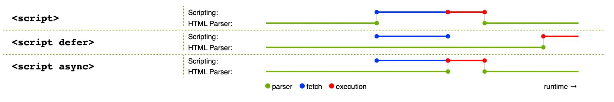

# script

- [script](#script)
  - [介绍](#介绍)
  - [async 和 defer 属性](#async-和-defer-属性)
    - [延迟加载 js 脚本的方法](#延迟加载-js-脚本的方法)
    - [遇到 script 标签为什么会阻塞](#遇到-script-标签为什么会阻塞)

## 介绍

`<script>` 元素用于嵌入可执行代码或数据，这通常用作嵌入或者引用 JavaScript 代码。

```html
<script src="javascript.js"></script>
<script>
  alert("Hello World!");
</script>
```

## async 和 defer 属性

- `defer` 属性
  - 脚本异步加载，与文档的解析同步进行，在文档解析完成后再执行这个脚本文件。
  - 所有脚本加载完毕后才会执行，并且按照它们在文档中出现的顺序执行。
- `async` 属性
  - 脚本异步加载，与文档的解析同步进行，当脚本加载完成后立即执行脚本。
  - 脚本加载后就执行，有可能在文档解析中执行，也可能在文档解析后执行。若在文档解析中执行，则会阻塞文档解析。
  - 多个脚本的执行顺序没有规律，取决于脚本的加载速度。

有可能 `async` 的脚本先执行，也可能 `defer` 的脚本先执行，取决于 `async` 加载脚本完成时是在文档解析前还是解析后



比较：

- 相同点
  - 都指示浏览器在一个单独的线程中下载脚本（异步加载脚本）
  - 加载脚本时不阻塞解析 `HTML`
- 不同点
  - `defer` 是等文档解析后再执行，`async` 是等脚本加载后就执行

### 延迟加载 js 脚本的方法

1. 将 js 脚本放在文档的底部，来使 js 脚本尽可能的在最后来加载执行
2. 给 js 脚本添加 `defer` 或 `async` 属性
3. 动态创建 DOM 标签的方式，我们可以对文档的加载事件进行监听，当文档加载完成后再动态的创建 script 标签来引入 js 脚本

### 遇到 script 标签为什么会阻塞

1. **JavaScript 可能修改 DOM 结构**‌：浏览器无法预知脚本内容是否会操作后续的 HTML 元素（例如通过 `document.write()` 或修改 `DOM` ），为保证页面结构正确性，‌必须暂停 HTML 解析，等待脚本执行完毕后再继续‌‌
2. **‌单线程 UI 渲染机制**‌：浏览器的 UI 更新（包括 DOM 解析、样式计算、布局、绘制）与 JavaScript 执行共享同一线程，‌JS 执行期间 UI 无法更新‌，导致渲染阻塞
