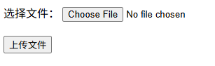
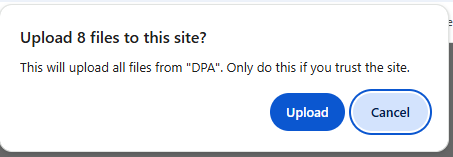

# 上传文件

- [上传文件](#上传文件)
  - [基本文件上传](#基本文件上传)
  - [常用属性和功能](#常用属性和功能)
    - [1. **基本属性**](#1-基本属性)
    - [2. **多文件上传**](#2-多文件上传)
    - [3. **文件大小限制**](#3-文件大小限制)
  - [完整示例（带预览功能）](#完整示例带预览功能)
  - [重要注意事项](#重要注意事项)
    - [1. **Form 属性必须设置**](#1-form-属性必须设置)
    - [2. **服务端处理**](#2-服务端处理)
  - [文件上传（带进度条）](#文件上传带进度条)
  - [上传文件夹](#上传文件夹)
    - [基本文件夹上传](#基本文件夹上传)
    - [服务器端处理示例](#服务器端处理示例)
  - [拖拽文件上传](#拖拽文件上传)
  - [使用第三方库](#使用第三方库)
    - [elements-plus 上传文件](#elements-plus-上传文件)

在HTML中，可以使用 `<input type="file">` 来实现文件上传功能。input 的样子如下：


## 基本文件上传

流程：

1. 创建一个 form，设置 action、method 和 enctype 属性。method 为 post，enctype 必须设置为 `multipart/form-data` 以支持文件上传。
2. 添加 `<input type="file">` ，用户点击选择文件，上传的文件会保存到 form 里面。
3. 添加一个提交按钮，`type` 设置为 `submit` 。点击后，表单会发送 post 请求表单发送给 action，表单中包含文件。然后就将文件上传到服务器了。

```html
<!DOCTYPE html>
<html>
<head>
    <title>文件上传示例</title>
</head>
<body>
    <!-- 最简单的文件上传 -->
    <form action="/upload" method="post" enctype="multipart/form-data">
        <input type="file" name="myFile">
        <button type="submit">上传</button>
    </form>
</body>
</html>
```

怎么获取上传的文件：

1. 监听 `input` 的 `change` 事件。
2. 通过 `e.target.files` 获取选择的文件列表。

```html
<input type="file" id="fileInput">

<script>
document.getElementById('fileInput').addEventListener('change', function(e) {   
    const files = e.target.files;
    console.log(files); // FileList 对象
});
</script>
```

## 常用属性和功能

### 1. **基本属性**

```html
<!-- 接受特定类型文件 -->
<input type="file" accept=".jpg,.png,.pdf">

<!-- 接受图片类型 -->
<input type="file" accept="image/*">

<!-- 接受视频类型 -->
<input type="file" accept="video/*">

<!-- 接受文档类型 -->
<input type="file" accept=".doc,.docx,.pdf,.txt">
```

### 2. **多文件上传**

```html
<!-- 允许选择多个文件 -->
<input type="file" multiple>

<!-- 限制文件数量 -->
<input type="file" multiple max="5">
```

### 3. **文件大小限制**

步骤：

1. 监听 input 的 `change` 事件。
2. 通过 `e.target.files` 获取选择的文件列表。
3. 检查每个文件的 `size` 属性，判断是否超过限制。
4. 如果超过限制，清空 `e.target.value` 并提示用户。

```html
<input type="file" id="fileInput">

<script>
document.getElementById('fileInput').addEventListener('change', function(e) {
    const file = e.target.files[0];
    const maxSize = 5 * 1024 * 1024; // 5MB
    
    if (file.size > maxSize) {
        alert('文件大小不能超过5MB');
        e.target.value = ''; // 清空选择
    }
});
</script>
```

## 完整示例（带预览功能）



```html
<!DOCTYPE html>
<html>
<head>
    <title>文件上传示例</title>
    <style>
        .preview {
            margin: 20px 0;
            max-width: 300px;
        }
        .preview img {
            max-width: 100%;
            max-height: 200px;
        }
    </style>
</head>
<body>
    <form id="uploadForm" action="/upload" method="post" enctype="multipart/form-data">
        <!-- 文件选择 -->
        <label for="fileInput">选择文件：</label>
        <input type="file" id="fileInput" name="file" accept="image/*">
        
        <!-- 文件预览区 -->
        <div class="preview" id="preview"></div>
        
        <!-- 上传按钮 -->
        <button type="submit">上传文件</button>
    </form>

    <script>
        const fileInput = document.getElementById('fileInput');
        const preview = document.getElementById('preview');
        
        // 文件选择事件
        fileInput.addEventListener('change', function(e) {
            const file = e.target.files[0];
            
            if (!file) return;
            
            // 检查文件类型
            if (!file.type.match('image.*')) {
                alert('请选择图片文件');
                this.value = '';
                preview.innerHTML = '';
                return;
            }
            
            // 预览图片
            const reader = new FileReader();
            
            reader.onload = function(e) {
                preview.innerHTML = `
                    
                    <p>文件名：${file.name}</p>
                    <p>文件大小：${(file.size / 1024).toFixed(2)} KB</p>
                `;
            };
            
            reader.readAsDataURL(file);
        });
        
        // 表单提交事件
        document.getElementById('uploadForm').addEventListener('submit', function(e) {
            const file = fileInput.files[0];
            
            if (!file) {
                e.preventDefault();
                alert('请选择文件');
                return;
            }
            
            // 可以在这里添加更多验证逻辑
            console.log('准备上传文件：', file.name);
        });
    </script>
</body>
</html>
```

## 重要注意事项

### 1. **Form 属性必须设置**

```html
<!-- 必须设置这两个属性才能正确上传文件 -->
<form method="post" enctype="multipart/form-data">
```

### 2. **服务端处理**

不同后端语言处理文件上传的方式不同：

**Node.js (Express)**：

```javascript
const multer = require('multer');
const upload = multer({ dest: 'uploads/' });

app.post('/upload', upload.single('file'), (req, res) => {
    console.log(req.file); // 上传的文件信息
});
```

**Python (Flask)**：

```python
from flask import request

@app.route('/upload', methods=['POST'])
def upload_file():
    file = request.files['file']
    file.save('uploads/' + file.filename)
```

## 文件上传（带进度条）

步骤：

1. 监听 input 的 `change` 事件，获取文件。
2. 使用 `XMLHttpRequest` 或 `Fetch API` 上传文件。
3. 监听 `xhr.upload` 的上传进度事件（`progress`），获取上传进度。
   1. `e.loaded`： 已上传的字节数
   2. `e.total`： 文件总字节数

```html
<input type="file" id="modernUpload">

<script>
document.getElementById('modernUpload').addEventListener('change', async function(e) {
    const file = e.target.files[0];
    if (!file) return;
    
    // 创建FormData
    const formData = new FormData();
    formData.append('file', file);
    
    // 使用Fetch API上传（支持进度监控）
    const xhr = new XMLHttpRequest();
    
    // 上传进度
    xhr.upload.addEventListener('progress', function(e) {
        if (e.lengthComputable) {
            const percent = Math.round((e.loaded / e.total) * 100);
            console.log(`上传进度: ${percent}%`);
        }
    });
    
    // 上传完成
    xhr.addEventListener('load', function() {
        console.log('上传完成');
    });
    
    xhr.open('POST', '/upload');
    xhr.send(formData);
});
</script>
```

## 上传文件夹

在HTML中，要**上传整个文件夹**，需要使用 `<input type="file" webkitdirectory multiple>`。

`webkitdirectory` 属性指示 `<input>` 元素应该让用户选择文件目录而非文件。

### 基本文件夹上传

步骤：

1. 使用 `<input type="file" webkitdirectory multiple>`
2. 用户点击选择文件后，可以选择一个文件夹，浏览器会递归获取该文件夹下的所有文件。
3. 然后浏览器会提示是否要信赖网站然后上传文件
4. 点击 yes 后就可以获取文件夹下的所有文件，还是通过 `e.target.files` 获取

```html
<!DOCTYPE html>
<html>
<head>
    <title>上传文件夹</title>
</head>
<body>
    <!-- 关键属性：webkitdirectory directory -->
    <input type="file" id="folderInput" webkitdirectory directory multiple>
    <div id="fileList"></div>

    <script>
        const folderInput = document.getElementById('folderInput');
        const fileList = document.getElementById('fileList');
        folderInput.addEventListener('change', function(e) {
            const files = e.target.files;
            let listHTML = '<h3>选中的文件：</h3>';
            let totalSize = 0;
            // 遍历所有文件
            for (let i = 0; i < files.length; i++) {
                const file = files[i];
                const filePath = file.webkitRelativePath || file.name;
                totalSize += file.size;
                listHTML += `
                    <div style="margin: 5px 0; padding: 5px; border-bottom: 1px solid #eee;">
                        <div><strong>路径：</strong> ${filePath}</div>
                        <div><strong>大小：</strong> ${formatBytes(file.size)}</div>
                        <div><strong>类型：</strong> ${file.type || '未知'}</div>
                    </div>
                `;
            }
            listHTML += `<hr><div><strong>总计：</strong> ${files.length} 个文件，${formatBytes(totalSize)}</div>`;
            fileList.innerHTML = listHTML;
        });
        function formatBytes(bytes, decimals = 2) {
            if (bytes === 0) return '0 Bytes';
            const k = 1024;
            const dm = decimals < 0 ? 0 : decimals;
            const sizes = ['Bytes', 'KB', 'MB', 'GB', 'TB'];
            const i = Math.floor(Math.log(bytes) / Math.log(k));
            return parseFloat((bytes / Math.pow(k, i)).toFixed(dm)) + ' ' + sizes[i];
        }
    </script>
</body>
</html>
```




浏览器兼容性：

- **Chrome**、**Edge**、**Opera**：完全支持
- **Firefox**：需要配置 `dom.input.dirpicker` 为 `true`
- **Safari**：部分支持
- **IE**：不支持

### 服务器端处理示例

**Node.js (Express + multer)**：

```javascript
const express = require('express');
const multer = require('multer');
const path = require('path');
const fs = require('fs');

const app = express();
const upload = multer();

app.post('/upload-folder', upload.array('files[]'), (req, res) => {
    try {
        const files = req.files; // 文件数组
        const paths = req.body.paths; // 相对路径数组
        
        // 确保上传目录存在
        const uploadDir = path.join(__dirname, 'uploads');
        if (!fs.existsSync(uploadDir)) {
            fs.mkdirSync(uploadDir, { recursive: true });
        }
        
        // 保存每个文件
        files.forEach((file, index) => {
            const relativePath = paths[index];
            
            // 构建完整路径
            const fullPath = path.join(uploadDir, relativePath);
            const dirName = path.dirname(fullPath);
            
            // 确保目录存在
            if (!fs.existsSync(dirName)) {
                fs.mkdirSync(dirName, { recursive: true });
            }
            
            // 写入文件
            fs.writeFileSync(fullPath, file.buffer);
        });
        
        res.json({
            success: true,
            message: `成功上传 ${files.length} 个文件`,
            count: files.length
        });
        
    } catch (error) {
        console.error('上传错误:', error);
        res.status(500).json({
            success: false,
            message: '上传失败',
            error: error.message
        });
    }
});
```

## 拖拽文件上传

步骤：

1. 创建一个可以接收拖拽的区域（drop zone），设置 id 为 `dropZone` 。
2. 通过 `document.getElementById()` 获取 `DOM` 节点
3. 处理拖拽事件：`dragover, dragleave, drop`。从拖拽事件中获取文件列表。
   1. 防止浏览器默认行为（比如拖拽文件到浏览器窗口时，浏览器会试图打开文件）。
   2. `dragover` 事件设置拖拽文件进来的样式
   3. `dragleave` 事件设置拖拽结束的样式
   4. `drop` 事件处理
      1. 设置拖拽结束的样式
      2. 通过 `e.dataTransfer.items` 获取拖拽的文件
4. 可以选择显示文件列表或预览。
5. 将文件上传到服务器。

例子：


```html
<!DOCTYPE html>
<html>
<head>
    <title>上传文件夹 - 完整示例</title>
    <style>
        .upload-container {
            max-width: 800px;
            margin: 50px auto;
            padding: 20px;
            border: 2px dashed #ccc;
            border-radius: 10px;
            text-align: center;
        }
        .file-item {
            padding: 10px;
            margin: 5px 0;
            background: #f5f5f5;
            border-radius: 5px;
            text-align: left;
        }
        .folder-path {
            color: #666;
            font-size: 12px;
            word-break: break-all;
        }
        .progress-bar {
            width: 100%;
            height: 20px;
            background: #f0f0f0;
            border-radius: 10px;
            margin: 10px 0;
            overflow: hidden;
        }
        .progress {
            height: 100%;
            background: #4CAF50;
            width: 0%;
            transition: width 0.3s;
        }
    </style>
</head>
<body>
    <div class="upload-container">
        <h2>上传文件夹</h2>
        
        <!-- 方法1：使用拖拽 -->
        <div id="dropZone" style="padding: 40px; border: 2px dashed #2196F3; margin: 20px 0; cursor: pointer;">
            拖拽文件夹到这里 或
            <br>
            <button onclick="document.getElementById('folderInput').click()">选择文件夹</button>
        </div>
        
        <!-- 方法2：传统选择 -->
        <input type="file" id="folderInput" webkitdirectory multiple style="display: none;">
        
        <!-- 文件列表 -->
        <div id="fileList"></div>
        
        <!-- 上传选项 -->
        <div style="margin: 20px 0;">
            <label>
                <input type="checkbox" id="preserveStructure" checked>
                保持文件夹结构
            </label>
            
            <label style="margin-left: 20px;">
                <input type="checkbox" id="includeHidden" checked>
                包含隐藏文件
            </label>
        </div>
        
        <!-- 进度条 -->
        <div class="progress-bar">
            <div class="progress" id="uploadProgress"></div>
        </div>
        
        <!-- 按钮 -->
        <button id="uploadBtn" style="padding: 10px 20px; background: #2196F3; color: white; border: none; border-radius: 5px;">
            开始上传
        </button>
    </div>

    <script>
        // 元素获取
        const dropZone = document.getElementById('dropZone');
        const folderInput = document.getElementById('folderInput');
        const fileList = document.getElementById('fileList');
        const uploadBtn = document.getElementById('uploadBtn');
        const uploadProgress = document.getElementById('uploadProgress');
        const preserveStructure = document.getElementById('preserveStructure');
        const includeHidden = document.getElementById('includeHidden');
        
        let selectedFiles = [];
        let folderName = '';

        // 1. 选择文件夹事件
        folderInput.addEventListener('change', function(e) {
            handleFiles(e.target.files);
        });

        // 2. 拖拽功能
        dropZone.addEventListener('dragover', function(e) {
            e.preventDefault();
            e.stopPropagation();
            this.style.borderColor = '#4CAF50';
            this.style.backgroundColor = '#f0fff0';
        });

        dropZone.addEventListener('dragleave', function(e) {
            e.preventDefault();
            e.stopPropagation();
            this.style.borderColor = '#2196F3';
            this.style.backgroundColor = '';
        });

        dropZone.addEventListener('drop', function(e) {
            e.preventDefault();
            e.stopPropagation();
            this.style.borderColor = '#2196F3';
            this.style.backgroundColor = '';
            
            const items = e.dataTransfer.items;
            if (items && items.length > 0) {
                // 处理拖拽的项目
                handleDroppedItems(items);
            }
        });

        // 3. 处理拖拽的文件项
        async function handleDroppedItems(items) {
            selectedFiles = [];
            const entries = [];
            
            // 获取所有拖拽的条目
            for (const item of items) {
                const entry = item.webkitGetAsEntry ? item.webkitGetAsEntry() : null;
                if (entry) {
                    entries.push(entry);
                }
            }
            
            // 遍历所有条目
            for (const entry of entries) {
                await traverseEntry(entry);
            }
            
            // 显示文件列表
            displayFileList();
        }

        // 4. 递归遍历文件夹
        async function traverseEntry(entry, path = '') {
            return new Promise((resolve) => {
                if (entry.isFile) {
                    // 如果是文件
                    entry.file((file) => {
                        file.relativePath = path + entry.name;
                        selectedFiles.push(file);
                        resolve();
                    });
                } else if (entry.isDirectory) {
                    // 如果是文件夹
                    const dirReader = entry.createReader();
                    dirReader.readEntries(async (entries) => {
                        for (const childEntry of entries) {
                            await traverseEntry(childEntry, path + entry.name + '/');
                        }
                        resolve();
                    });
                }
            });
        }

        // 5. 处理选择的文件
        function handleFiles(files) {
            selectedFiles = Array.from(files);
            displayFileList();
        }

        // 6. 显示文件列表
        function displayFileList() {
            if (selectedFiles.length === 0) {
                fileList.innerHTML = '<p style="color: #999;">没有选择文件</p>';
                return;
            }
            
            let html = '<h3>选择的文件 (' + selectedFiles.length + ' 个)</h3>';
            let totalSize = 0;
            
            selectedFiles.forEach((file, index) => {
                totalSize += file.size;
                const relativePath = file.webkitRelativePath || file.relativePath || file.name;
                
                html += `
                    <div class="file-item">
                        <div><strong>${index + 1}. ${file.name}</strong></div>
                        <div class="folder-path">${relativePath}</div>
                        <div style="font-size: 12px; color: #666;">
                            大小: ${formatBytes(file.size)} | 
                            类型: ${file.type || '未知'}
                        </div>
                    </div>
                `;
            });
            
            html += `
                <hr>
                <div style="text-align: right; font-weight: bold;">
                    总计: ${selectedFiles.length} 个文件, ${formatBytes(totalSize)}
                </div>
            `;
            
            fileList.innerHTML = html;
        }

        // 7. 上传功能
        uploadBtn.addEventListener('click', async function() {
            if (selectedFiles.length === 0) {
                alert('请先选择文件夹');
                return;
            }
            
            uploadBtn.disabled = true;
            uploadBtn.textContent = '上传中...';
            
            // 创建FormData
            const formData = new FormData();
            
            // 添加文件
            selectedFiles.forEach((file, index) => {
                const relativePath = file.webkitRelativePath || file.relativePath || file.name;
                formData.append('files[]', file);
                formData.append('paths[]', relativePath);
            });
            
            // 添加上传选项
            formData.append('preserveStructure', preserveStructure.checked);
            formData.append('timestamp', Date.now());
            
            // 使用XMLHttpRequest获取上传进度
            const xhr = new XMLHttpRequest();
            
            xhr.upload.addEventListener('progress', function(e) {
                if (e.lengthComputable) {
                    const percent = Math.round((e.loaded / e.total) * 100);
                    uploadProgress.style.width = percent + '%';
                    
                    // 显示百分比
                    if (percent === 100) {
                        uploadProgress.textContent = '处理中...';
                    } else {
                        uploadProgress.textContent = percent + '%';
                    }
                }
            });
            
            xhr.addEventListener('load', function() {
                uploadBtn.disabled = false;
                uploadBtn.textContent = '开始上传';
                
                if (xhr.status === 200) {
                    alert('上传成功！');
                    uploadProgress.style.width = '0%';
                    uploadProgress.textContent = '';
                } else {
                    alert('上传失败：' + xhr.statusText);
                }
            });
            
            xhr.addEventListener('error', function() {
                uploadBtn.disabled = false;
                uploadBtn.textContent = '开始上传';
                alert('上传出错！');
            });
            
            // 发送请求
            xhr.open('POST', '/upload-folder'); // 替换为你的上传接口
            xhr.send(formData);
        });

        // 工具函数：格式化文件大小
        function formatBytes(bytes, decimals = 2) {
            if (bytes === 0) return '0 Bytes';
            const k = 1024;
            const dm = decimals < 0 ? 0 : decimals;
            const sizes = ['Bytes', 'KB', 'MB', 'GB', 'TB'];
            const i = Math.floor(Math.log(bytes) / Math.log(k));
            return parseFloat((bytes / Math.pow(k, i)).toFixed(dm)) + ' ' + sizes[i];
        }
    </script>
</body>
</html>
```

## 使用第三方库

对于更复杂的文件上传需求，可以考虑使用第三方库：

- **Dropzone.js** - 拖拽上传
- **Uppy** - 现代化的文件上传器
- **FilePond** - 功能丰富的文件上传

这样就能实现完整的文件上传功能了！根据具体需求选择合适的实现方式。

### elements-plus 上传文件

1、隐藏 `<input type="file">`，用 `slot` 接收外面传进的自定义的上传按钮类型（`el-button`）和文字提示，当点击 `slot` 里面的内容触发点击事件来上传文件

```vue
<template>
  <div @click="handleClick">
    <!-- 可以向 slot 传入 <el-button>上传文件</el-button> -->
    <slot></slot>
    <input type="file" ref="inputRef" style="display: none" @change="handleFileChange">
  </div>
</template>

<script setup>
import { shallowRef } from 'vue'

const inputRef = shallowRef<HTMLInputElement>()

const handleClick = () => {
  inputRef.value!.value = ''
  inputRef.value!.click()
}

const handleFileChange = (e: Event) => {
  // 获取文件
  const files = (e.target as HTMLInputElement).files
  if (!files) return
  // 上传文件
  uploadFiles(Array.from(files))
}
</script>
```

2、使用 `XMLHttpRequest` 发送请求到 action

监听 `xhr.upload` 的上传进度事件（`progress`），获取上传进度。
