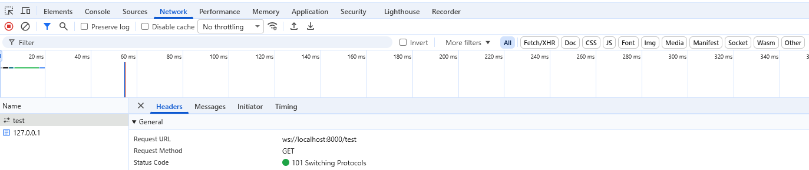
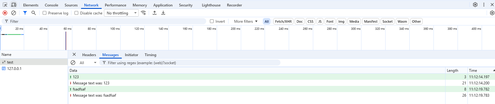

# WebSocket

- [WebSocket](#websocket)
  - [指南](#指南)
    - [1. 创建 WebSocket 对象](#1-创建-websocket-对象)
    - [2. 监听 open 和 error 事件](#2-监听-open-和-error-事件)
    - [3. 发送消息](#3-发送消息)
    - [4. 接收消息](#4-接收消息)
    - [5. 关闭连接](#5-关闭连接)
    - [6. 完整例子](#6-完整例子)
    - [7. 发送多条消息，匹配对应的响应](#7-发送多条消息匹配对应的响应)
  - [接口](#接口)
    - [WebSocket](#websocket-1)
  - [调试](#调试)

[WebSocket 介绍](../../../basic--web/Web开发技术.md#websocket)

## 指南

### 1. 创建 WebSocket 对象

url 的格式为：`ws://` 或 `wss://` 开头，后面跟服务器的地址和端口号（如果需要），以及可选的路径。

```js
const exampleSocket = new WebSocket("ws://www.example.com/socketserver");
```

### 2. 监听 open 和 error 事件

使用 `onopen` 和 `onerror` 属性监听 WebSocket 连接的打开和错误事件：

```js
// 使用 onopen 属性
exampleSocket.onopen = function (event) {
    console.log("连接已打开");
};

// 使用 onerror 属性
exampleSocket.onerror = function (event) {
    console.error("发生错误:", event);
};
```

### 3. 发送消息

使用 `send()` 方法将消息发送到服务器。可以发送字符串、Blob 或 ArrayBuffer 数据。

`send()` 方法是异步的，不会等待数据传输完成。

```js
function sendMessage() {
    const message = "test message";
    exampleSocket.send(message);
}
```

一种常见的方法是使用 JSON 将序列化的 JavaScript 对象作为文本发送。

```js
function sendMessage() {
    const message = {
        iteration: counter,
        content: "ping",
    };
    exampleSocket.send(JSON.stringify(message));
}
```

### 4. 接收消息

当 WebSocket 接收到消息时，会触发 `message` 事件，可以使用 `onmessage` 属性或 `addEventListener` 方法监听该事件：

```js
// 使用 onmessage 属性
exampleSocket.onmessage = function (event) {
    console.log(event.data);
};

// 使用 addEventListener 方法监听 message 事件
exampleSocket.addEventListener('message', function (event) {
    console.log(event.data);
});
```

服务器可以发送字符串或二进制数据，接收时可以根据需要进行处理。

二进制数据将作为 `Blob` 或 `ArrayBuffer` 提供给客户端，具体取决于 `WebSocket.binaryType` 属性的值。

服务器可以发送 JSON 字符串，客户端可以将其解析为对象。

```js
exampleSocket.onmessage = function (event) {
    const message = JSON.parse(event.data);
    console.log(message);
};
```

### 5. 关闭连接

可以调用 `close()` 方法主动关闭 WebSocket 连接：

```js
exampleSocket.close();
```

当连接关闭时（无论是客户端还是服务器关闭它，还是因为发生了错误），将触发 `close` 事件。然后可以使用 `onclose` 属性或 `addEventListener` 方法监听该事件：

```js
exampleSocket.onclose = function (event) {
    console.log("连接已关闭:", event);
};

exampleSocket.addEventListener('close', function (event) {
    console.log("连接已关闭:", event);
});
```

会触发 close 事件的情况：

- 主动关闭（常规场景）
  - **调用 `close()` 方法**：无论是**客户端（如用户登出）** 还是**服务端（如维护）** 主动调用了 `close()` 方法，都会触发一个干净的（`wasClean: true`）关闭事件。
  - **浏览器或标签页关闭**：用户直接关闭浏览器标签页或导航到其他页面时，浏览器会自动触发连接关闭。

- 被动/异常中断（突发场景）
  - **网络故障与服务器崩溃**：网络断开、服务器宕机，或代理服务器超时断开空闲连接时。此场景通常对应 `code: 1006`，表示"异常关闭"。
  - **协议与数据格式错误**：客户端与服务端交互违反了 WebSocket 规范。例如数据帧结构错误（`code: 1002`），或发送了不合规的数据类型（如向仅接收文本的接口发送二进制数据，`code: 1003`）。
  - **安全策略与超时**：因安全策略（如权限认证失败，`code: 1008`），或长时间无数据交互**连接超时**（`code: 1006`）导致的关闭。
  - **服务端内部错误**：服务器端遇到未预料的异常（`code: 1011`）或过载临时断开连接（`code: 1013`）。

### 6. 完整例子

```js
let exampleSocket;
// 连接 WebSocket
function connectWebSocket() {
    exampleSocket = new WebSocket("ws://www.example.com/socketserver");

    exampleSocket.onopen = function (event) {
        console.log("连接已打开");
        exampleSocket.send("Hello Server!");
    };

    exampleSocket.onmessage = function (event) {
        console.log("收到消息:", event.data);
    };

    exampleSocket.onerror = function (event) {
        console.error("发生错误:", event);
    };

    exampleSocket.onclose = function (event) {
        console.log("连接已关闭:", event);
    };
}
// 关闭连接
function disconnectWebSocket() {
    if (exampleSocket) {
        exampleSocket.close();
    }
}
// 发送消息
function sendMessage() {
    if (exampleSocket && exampleSocket.readyState === WebSocket.OPEN) {
        exampleSocket.send("Some message");
    } else {
        console.warn("WebSocket 连接未打开，无法发送消息");
    }
}
```

### 7. 发送多条消息，匹配对应的响应

如果同时发送多条消息，并且需要根据响应内容匹配对应的请求，可以在发送消息时生成一个唯一的 `requestId`，并将其包含在消息中。然后在接收消息时，根据 `requestId` 来匹配对应的请求。

```js
const ws = new WebSocket('wss://example.com/ws');

// 维护一个映射表，存储未完成的请求
const pendingMap = new Map();

ws.onmessage = (event) => {
  const msg = JSON.parse(event.data);
  const { requestId, data, error } = msg;
  // 根据 requestId 匹配对应的请求，并处理响应
  if (pendingMap.has(requestId)) {
    if (error) {
      pendingMap.get(requestId).reject(new Error(error));
    } else {
      pendingMap.get(requestId).resolve(data);
    }
    pendingMap.delete(requestId);
  }
};

function sendWsMessage(type, payload) {
  // 返回 Promise，方便调用方使用 async/await 或 .then() 来处理响应
  return new Promise((resolve, reject) => {
    // 生成唯一的 requestId，可以使用时间戳加随机数的方式
    const requestId = String(Date.now()) + Math.random();
    pendingMap.set(requestId, { resolve, reject });
    // 发送消息
    ws.send(
      JSON.stringify({
        type,
        requestId,
        payload,
      })
    );
  });
}
```

使用示例：

```js
function printUserInfo(userId) {
  getUserInfo(userId)
    .then((data) => {
      console.log('用户信息:', data);
    })
    .catch((err) => {
      console.error('获取用户信息失败:', err);
    });
}
```

## 接口

### WebSocket

**属性**：

- `url`：WebSocket 连接的 URL。
- `readyState`：WebSocket 连接的当前状态。
- `binaryType`：WebSocket 连接接收的的二进制数据的类型。
  - `blob`：表示二进制数据将被处理为 Blob 对象。
  - `arraybuffer`：表示二进制数据将被处理为 ArrayBuffer 对象。
- `onmessage`：当 WebSocket 接收到消息时触发的事件处理程序。
- `onopen`：当 WebSocket 连接成功建立时触发的事件处理程序。
- `onclose`：当 WebSocket 连接关闭时触发的事件处理程序。
- `onerror`：当 WebSocket 连接发生错误时触发的事件处理程序。

**实例方法**：

- `send(data)`：向服务器发送数据。
- `close(code, reason)`：关闭 WebSocket 连接。

**事件**：

- `message`：当 WebSocket 接收到消息时触发。
- `open`：当 WebSocket 连接成功建立时触发。
- `close`：当 WebSocket 连接关闭时触发。
- `error`：当 WebSocket 连接发生错误时触发。

***

可以使用 onmessage 属性或监听 message 事件两种方式监听消息：

```js
// 使用 onmessage 属性
exampleSocket.onmessage = function (event) {
    console.log(event.data);
};

// 使用 addEventListener 方法监听 message 事件
exampleSocket.addEventListener('message', function (event) {
    console.log(event.data);
});
```

> open、close 和 error 事件也可以使用类似的方式监听。

两种方式的区别：

- 使用 `onmessage` 属性时，每次只能有一个事件处理程序。如果再次赋值，会覆盖之前的处理程序。
- 使用 `addEventListener` 方法时，可以添加多个事件处理程序，不会相互覆盖。

## 调试

在 Chrome DevTools 中，可以在 Network 面板中查看 WebSocket 连接和消息。点击 `WS` 标签可以过滤出 WebSocket 连接。

选择一个 WebSocket 连接后，可以查看其 Frames（帧）来监控发送和接收的消息内容。

WebSocket 连接在初始化时会发送一个请求，状态为 "101 Switching Protocols"。



点击该连接后，可以在 `Messages` tab 中查看消息内容。**后续发送和接收的消息也会显示在这里**。



绿色上传箭头表示发送的消息，红色下载箭头表示接收的消息。
