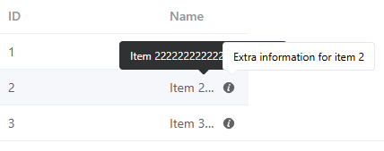
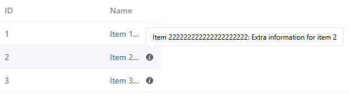

# Table

- [Table](#table)
  - [guide](#guide)
    - [显示溢出工具提示的表格](#显示溢出工具提示的表格)
    - [自定义列模板](#自定义列模板)
    - [展开行](#展开行)
  - [problem](#problem)
    - [1. el-table-column 的 show-overflow-tooltip 与自定义的 el-tooltip 冲突](#1-el-table-column-的-show-overflow-tooltip-与自定义的-el-tooltip-冲突)

## guide

### 显示溢出工具提示的表格

**当内容太长时，它会分成多行**。您可以使用 `show-overflow-tooltip` 将其保留在一行中。

属性 `show-overflow-tooltip` 接受一个布尔值。 为 `true` 时多余的内容会在 `hover` 时以 `tooltip` 的形式显示出来。

```vue
<template>
  <el-table :data="tableData" style="width: 100%">
    <el-table-column type="selection" width="55" />
    <el-table-column label="Date" width="120">
      <template #default="scope">{{ scope.row.date }}</template>
    </el-table-column>
    <el-table-column property="name" label="Name" width="120" />
    <el-table-column
      property="address"
      label="use show-overflow-tooltip"
      width="240"
      show-overflow-tooltip
    />
    <el-table-column property="address" label="address" />
  </el-table>
</template>

<script lang="ts" setup>
interface User {
  date: string
  name: string
  address: string
}
const tableData: User[] = [
  {
    date: '2016-05-04',
    name: 'Aleyna Kutzner',
    address: 'Lohrbergstr. 86c, Süd Lilli, Saarland',
  },
  {
    date: '2016-05-03',
    name: 'Helen Jacobi',
    address: '760 A Street, South Frankfield, Illinois',
  },
  {
    date: '2016-05-02',
    name: 'Brandon Deckert',
    address: 'Arnold-Ohletz-Str. 41a, Alt Malinascheid, Thüringen',
  },
  {
    date: '2016-05-01',
    name: 'Margie Smith',
    address: '23618 Windsor Drive, West Ricardoview, Idaho',
  },
]
</script>
```

### 自定义列模板

自定义列的显示内容。

父组件可以通过 `slot` 获取到 `row`, `column`, `$index` 和 `store` 的数据。

- `row`: 当前行的数据
- `column`: 当前列的数据
- `$index`: 当前行的索引
- `store`: table 内部的状态管理

```vue
<template>
  <el-table :data="tableData" style="width: 100%">
    <el-table-column label="Operations">
      <template #default="scope">
        <span>name: {{ scope.row.name }}</span>
        <span>address: {{ scope.row.address }}</span>
        <el-button size="small" @click="handleEdit(scope.$index, scope.row)">
          Edit
        </el-button>
      </template>
    </el-table-column>
  </el-table>
</template>

<script lang="ts" setup>
interface User {
  date: string
  name: string
  address: string
}

const handleEdit = (index: number, row: User) => {
  console.log(index, row)
}

const tableData: User[] = [
  {
    name: 'Tom1',
    address: 'No. 189, Grove St, Los Angeles',
  },
  {
    name: 'Tom2',
    address: 'No. 189, Grove St, Los Angeles',
  },
]
</script>
```

### 展开行

通过设置 `type="expand"` 和 `slot` 可以开启展开行功能， `el-table-column` 的模板会被渲染成为展开行的内容，展开行可访问的属性与使用自定义列模板时的 `slot` 相同。

```vue
<template>
  <el-table
    :data="tableData"
    border
    style="width: 100%"
  >
    <el-table-column type="expand">
      <template #default="props">
        <div m="4">
          <p m="t-0 b-2">State: {{ props.row.state }}</p>
          <p m="t-0 b-2">City: {{ props.row.city }}</p>
          <p m="t-0 b-2">Address: {{ props.row.address }}</p>
          <p m="t-0 b-2">Zip: {{ props.row.zip }}</p>
        </div>
      </template>
    </el-table-column>
    <el-table-column label="Date" prop="date" />
    <el-table-column label="Name" prop="name" />
  </el-table>
</template>

<script lang="ts" setup>

const tableData = [
  {
    date: '2016-05-03',
    name: 'Tom',
    state: 'California',
    city: 'San Francisco',
    address: '3650 21st St, San Francisco',
    zip: 'CA 94114',
  },
  {
    date: '2016-05-02',
    name: 'Tom',
    state: 'California',
    city: 'San Francisco',
    address: '3650 21st St, San Francisco',
    zip: 'CA 94114',
  },
]
</script>
```

## problem

### 1. el-table-column 的 show-overflow-tooltip 与自定义的 el-tooltip 冲突

问题：`el-table-column` 设置了 `show-overflow-tooltip`，当单元格的内容过长时，会自动显示一个 `tooltip`。但是单元格的后面放置了一个图标样式的 `el-tooltip`，用于显示自定义的额外信息。当放置鼠标上去时会出现两个 `tooltip`，分别是单元格内容的 `tooltip` 和图标的 `tooltip`。



目标：只显示一个 `tooltip`，并且能同时显示单元格内容和自定义的额外信息

解决方案：

1. 先去掉 `show-overflow-tooltip`
2. 声明 `nameRefs` 来存储每行 `name` 单元格的引用
3. 在 `name` 单元格的 `template` 中设置 `ref`，调用 `setNameRef` 来存储每行 `name` 单元格的引用
   - 当 `el` 有值时才设置引用
   - 当 `el` 没有值时，说明组件卸载了，需要删除对应的引用
4. 定义 `isTextOverflowing` 方法来判断单元格内容是否溢出
   - 获取单元格的 `clientWidth`，如果单元格有父元素，则用父元素的 `clientWidth` 减去图标的宽度（22px）来判断
   - 如果单元格的 `scrollWidth` 大于 `clientWidth`，说明内容溢出，返回 `true`
5. 定义 `getTooltipContent` 方法来获取 `tooltip` 的内容，如果单元格内容溢出，则 `tooltip` 内容为单元格内容加上额外信息；如果不溢出，则 `tooltip` 内容只显示额外信息
6. 在 `el-tooltip` 的 `content` 中调用 `getTooltipContent` 来显示 `tooltip` 的内容
7. 在组件卸载时清空 `nameRefs` 中的引用

```vue
<template>
  <el-table :data="tableData" style="width: 100%">
    <el-table-column prop="id" label="ID" width="180"></el-table-column>
    <el-table-column prop="name" label="Name" width="100">
      <template #default="scope">
        <div class="name-cell">
          <span class="name-text" :ref="el => setNameRef(el, scope.$index)">{{ scope.row.name }}</span>
          <el-tooltip
            v-if="isTextOverflowing(scope.$index) || scope.row.extra"
            effect="light"
            :content="getTooltipContent(scope.row, scope.$index)"
            placement="top-start"
          >
            <el-icon><InfoFilled /></el-icon>
          </el-tooltip>
        </div>
      </template>
    </el-table-column>
  </el-table>
</template>

<script lang="ts" setup>
import { reactive, ref, onUnmounted } from 'vue'
import { InfoFilled } from '@element-plus/icons-vue';

const tableData = reactive([
  { id: 1, name: 'Item 111111111111111111111', extra: 'Extra information for item 1' },
  { id: 2, name: 'Item 222222222222222222222', extra: 'Extra information for item 2' },
  { id: 3, name: 'Item 333333333333333333333', extra: 'Extra information for item 3' }
])

// 存储每行 name 单元格的引用
const nameRefs = ref<Map<string, HTMLElement>>(new Map());

// 设置每行 name 单元格的引用
const setNameRef = (el: any, index: number) => {
  const key = index.toString();
  if (el && el instanceof HTMLElement) {
    nameRefs.value.set(key, el);
  } else {
    // unmount 时移除引用
    nameRefs.value.delete(key);
  }
};

const isTextOverflowing = (index: number): boolean => {
  const element = nameRefs.value.get(index.toString());
  if (!element) return false;

  let clientWidth = element.clientWidth
  if (element.parentElement) {
    clientWidth = element.parentElement.clientWidth - 22
  }
  return element.scrollWidth > clientWidth;
};

const getTooltipContent = (row: any, index: number): string => {
  const isOverflowing = isTextOverflowing(index)
  let tooltip = isOverflowing ? row.name : ""
  if (row.extra) {
    tooltip += (tooltip ? ": " : "") + row.extra;
  }
  return tooltip;
};

onUnmounted(() => {
  nameRefs.value.clear();
});

</script>

<style scoped>
.name-cell {
  display: flex;
  align-items: center;
}

.name-cell .name-text {
  margin-right: 5px;
  overflow: hidden;
  text-overflow: ellipsis;
  white-space: nowrap;
  /* 留出图标的位置 */
  max-width: calc(100% - 20px);
}
</style>
```


