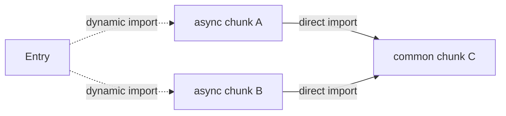

# 功能

- [功能](#功能)
  - [构建优化](#构建优化)
    - [Tree Shaking](#tree-shaking)
    - [CSS 代码分割](#css-代码分割)
    - [预加载指令生成](#预加载指令生成)
    - [异步 Chunk 加载优化](#异步-chunk-加载优化)

## 构建优化

> 在构建过程中，下面所罗列的功能会**自动应用**。

### Tree Shaking

`Vite` 使用 `Rollup` 作为底层的打包工具，因此它继承了 `Rollup` 强大的 `Tree Shaking` 功能。`Tree Shaking` 会在构建过程中移除那些没有被使用到的代码，从而减小最终产物的体积。

### CSS 代码分割

`Vite` 会自动地将一个异步 `chunk` 模块中使用到的 `CSS` 代码抽取出来并为其生成一个单独的文件。  
这个 `CSS` 文件将在该异步 `chunk` 加载完成时自动通过一个 `<link>` 标签载入，该异步 `chunk` 会保证只在 `CSS` 加载完毕后再执行，避免发生 `FOUC` 。

> `FOUC`（`Flash of Unstyled Content`）是指在网页加载过程中，由于 `CSS` 样式加载延迟或加载顺序不当，导致页面短暂出现未样式化的内容闪烁的现象。

如果你更倾向于将所有的 `CSS` 抽取到一个文件中，你可以通过设置 `build.cssCodeSplit` 为 `false` 来禁用 `CSS` 代码分割。

### 预加载指令生成

`Vite` 会在打包后的 `HTML` 文件给**入口** `chunk` 自动生成 `<link rel="modulepreload">` 指令，例如：

```html
<link rel="modulepreload" crossorigin href="/searatesqc/assets/js/vue-DotfOHtL.js">
```

`<link rel="modulepreload">` 指令的作用：浏览器会预加载 ES 模块，自动解析并预加载其所有导入的依赖。

```txt
开始 → 同时下载所有模块 → 解析 → 执行
        (并行无等待)
```

如果没添加该指令：

```txt
开始 → 下载 main.js → 解析 → 发现依赖 → 下载 helper.js → 解析 → 执行
        (等待)              (等待)               (等待)
```

> 懒加载的 `chunk` 不会出现在 `index.html` 中，只有在运行时动态加载时才会被请求。

### 异步 Chunk 加载优化



在无优化的情境下，当异步 `chunk A` 被导入时，浏览器将必须请求和解析 A，然后它才能弄清楚它也需要共用 `chunk C`。这会导致额外的网络往返：

```txt
Entry ---> A ---> C
```

Vite 将使用一个预加载步骤自动重写代码，来分割动态导入调用，以实现当 A 被请求时，C 也将 **同时** 被请求：

```txt
Entry ---> (A + C)
```

如果 C 也有更多层的直接导入，Vite 也会跟踪所有层次的直接导入，无论导入的深度如何，并确保它们都被预加载。
