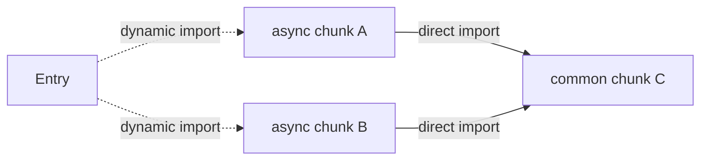

# 功能

- [功能](#功能)
  - [npm 依赖解析预构建](#npm-依赖解析预构建)
    - [1、Import Maps](#1import-maps)
    - [2、依赖解析与预构建](#2依赖解析与预构建)
  - [构建优化](#构建优化)
    - [Tree Shaking](#tree-shaking)
    - [CSS 代码分割](#css-代码分割)
    - [预加载指令生成](#预加载指令生成)
    - [异步 Chunk 加载优化](#异步-chunk-加载优化)

## npm 依赖解析预构建

### 1、Import Maps

原生 ES 模块（ESM）在语法上支持 `import { someMethod } from 'my-dep'` 这种写法。但能否实际工作取决于运行环境能否正确解析裸模块标识符（bare specifier）`'my-dep'`：

- **浏览器**：默认**不支持**裸标识符，因为浏览器要求模块说明符必须是相对路径（`./foo.js`）或绝对 URL（`https://...`）。要让浏览器识别 `'my-dep'`，需要配合 **Import Maps**（导入映射），将裸标识符映射到真实地址。
- **Node.js**：**支持**裸标识符。它会像解析 CommonJS 模块一样，在 `node_modules` 目录下查找 `'my-dep'` 对应的 ES 模块入口。

***

Import Maps 让浏览器能在运行时将代码中的 `'my-dep'` 映射到一个具体的 URL，从而理解并加载该模块。

其配置步骤如下：

1. **在 HTML 中定义**：在 `<head>` 中添加 `<script type="importmap">` 标签，内部为一个 JSON 对象。
2. **编写映射规则**：JSON 对象的 `imports` 字段用于定义映射关系。键是你在代码中写的模块名（即裸模块标识符），值是其对应的真实 URL。
3. **确保顺序正确**：`<script type="importmap">` 必须放在你所有 `<script type="module">` 标签之前，确保映射规则优先加载。

下面是一个完整的配置示例：

```html
<head>
  <!-- 步骤1 & 2: 定义 Import Map -->
  <script type="importmap">
    {
      "imports": {
        "lodash": "https://cdn.jsdelivr.net/npm/lodash-es@4.17.21/lodash.js"
      }
    }
  </script>

  <!-- 步骤3: 编写你的模块代码 -->
  <script type="module">
    // 现在，浏览器知道 'lodash' 应该去指定的 URL 加载
    import { debounce } from 'lodash';
    
    console.log('debounce method loaded successfully!');
    // 你可以在这里使用 debounce 函数了
  </script>
</head>
```

### 2、依赖解析与预构建

vite 会自动帮我们处理 Import Maps 和依赖的相关处理。vite 的处理机制：

1. **自动检测**：Vite 会扫描所有源文件，找到其中无法被浏览器识别的裸模块导入（例如 `import { someMethod } from 'my-dep'`）。
2. **预构建**：当它发现这类导入后，会使用性能极高的 `esbuild` 对依赖进行预构建。
3. **URL 重写**：最后，Vite 会将源码中的裸模块路径重写为浏览器可以识别的有效 URL，比如 `/node_modules/.vite/deps/my-dep.js?v=f3sf2ebd`。

> 只在开发环境下进行预构建，生产环境则直接使用原始依赖进行构建。

## 构建优化

> 在构建过程中，下面所罗列的功能会**自动应用**。

### Tree Shaking

`Vite` 使用 `Rollup` 作为底层的打包工具，因此它继承了 `Rollup` 强大的 `Tree Shaking` 功能。`Tree Shaking` 会在构建过程中移除那些没有被使用到的代码，从而减小最终产物的体积。

### CSS 代码分割

`Vite` 会自动地将一个异步 `chunk` 模块中使用到的 `CSS` 代码抽取出来并为其生成一个单独的文件。  
这个 `CSS` 文件将在该异步 `chunk` 加载完成时自动通过一个 `<link>` 标签载入，该异步 `chunk` 会保证只在 `CSS` 加载完毕后再执行，避免发生 `FOUC` 。

> `FOUC`（`Flash of Unstyled Content`）是指在网页加载过程中，由于 `CSS` 样式加载延迟或加载顺序不当，导致页面短暂出现未样式化的内容闪烁的现象。

如果你更倾向于将所有的 `CSS` 抽取到一个文件中，你可以通过设置 `build.cssCodeSplit` 为 `false` 来禁用 `CSS` 代码分割。

### 预加载指令生成

`Vite` 会在打包后的 `HTML` 文件给**入口** `chunk` 自动生成 `<link rel="modulepreload">` 指令，例如：

```html
<link rel="modulepreload" crossorigin href="/searatesqc/assets/js/vue-DotfOHtL.js">
```

`<link rel="modulepreload">` 指令的作用：浏览器会预加载 ES 模块，自动解析并预加载其所有导入的依赖。

```txt
开始 → 同时下载所有模块 → 解析 → 执行
        (并行无等待)
```

如果没添加该指令：

```txt
开始 → 下载 main.js → 解析 → 发现依赖 → 下载 helper.js → 解析 → 执行
        (等待)              (等待)               (等待)
```

> 懒加载的 `chunk` 不会出现在 `index.html` 中，只有在运行时动态加载时才会被请求。

### 异步 Chunk 加载优化


```mermaid
flowchart LR
    A["Entry"] -. dynamic import .-> n1["async chunk A"] & n2["async chunk B"]
    n1 -- direct import --> n3["common chunk C"]
    n2 -- direct import --> n3

    n2@{ shape: rect}
```

在无优化的情境下，当异步 `chunk A` 被导入时，浏览器将必须请求和解析 A，然后它才能弄清楚它也需要共用 `chunk C`。这会导致额外的网络往返：

```txt
Entry ---> A ---> C
```

Vite 将使用一个预加载步骤自动重写代码，来分割动态导入调用，以实现当 A 被请求时，C 也将 **同时** 被请求：

```txt
Entry ---> (A + C)
```

如果 C 也有更多层的直接导入，Vite 也会跟踪所有层次的直接导入，无论导入的深度如何，并确保它们都被预加载。
