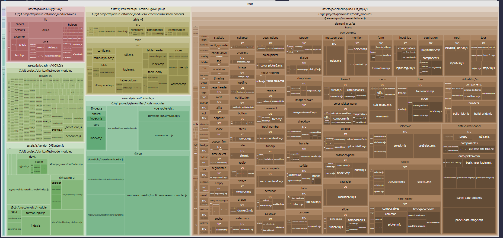

# 打包体积分析

- [打包体积分析](#打包体积分析)
  - [使用 rollup-plugin-visualizer 插件](#使用-rollup-plugin-visualizer-插件)
    - [安装](#安装)
    - [使用](#使用)

## 使用 rollup-plugin-visualizer 插件

`rollup-plugin-visualizer` 是一个用于 `Rollup` 构建工具的插件，它可以生成可视化的构建报告，帮助开发者更好地了解构建过程中的文件大小、依赖关系等信息。

使用 `rollup-plugin-visualizer` 插件，可以在构建完成后生成一个交互式的 `HTML` 报告，其中包含了构建过程中的各种统计信息，如文件大小、依赖关系、模块数量等。

[github 地址](https://github.com/btd/rollup-plugin-visualizer)

### 安装

```bash
npm install rollup-plugin-visualizer --save-dev
```

### 使用

在 `vite.config.js` 文件中引入并配置该插件：

```javascript
import { defineConfig } from 'vite';
import vue from '@vitejs/plugin-vue';
import { visualizer } from "rollup-plugin-visualizer";

export default defineConfig({
  plugins: [
    vue(),
    visualizer({
      filename: 'bundle-analysis.html', // 输出文件名
      open: true, // 构建完成后自动打开报告
      gzipSize: true, // 显示 gzip 大小
      brotliSize: true, // 显示 brotli 大小
    }),
  ],
});
```

参数说明：

- `filename`
  - (string, default stats.{ext depending template})
  - 报告的文件名
  - template 为 treemap 时，默认文件名为 `stats.html`
- `title`
  - (string, default Rollup Visualizer)
  - title tag value
- `open`
  - (boolean, default false)
  - 构建完成后是否自动打开报告
- `template`
  - (string, default treemap)
  - 使用的图表类型：sunburst、treemap、network、raw-data、list、flamegraph。
- `gzipSize`
  - (boolean, default false)
  - 收集源代码的 gzip 大小并在图表中显示。
- `brotliSize`
  - (boolean, default false)
  - 收集源代码的 brotli 大小并在图表中显示。

分析图：



- 分析图中，方块或节点的大小通常表示模块的大小。方块越大，表示该模块占用的空间越大
