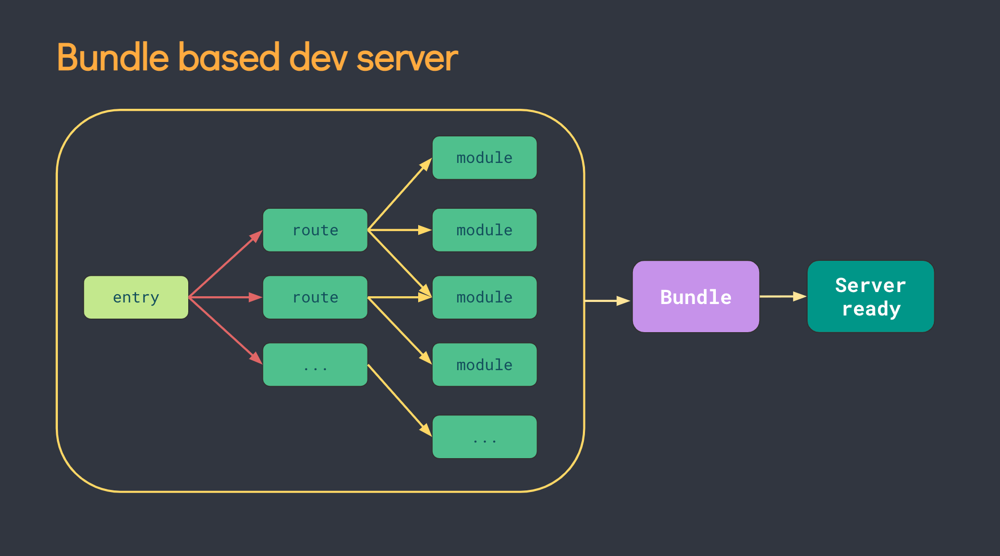
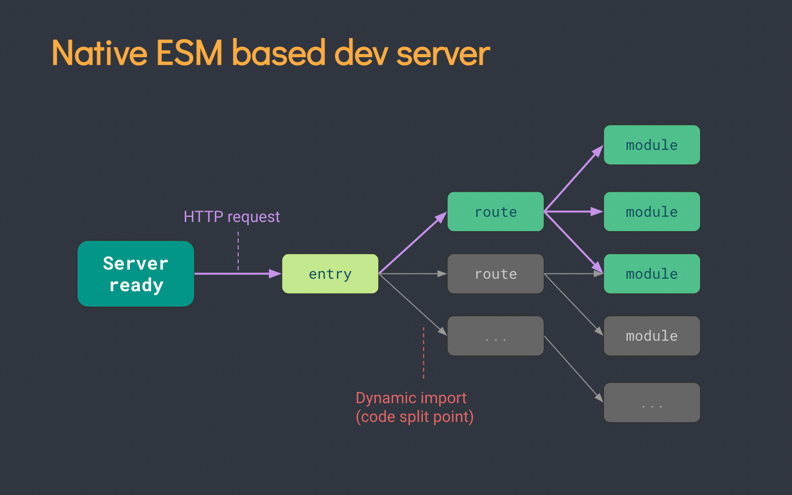

# Vite 概念与原理

- [Vite 概念与原理](#vite-概念与原理)
  - [介绍](#介绍)
    - [对比 webpack](#对比-webpack)
    - [前置知识](#前置知识)
      - [esbuild](#esbuild)
      - [Rollup](#rollup)
  - [Vite 核心原理](#vite-核心原理)
    - [基于 ESM 的 Dev server](#基于-esm-的-dev-server)
    - [基于 ESM 的 HMR 热更新](#基于-esm-的-hmr-热更新)
    - [为什么使用 esbuild?](#为什么使用-esbuild)
    - [总结](#总结)
  - [Vite 为什么比 Webpack 快](#vite-为什么比-webpack-快)
    - [比较构建方式](#比较构建方式)
    - [比较热更新](#比较热更新)
  - [为什么在生产环境下 Vite 不用 `esbuild` 而用 `Rollup` 打包](#为什么在生产环境下-vite-不用-esbuild-而用-rollup-打包)

## 介绍

Vite 是新一代的前端构建工具，特点如下：

- 快速的冷启动：`No Bundle + esbuild` 预构建
- 即时的模块热更新：基于 `ESM` 的 `HMR`，同时利用浏览器缓存策略提升速度
- 真正的按需加载：利用浏览器 `ESM` 支持，实现真正的按需加载

### 对比 webpack

Webpack 在启动时会先构建项目模块的依赖图。如果在项目中的某个地方改动了代码，Webpack 会对相关依赖重新打包；随着项目增大，打包速度会下降。

Vite 相比于 Webpack，没有先打包的过程，而是直接启动一个开发服务器（Dev Server）。它拦截浏览器的 HTTP 请求，在后端处理并将项目文件以 ESM 形式返回（整个过程不需要先打包）。因此冷启动非常快。

### 前置知识

#### esbuild

`Vite` 底层使用 `esbuild` 实现对 `.ts`、`.jsx`、`.js` 代码文件的**转化**，所以先看下什么是 `esbuild`。

`esbuild` 是一个 JavaScript bundler 和压缩工具，提供与 Webpack、Rollup 类似的资源打包能力。它可以将 JavaScript 和 TypeScript 代码打包分发在网页上运行，但打包速度通常比其他工具快 10～100 倍。

目前他支持以下的功能：

- 加载器
- 压缩
- 打包
- Tree shaking
- Source map生成

esbuild 提供的主要 API 包括 `transform`、`build`、`buildSync`、`service`。

#### Rollup

在生产环境下，`Vite` 使用 `Rollup` 来进行打包。

`Rollup` 是基于 `ESM` 的 JavaScript 打包工具，**使用 `TypeScript` 编写**。相比其他打包工具（如 Webpack），它往往能打出更小、更快的包，因为 ESM 比 CommonJS 更高效。Rollup 的亮点是 `Tree Shaking`（去除未使用代码）与 `Scope Hoisting`，以减小输出文件体积、提升运行性能。

Rollup 分为 `build`（构建）阶段和 `output generate`（输出生成）阶段。主要过程如下：

- 获取入口文件内容，包装成 module，生成抽象语法树
- 对入口文件抽象语法树进行依赖解析
- 生成最终代码
- 写入目标文件

默认会输出 `ESM`，并且通常还会输出 `UMD`

## Vite 核心原理

Vite 的核心原理是：

- 利用浏览器已支持 `ES6` 的 `import`，遇到 `import` 就会发起 `HTTP` 请求加载模块。
- `Vite` 启动一个 Koa 服务器拦截请求，在后端处理并将项目文件以 `ESM` 形式返回给浏览器。
- 整个过程不需要先打包编译，做到真正按需加载，因此开发编译速度显著快于传统 Webpack。

### 基于 ESM 的 Dev server

在 `Vite` 出来之前，传统打包工具（如 `Webpack`）通常先解析依赖、打包构建，再启动开发服务器。`Dev Server` 必须等待所有模块构建完成。当我们修改 `bundle` 中某个子模块时，整个 `bundle` 都要重新打包输出。项目越大，启动时间越长。

而 `Vite` 利用浏览器对 `ESM` 的支持：当 `import` 模块时，浏览器会下载被导入的模块。先启动开发服务器，代码执行到模块加载处再请求对应文件，本质上是动态加载。未用到的路由不会参与构建过程，因此应用规模增长时冷启动仍保持快速。

### 基于 ESM 的 HMR 热更新

实现原理：通过 `WebSocket` 建立浏览器和服务器通信，监听文件变化。当文件被修改时，服务端发送消息通知客户端更新相应模块，客户端根据不同文件进行不同的更新操作。

Vite 整个热更新过程可以分成四步：

- 创建 `WebSocket` 服务端与客户端连接，启动服务
- 通过 `chokidar` 监听文件变更
- 当代码变更后，服务端判断并推送更新到客户端
- 客户端根据推送的信息执行不同类型的更新

### 为什么使用 esbuild?

- 编译运行 vs 解释运行
  - 大多数前端打包工具基于 `JavaScript` 实现，`JavaScript` 是解释型语言，边运行边解释。`esbuild` 使用 `Go` 编写，可编译为原生代码，启动时直接执行。在 `CPU` 密集场景下，`Go` 更具性能优势。
- 多线程 vs 单线程
  - `JavaScript` 本质上是单线程语言，虽然引入 `WebWorker` 后在浏览器与 `Node` 中可实现多线程，但不少打包工具并未充分利用这一能力。`Go` 则天生具备多线程优势。
  - 构建流程更易并行化，充分利用 `CPU` 资源。

### 总结

最后总结下 Vite 的优缺点：

- 优点：
  - 快速冷启动：采用 No Bundle 和 esbuild 预构建，速度远快于 Webpack
  - 高效热更新：基于 ESM 实现，同时利用 HTTP 头加速页面重载并增加缓存策略
  - 真正按需加载：基于浏览器 ESM 支持，实现真正按需加载
- 缺点：
  - 生态：目前 Vite 生态不如 Webpack，但正在快速完善
  - 生产环境需要更成熟的打包与优化能力，因此使用 Rollup
  
## Vite 为什么比 Webpack 快

### 比较构建方式

1、webpack

当你使用 `Webpack` 打包项目时，通常会生成一个或多个 `bundle` 文件，这些文件包含应用所需的所有代码、样式和资源。你在 `HTML` 中通过 `<script>` 标签引入 `bundle`。随着项目规模增大，模块数量增加，`Webpack` 需要扫描整个依赖图并分析模块关系，这个过程会变得复杂且耗时。

2、vite

从上图可以看到，启动一个 `Vite` 项目时与 `Webpack` 不同：**`Server` 一开始就启动**，然后通过网络请求加载对应文件。`Vite` 的构建特点可以概括为：

- **基于浏览器原生 ES 模块支持**：
  - Vite 利用现代浏览器对 `ESM` 的原生支持，采用 `no bundle` 策略。启动时，每个模块都以独立文件提供给浏览器，无需先打包成一个或多个 `bundle`，从而实现快速冷启动。

- **即时编译（Instant Compilation）**：
  - Vite 采用了即时编译策略。**当浏览器请求一个模块时，Vite 会即时地将该模块编译成浏览器可执行的代码，并将编译结果缓存起来**（我们在node_modules下可以找到一个.vite文件）。
  - 下次再次请求同一模块时，Vite 可以直接返回缓存的编译结果，而不必重新编译，从而避免了冗余的编译过程，大大提高了启动速度。

- **esbuild 预构建依赖**：
  - `Go` 编写的构建工具，预构建依赖速度比以 JavaScript 编写的打包器快 10-100 倍。

### 比较热更新

1、webpack

`Webpack` 的热更新机制由 `webpack-dev-server` 提供。它是一个开发服务器，用于提供热更新、自动刷新等能力。

`webpack-dev-server` 的热更新机制基于 `WebSocket`。启动后会创建 `WebSocket` 服务器并与浏览器建立连接，监视项目文件变化并推送到浏览器，浏览器收到变化后执行更新操作，实现热更新。

具体流程如下：

1. **创建 `WebSocket` 服务器**：启动时创建 `WebSocket` 服务器并与浏览器建立连接。
2. **监听文件变化**：监听入口文件、模块文件、样式文件等变更。
3. **构建更新模块**：当文件变化时重新构建对应模块并生成更新代码。
4. **推送更新信息**：通过 `WebSocket` 推送到浏览器。
5. **浏览器端处理更新**：根据更新信息重新加载模块或更新页面内容。

2、vite

`Vite` 也使用 `WebSocket` 与浏览器通信。

当模块变化时，`Vite` 会通过 `WebSocket` 将更新信息推送给浏览器端，触发模块重载。看起来与 `Webpack` 类似，

但根据 `Vite` 官网说法，`HMR` 在原生 `ESM` 上执行。编辑文件时，`Vite` 只需精确地使已编辑模块与最近的 `HMR` 边界之间的链失活（多数情况下只是模块本身），因此无论应用大小如何，HMR 都能保持快速更新。

因此可以理解为：Vite 依赖 ESM 的能力，实现更细粒度的热更新。

## 为什么在生产环境下 Vite 不用 `esbuild` 而用 `Rollup` 打包

1. 兼容性：
   1. 生产环境仍需要考虑旧浏览器兼容性。通过打包工具可将 ESM 转换为兼容性更好的格式。
   2. 对比：`Rollup` 在多种模块格式与边界场景处理上更成熟、行为更可预测；`esbuild` 更偏速度优先，某些边界兼容需要额外处理。
2. 性能优化：
   1. 需要代码压缩、合并、分割等优化，减小体积、加快加载。
   2. 对比：`Rollup` 在 tree-shaking、代码分割与产物形态控制上更细致；`esbuild` 优化更“快速优先”，深度与精细度相对有限。
3. 资源管理：
   1. 除了 JavaScript，还包含样式、图片、字体等资源，需要打包工具统一处理与优化。
   2. 对比：`Rollup` 的插件生态更成熟，覆盖各类资源处理；`esbuild` 插件体系相对年轻，复杂资源链路常需配合其他工具。
4. 部署与发布：
   1. 需要生成部署所需的静态文件，并处理路径、缓存等配置。
   2. 对比：`Rollup` 输出配置更灵活（多入口、分包、命名、asset 管理）；`esbuild` 配置更简化，适合快速构建而非精细化产物控制。

***

v8 版本：

Rollup 已开始改进性能，在 v4 中将解析器切换到 SWC。同时正在推进一个名为 `Rolldown` 的 `Rust` 版本 `Rollup`。待 `Rolldown` 就绪后，它可在 Vite 中取代 Rollup 与 esbuild，显著提升构建性能，并减少开发与构建之间的不一致性。
