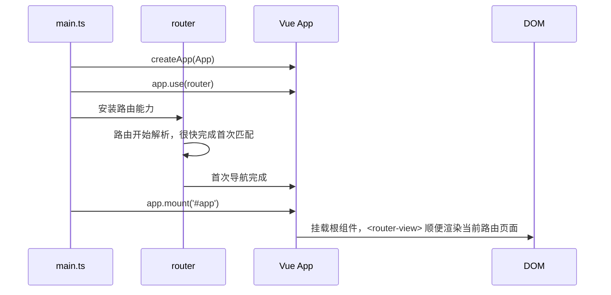
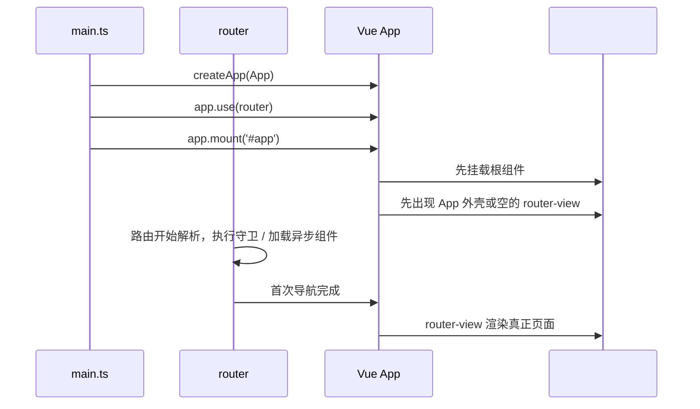

# 路由解析时序

- [路由解析时序](#路由解析时序)
  - [情况一：路由解析比 mount 快](#情况一路由解析比-mount-快)
  - [情况二：路由解析比 mount 慢](#情况二路由解析比-mount-慢)
  - [情况三：让路由先解析好，再 mount](#情况三让路由先解析好再-mount)

下面说明 Vue 应用首次启动时，`app.mount()` 和路由首次解析的时序关系。

首次启动时，可以把流程拆成三条线来看：

- `app.mount('#app')`：把根组件挂到真实 DOM
- “首次路由解析” `app.use(router);`：根据当前 URL 完成匹配、守卫、懒加载，然后让 `<router-view>` 知道该渲染谁
- `router-view` 渲染：`router-view` 组件根据路由解析结果渲染目标组件

关键点：`mount` 基本是同步动作，而首次路由解析是异步的，它可能比 `mount` 先完成，也可能比 `mount` 慢。

## 情况一：路由解析比 mount 快

典型条件：

- 路由表都是同步组件
- 没有耗时的 `beforeEach` / `beforeResolve`
- 没有异步权限校验、接口请求、懒加载等待

常见代码：

```ts
const app = createApp(App)
app.use(router)
app.mount('#app')
```

时序图：



体感上会像“刚 mount 完就立刻显示正确页面”

## 情况二：路由解析比 mount 慢

典型条件：

- 路由组件是懒加载：`() => import(...)`
- 有路由守卫，并且守卫里有异步逻辑
- 首次进入要做登录态校验、权限拉取、重定向判断

还是同样的代码：

```ts
const app = createApp(App)
app.use(router)
app.mount('#app')
```

时序更接近这样：



这时页面可能出现几种现象：

- 先看到一个空白的 `<router-view>`
- 先看到 App 的外层布局，再晚一点出现页面内容
- 如果守卫里重定向，最终显示的可能不是当前 URL 最初对应的组件，而是重定向后的组件

## 情况三：让路由先解析好，再 mount

如果想让“路由先完全准备好，再 mount”，可以这样写：

```ts
const app = createApp(App)
app.use(router)

await router.isReady()
app.mount('#app')
```

这时时序变成：

1. 安装 router
2. 等首次路由解析完成
3. 再 mount

这样不会出现“先挂空壳、后出页面”的过渡感，首屏更稳定，但首屏会整体晚一点出现。
