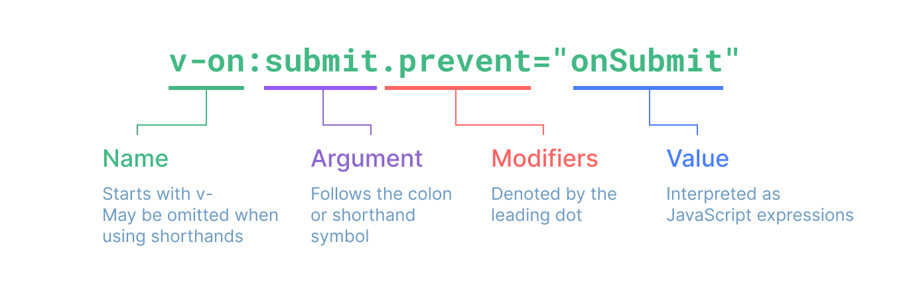

# 模板语法

- [模板语法](#模板语法)
  - [文本插值](#文本插值)
  - [原始 HTML](#原始-html)
  - [Attribute 绑定](#attribute-绑定)
    - [布尔型 Attribute](#布尔型-attribute)
    - [动态绑定多个值](#动态绑定多个值)
  - [使用 JavaScript 表达式](#使用-javascript-表达式)
    - [仅支持表达式](#仅支持表达式)
    - [调用函数](#调用函数)
    - [受限的全局访问](#受限的全局访问)
  - [指令 Directives](#指令-directives)
    - [动态参数](#动态参数)
    - [修饰符 `Modifiers`](#修饰符-modifiers)
    - [完整的指令语法](#完整的指令语法)

在底层机制中，Vue 会将模板编译成高度优化的 `JavaScript` 代码。结合响应式系统，当应用状态变更时，Vue 能够智能地推导出需要重新渲染的组件的最少数量，并应用最少的 DOM 操作。

vue 也使用 `virtual dom`。

## 文本插值

最基本的数据绑定形式是文本插值，它使用的是“Mustache”语法 (即双大括号)：

```html
<span>Message: {{ msg }}</span>
```

双大括号标签会被替换为相应组件实例中 `msg` 属性的值。同时每次 `msg` 属性更改时它也会同步更新。

## 原始 HTML

使用 **v-html** 指令插入 HTML：

```html
<p>Using text interpolation: {{ rawHtml }}</p>
<p>Using v-html directive: <span v-html="rawHtml"></span></p>
```

```txt
Using text interpolation: <span style="color: red">This should be red.</span>

Using v-html directive: This should be red. （“This should be red.” 这句话显示红色）
```

该指令做的事情简单来说就是：在当前组件实例上，将此元素的 innerHTML 与 rawHtml 属性保持同步。
>安全警告：在网站上动态渲染任意 HTML 是非常危险的，因为这非常容易造成 XSS 漏洞。请仅在内容安全可信时再使用 v-html，并且永远不要使用用户提供的 HTML 内容。

## Attribute 绑定

使用 **v-bind** 指令响应式地绑定一个 attribute

```html
<div v-bind:id="dynamicId"></div>
<div :id="dynamicId"></div>
```

`v-bind` 指令指示 Vue 将元素的 `id attribute` 与组件的 `dynamicId` 属性保持一致。如果绑定的值是 `null` 或者 `undefined`，那么该 `attribute` 将会从渲染的元素上移除。

### 布尔型 Attribute

当绑定的值为**布尔型** `Attribute`， 当属性为真值或一个空字符时，元素会包含这个 `attribute`。而当其为其他假值时 `attribute` 将被忽略。

### 动态绑定多个值

通过不带参数的 `v-bind`，你可以将它们绑定到单个元素上：

```js
const objectOfAttrs = {
  id: 'container',
  class: 'wrapper'
}

<div v-bind="objectOfAttrs"></div>
```

## 使用 JavaScript 表达式

在 Vue 模板内，JavaScript 表达式可以被使用在如下场景上：

- 在文本插值中 (双大括号)
- 在任何 Vue 指令 (以 v- 开头的特殊 attribute) attribute 的值中

```vue
{{ number + 1 }}

{{ ok ? 'YES' : 'NO' }}

{{ message.split('').reverse().join('') }}

<div :id="`list-${id}`"></div>
```

### 仅支持表达式

每个绑定仅支持单一表达式，也就是一段能够被求值的 JavaScript 代码。一个简单的判断方法是**是否可以合法地写在 return 后面**。

因此，下面的例子都是无效的：

```vue
<!-- 这是一个语句，而非表达式 -->
{{ var a = 1 }}

<!-- 条件控制也不支持，请使用三元表达式 -->
{{ if (ok) { return message } }}
```

### 调用函数

可以在绑定的表达式中使用一个组件暴露的方法：

```vue
<!-- 调用组件方法，toTitleDate 为组件方法 -->
<time :title="toTitleDate(date)" :datetime="date">
  {{ formatDate(date) }}
</time>
```

> 绑定在表达式中的方法在组件每次更新时都会被重新调用，因此不应该产生任何副作用，比如改变数据或触发异步操作。

### 受限的全局访问

模板中的表达式将被沙盒化，仅能够访问到有限的全局对象列表。

## 指令 Directives

指令是带有 `v-` 前缀的特殊 attribute。Vue 提供了许多内置指令，包括上面我们所介绍的 `v-bind` 和 `v-html`。

### 动态参数

同样在指令参数上也可以使用一个 JavaScript 表达式，需要包含在一对方括号内：

```html
<!-- 绑定属性 -->
<a v-bind:[attributeName]="url"> ... </a>
<a :[attributeName]="url"> ... </a>
<!-- 这里的 attributeName 会作为一个 JavaScript 表达式被动态执行，计算得到的值会被用作最终的参数。举例来说，如果你的组件实例有一个数据属性 attributeName，其值为 "href"，那么这个绑定就等价于 v-bind:href。 -->

<!-- 绑定事件 -->
<a v-on:[eventName]="doSomething"> ... </a>
<a @[eventName]="doSomething">
```

**动态参数值的限制**：

- 应当是一个字符串，或者是 null。特殊值 null 意为显式移除该绑定。其他非字符串的值会触发警告。

**动态参数语法的限制**：

1、因为某些字符的缘故有一些语法限制，比如空格和引号，在 HTML attribute 名称中都是不合法的。

```vue
<!-- 这会触发一个编译器警告 -->
<a :['foo' + bar]="value"> ... </a>
```

2、当使用 **DOM 内嵌模板** (直接写在 HTML 文件里的模板) 时，我们需要避免在名称中使用大写字母，因为浏览器会强制将其转换为小写。

```vue
<a :[someAttr]="value"> ... </a>
```

上面的例子将会在 DOM 内嵌模板中被转换为 `:[someattr]`。如果你的组件拥有 “someAttr” 属性而非 “someattr”，这段代码将不会工作。单文件组件内的模板不受此限制。

### 修饰符 `Modifiers`

- 修饰符是以点开头的特殊后缀，表明指令需要以一些特殊的方式被绑定。
- 例如 `.prevent` 修饰符会告知 `v-on` 指令对触发的事件调用 `event.preventDefault()`：
  
  ```html
  <form @submit.prevent="onSubmit">...</form>
  ```

### 完整的指令语法


