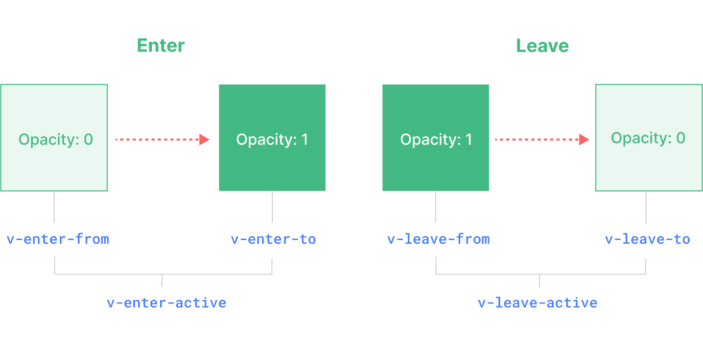

# Transition

- [Transition](#transition)
  - [`<Transition>` 组件](#transition-组件)
  - [基于 CSS 的过渡效果](#基于-css-的过渡效果)
    - [CSS 过渡 class](#css-过渡-class)
    - [为过渡效果命名](#为过渡效果命名)
    - [CSS 的 transition](#css-的-transition)
    - [CSS 的 animation](#css-的-animation)

Vue 提供了两个内置组件，可以帮助你制作基于状态变化的过渡和动画：

- `<Transition>` 会在一个元素或组件进入和离开 DOM 时应用动画。
- `<TransitionGroup>` 会在一个 `v-for` 列表中的元素或组件被插入，移动，或移除时应用动画。

除了这两个组件，我们也可以通过其他技术手段来应用动画，比如切换 CSS class 或用状态绑定样式来驱动动画。

## `<Transition>` 组件

`<Transition>` 是一个内置组件。它可以将进入和离开动画应用到*通过其默认插槽传递的元素或组件上*。进入或离开可以由以下的条件之一触发：

- 由 `v-if` 所触发的切换
- 由 `v-show` 所触发的切换
- 由特殊元素 `<component>` 切换的动态组件
- 改变特殊的 `key` 属性

例子：

> opacity 的默认值为 1。  
> 1 是完全不透明，0 是完全透明。

```vue
<script setup>
import { ref } from 'vue'

const show = ref(true)
</script>

<template>
    <div class="container">
        <transition>
            <div v-if="show" class="box">Hello, Vue 3!</div>
        </transition>
        <button @click="show = !show">Toggle</button>
    </div>
</template>

<style scoped>
.v-enter-active,
.v-leave-active {
  transition: opacity 0.5s ease;
}

.v-enter-from,
.v-leave-to {
  opacity: 0;
}
</style>
```

> `<Transition>` 仅支持单个元素或组件作为其插槽内容。如果内容是一个组件，这个组件必须仅有一个根元素。

当一个 `<Transition>` 组件中的元素被插入或移除时，会发生下面这些事情：

1. Vue 会自动检测目标元素是否应用了 CSS 过渡或动画。如果是，则一些 *CSS 过渡 class* 会在适当的时机被添加和移除。
2. 如果有作为监听器的 *JavaScript 钩子*，这些钩子函数会在适当时机被调用。
3. 如果没有探测到 CSS 过渡或动画、也没有提供 JavaScript 钩子，那么 DOM 的插入、删除操作将在浏览器的下一个动画帧后执行。

## 基于 CSS 的过渡效果

### CSS 过渡 class

一共有 6 个应用于进入与离开过渡效果的 CSS class。



- 插入元素
  1. `v-enter-from`：**进入动画的起始状态**。在元素插入之前添加，在元素插入完成后的下一帧移除
  2. `v-enter-active`：**进入动画的生效状态**。应用于整个进入动画阶段。在元素被插入之前添加，在过渡或动画完成之后移除。这个 class 可以被用来定义进入动画的持续时间、延迟与速度曲线类型。
  3. `v-enter-to`：**进入动画的结束状态**。在元素插入完成后的下一帧被添加 (也就是 `v-enter-from` 被移除的同时)，在过渡或动画完成之后移除。

- 移除元素
  1. `v-leave-from`：**离开动画的起始状态**。在离开过渡效果被触发时立即添加，在一帧后被移除。
  2. `v-leave-active`：**离开动画的生效状态**。应用于整个离开动画阶段。在离开过渡效果被触发时立即添加，在过渡或动画完成之后移除。这个 class 可以被用来定义离开动画的持续时间、延迟与速度曲线类型。
  3. `v-leave-to`：**离开动画的结束状态**。在一个离开动画被触发后的下一帧被添加 (也就是 `v-leave-from` 被移除的同时)，在过渡或动画完成之后移除。

`v-enter-active` 和 `v-leave-active` 给我们提供了为进入和离开动画指定不同速度曲线的能力，我们将在下面的小节中看到一个示例。

### 为过渡效果命名

我们可以给 `<Transition>` 组件传一个 `name` prop 来声明一个过渡效果名：

```html
<Transition name="fade">
  ...
</Transition>
```

对于一个有名字的过渡效果，对它起作用的过渡 `class` 会**以其名字而不是 `v` 作为前缀**。

比如，上方例子中被应用的 `class` 将会是 `fade-enter-active` 而不是 `v-enter-active`。这个“fade”过渡的 class 应该是这样：

```css
.fade-enter-active,
.fade-leave-active {
  transition: opacity 0.5s ease;
}

.fade-enter-from,
.fade-leave-to {
  opacity: 0;
}
```

### CSS 的 transition

`<Transition>` 一般都会搭配**原生 CSS 过渡**一起使用

下面是一个更高级的例子，它使用了不同的持续时间和速度曲线来过渡多个属性：

```vue
<script setup>
import { ref } from 'vue'

const show = ref(true)
</script>

<template>
    <div class="container">
        <Transition name="slide-fade">
            <div v-if="show" class="box">Hello, Vue 3!</div>
        </Transition>
        <button @click="show = !show">Toggle</button>
    </div>
</template>

<style scoped>
/*
  进入和离开动画可以使用不同
  持续时间和速度曲线。
*/
.slide-fade-enter-active {
  transition: all 0.3s ease-out;
}

.slide-fade-leave-active {
  transition: all 0.8s cubic-bezier(1, 0.5, 0.8, 1);
}

.slide-fade-enter-from,
.slide-fade-leave-to {
  transform: translateX(20px); /* 向右移动 20 px */
  opacity: 0;
}
</style>
```

### CSS 的 animation

> 原生 CSS 动画和 CSS transition 的应用方式基本上是相同的，只有一点不同，那就是 `*-enter-from` 不是在元素插入后立即移除，而是在一个 `animationend` 事件触发时被移除。

使用步骤：

1. 定义一个 CSS animation。
2. 在 `*-enter-active` 和 `*-leave-active` class 下声明这个 animation。

下面是一个示例：

```vue
<script setup>
import { ref } from 'vue'

const show = ref(true)
</script>

<template>
	<button @click="show = !show">Toggle</button>
  <Transition name="bounce">
    <!-- 这里要设置 'text-align: center;' 这样动画才能正常显示。如果没有设置 center，那么就要设置 'transform-origin: left center' 更改变换的原点 -->
    <p v-if="show" style="margin-top: 20px; text-align: center;">
      Hello here is some bouncy text!
    </p>
  </Transition>
</template>

<style>
.bounce-enter-active {
  animation: bounce-in 0.5s;
}
.bounce-leave-active {
  animation: bounce-in 0.5s reverse;
}
@keyframes bounce-in {
  0% {
    transform: scale(0);
  }
  50% {
    transform: scale(1.25);
  }
  100% {
    transform: scale(1);
  }
}
</style>
```
