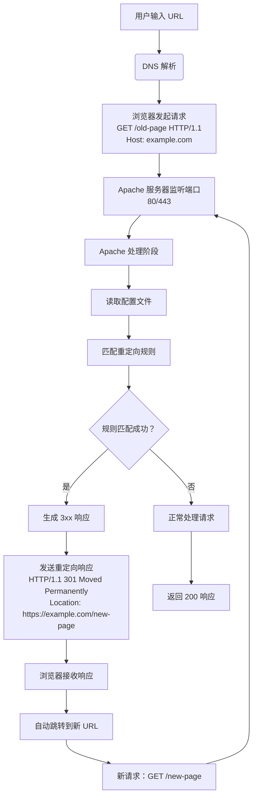

# 服务器

- [服务器](#服务器)
  - [介绍](#介绍)
  - [Nginx 与 IIS 重定向区别对比](#nginx-与-iis-重定向区别对比)
    - [完整请求处理流程（纯 Apache 重定向）](#完整请求处理流程纯-apache-重定向)
    - [详细处理阶段（Apache 内部工作流程）](#详细处理阶段apache-内部工作流程)
    - [Apache 重定向关键技术点](#apache-重定向关键技术点)
    - [典型重定向场景示例](#典型重定向场景示例)
    - [性能优化建议](#性能优化建议)
    - [完整工作流程总结](#完整工作流程总结)

## 介绍

服务器的种类：

- IIS
- Apache
- Nginx
- Azure

## Nginx 与 IIS 重定向区别对比

好的，当您只使用 Apache 进行重定向时，从用户输入 URL 到完成重定向的完整流程如下（假设用户访问 `http://example.com/old-page`）：

### 完整请求处理流程（纯 Apache 重定向）



### 详细处理阶段（Apache 内部工作流程）

1. **接收请求阶段**
   - Apache 监听端口（通常 80/443）接收到 TCP 连接
   - 解析 HTTP 请求头：

     ```txt
     GET /old-page HTTP/1.1
     Host: example.com
     User-Agent: ...
     ```

2. **配置读取阶段**
   - 按顺序加载配置文件：
     - `httpd.conf` 主配置文件
     - 虚拟主机配置（`<VirtualHost>`）
     - `.htaccess` 文件（如果启用）
   - 激活 `mod_rewrite` 模块（重定向核心模块）

3. **重定向规则匹配阶段**
   - **示例配置**：

     ```apache
     # httpd.conf 或 .htaccess
     RewriteEngine On
     RewriteRule ^old-page$ /new-page [R=301,L]
     ```

   - 匹配过程：
     1. 检查请求 URI (`/old-page`)
     2. 应用正则表达式 `^old-page$`
     3. 匹配成功 → 触发重定向规则

4. **重定向响应生成阶段**
   - 构建 301 响应：

     ```txt
     HTTP/1.1 301 Moved Permanently
     Location: https://example.com/new-page
     Content-Type: text/html
     
     <!DOCTYPE HTML>...重定向页面...
     ```

   - 关键参数：
     - `R=301`：指定 HTTP 状态码
     - `L`：Last 标志（停止处理后续规则）

5. **发送响应阶段**
   - 通过 TCP 连接发送 HTTP 响应
   - 保持或关闭连接（根据 Keep-Alive 配置）

6. **浏览器处理阶段**
   - 接收到 301/302 状态码
   - 自动读取 `Location` 头部
   - 发起新请求到 `https://example.com/new-page`

7. **二次请求处理**
   - Apache 接收到新请求 `/new-page`
   - 不再匹配重定向规则
   - 正常处理请求（返回页面内容）

### Apache 重定向关键技术点

1. **核心模块**：
   - `mod_rewrite`：最强大的重定向模块（支持正则、条件判断）
   - `mod_alias`：提供简单指令（Redirect, RedirectMatch）

2. **配置位置优先级**：

   ```apache
   # 1. 主配置文件 (最高优先级)
   <VirtualHost *:80>
     RewriteRule ^/legacy /new-system [R=301]
   </VirtualHost>
   
   # 2. 目录配置 (.htaccess)
   # /var/www/site/.htaccess
   RewriteRule ^old-path /new-path [R=302]
   
   # 3. Location 块 (最具体)
   <Location "/special">
     Redirect 301 /special/page /new-special
   </Location>
   ```

3. **常用重定向方法对比**：

   | 方法| 示例| 适用场景|
   |--|--|--|
   | **RewriteRule**     | `RewriteRule ^old$ new [R=301,L]`    | 复杂正则匹配/条件重定向      |
   | **Redirect**        | `Redirect 301 /old /new`             | 简单路径重定向               |
   | **RedirectMatch**   | `RedirectMatch 302 "/user/(.*)" "/u/$1"` | 正则表达式匹配重定向      |
   | **mod_rewrite 条件**| `RewriteCond %{HTTPS} off`<br>`RewriteRule ^ https://%{HTTP_HOST}%{REQUEST_URI} [R,L]` | 复杂条件判断重定向 |

4. **调试技巧**：

   ```apache
   # 启用重写日志
   RewriteLogLevel 3
   RewriteLog "/path/to/rewrite.log"
   
   # 日志示例：
   # [rewrite:trace2] applying pattern '^old-page$' to uri '/old-page'
   # [rewrite:trace1] pass through /old-page
   # [rewrite:trace1] [perdir] forcing redirect with https://example.com/new-page
   ```

### 典型重定向场景示例

1. **HTTP → HTTPS 强制跳转**：

   ```apache
   RewriteEngine On
   RewriteCond %{HTTPS} off
   RewriteRule ^ https://%{HTTP_HOST}%{REQUEST_URI} [R=301,L]
   ```

2. **域名标准化**：

   ```apache
   RewriteCond %{HTTP_HOST} ^www\.example\.com [NC]
   RewriteRule ^(.*)$ https://example.com/$1 [R=301,L]
   ```

3. **路径迁移**：

   ```apache
   RedirectMatch 301 ^/products/([0-9]+)$ /new-products/$1
   ```

4. **带参数重定向**：

   ```apache
   RewriteCond %{QUERY_STRING} ^id=([0-9]+)$
   RewriteRule ^item\.php$ /products/%1? [R=301,L]
   ```

### 性能优化建议

1. **规则顺序优化**：

   ```apache
   # 将高频重定向放在前面
   RewriteRule ^contact-us$ /contact [R=301,L]  # 高频页面
   RewriteRule ^about/legacy$ /about [R=301,L]  # 低频页面
   ```

2. **避免正则回溯**：

   ```apache
   # 优化前（可能回溯）
   RewriteRule ^(.*)/old$ /new/$1 [R=301,L]
   
   # 优化后（更高效）
   RewriteRule ^([^/]+)/old$ /new/$1 [R=301,L]
   ```

3. **利用缓存**：

   ```apache
   # 设置长期缓存的重定向
   <FilesMatch "\.(redirects)$">
     Header set Cache-Control "max-age=31536000, immutable"
   </FilesMatch>
   ```

### 完整工作流程总结

1. **请求入口**：Apache 监听端口接收请求
2. **配置加载**：按优先级加载所有重定向规则
3. **规则匹配**：顺序匹配 RewriteRule/Redirect 等规则
4. **响应生成**：匹配成功则生成 3xx 响应（含 Location 头）
5. **连接处理**：发送响应并管理 TCP 连接状态
6. **客户端跳转**：浏览器自动跳转到新地址
7. **二次处理**：新请求由 Apache 正常处理

这种纯 Apache 方案相比 IIS+Apache 混合架构有以下优势：

- 减少网络跳转（无需浏览器二次解析）
- 降低配置复杂度
- 统一日志管理
- 更好的性能（单层处理）
- 避免重定向循环风险

通过合理配置 Apache 的 `mod_rewrite` 和 `mod_alias`，您可以实现从简单到复杂的各种重定向需求，完全替代 IIS 的重定向功能。
