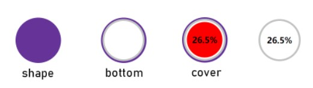
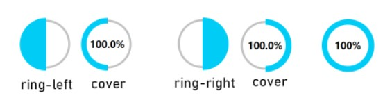
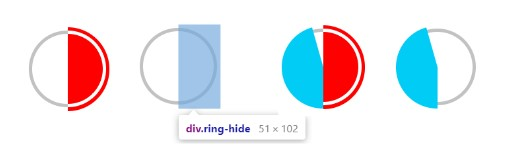
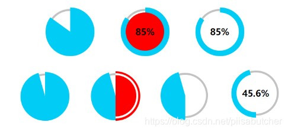

# css 实现功能

- [css 实现功能](#css-实现功能)
  - [单行、多行文本显示省略号](#单行多行文本显示省略号)
  - [实现两栏](#实现两栏)
  - [实现三栏](#实现三栏)
  - [图片居中](#图片居中)
  - [图片旋转](#图片旋转)
  - [实现百分比环形图](#实现百分比环形图)

## 单行、多行文本显示省略号

1. 单行显示文本，超出显示省略号，很容易实现（需要加宽度 `width` 属来兼容部分浏览）：

    ```css
    width:200px;
    overflow: hidden;
    text-overflow:ellipsis;
    white-space: nowrap;
    ```

2. 多行文本显示，限制行数，超出显示省略号，如下实现：

    ```css
    width:200px;
    display: -webkit-box;
    -webkit-box-orient: vertical;
    -webkit-line-clamp: 3;
    overflow: hidden;
    ```

## 实现两栏

```html
	<body>
		<div class="outer">
			<div class="left">123</div>
			<div class="right">right</div>
		</div>
	</body>
```

（1）利用**浮动**，将左边元素宽度设置为200px，并且设置向左浮动。将右边元素的margin-left设置为200px，宽度设置为auto（默认为auto，撑满整个父元素）

```css
.outer {
  height: 100px;
}

.left {
  float: left;

  height: 100px;
  width: 200px;

  background: tomato;
}

.right {
  margin-left: 200px;

  width: auto;
  height: 100px;

  background: gold;
}
```

（2）第二种是利用 **flex 布局**，将左边元素的放大和缩小比例设置为 0，基础大小设置为 200px 。将右边的元素的放大比例设置为 1 ，缩小比例设置为 1 ，基础大小设置为auto。

```css
.outer {
  display: flex;

  height: 100px;
}

.left {
  flex-shrink: 0;
  flex-grow: 0;
  flex-basis: 200px;

  background: tomato;
}

.right {
  flex: auto;
  /*11auto*/

  background: gold;
}
```

（3）第三种是利用 **绝对定位** 布局的方式，  
将父级元素设置相对定位。左边元素设置为 absolute 定位，并且宽度设置为 200px。将右边元素的 margin-left 的值设置为200px。

```css
.outer {
  position: relative;

  height: 100px;
}

.left {
  position: absolute;

  width: 200px;
  height: 100px;

  background: tomato;
}

.right {
  margin-left: 200px;
  height: 100px;

  background: gold;
}
```

（4）第四种还是利用**绝对定位**的方式，  
将父级元素设置为相对定位。左边元素宽度设置为 200px，**右边元素设置为绝对定位**，左边定位为 200px，其余方向定位为0。

```css
.outer {
  position: relative;

  height: 100px;
}

.left {
  width: 200px;
  height: 100px;

  background: tomato;
}

.right {
  position: absolute;

  top: 0;
  right: 0;
  bottom: 0;
  left: 200px;

  background: gold;
}
```

## 实现三栏

```html
	<body>
		<div class="outer">
			<div class="left">123</div>
			<div class="center">
				center
			</div>
			<div class="right">
				<div>
					<button>test</button>
				</div>
			</div>
		</div>
	</body>
```

(1) **绝对布局**。中间和右边设置 position: absolute

```css
		.outer {
			height: 200px;
			position: relative;
		}
		.left {
			height: 100%;
			background-color: antiquewhite;
			width: 150px
		}
		.right {
			background-color: red;
			height: 100%;
			width: 80px;
			
			position: absolute;
			top: 0;
			right: 0;
		}
		.center {
			background-color: dodgerblue;
			
			position: absolute;
			left: 150px;
			top: 0;
			bottom: 0;
			right: 80px;
		}
```

(2) **绝对布局**。左边和右边设置 position: absolute

```css
.outer {
  position: relative;
  height: 100px;
}

.left {
  position: absolute;

  width: 100px;
  height: 100px;
  background: tomato;
}

.right {
  position: absolute;
  top: 0;
  right: 0;

  width: 200px;
  height: 100px;
  background: gold;
}

.center {
  margin-left: 100px;
  margin-right: 200px;
  height: 100px;
  background: lightgreen;
}
```

(3) **flex布局**的方式。左右两栏的放大和缩小比例都设置为0，基础大小设置为固定的大小，中间一栏设置为auto

```css
.outer {
  display: flex;
  height: 100px;
}

.left {
  flex: 0 0 100px;
  background: tomato;
}

.right {
  flex: 0 0 200px;
  background: gold;
}

.center {
  flex: auto;
  background: lightgreen;
}
```

(4) **浮动**的方式。左右两栏设置固定大小，并设置对应方向的浮动。中间一栏设置左右两个方向的margin值，注意这种方式，**中间一栏必须放到最后**。

```html
	<body>
		<div class="outer">
			<div class="left">123</div>
			
			<div class="right">
				<div>
					<button>test</button>
				</div>
			</div>
			<div class="center">
				center
			</div>
		</div>
	</body>
```

```css
.outer {
  height: 100px;
}

.left {
  float: left;
  width: 100px;
  height: 100px;
  background: tomato;
}

.right {
  float: right;
  width: 200px;
  height: 100px;
  background: gold;
}

.center {
  height: 100px;
  margin-left: 100px;
  margin-right: 200px;
  background: lightgreen;
}
```

(5) 圣杯布局。利用**浮动和负边距**来实现。

- 父级元素设置左右的 padding，
- 三列均设置向左浮动，**中间一列放在最前面**，宽度设置为父级元素的宽度，因此后面两列都被挤到了下一行，
- 通过设置 margin 负值将其移动到上一行，
- 再利用相对定位，定位到两边

```html
		<div class="outer">
			<div class="center">
				center
			</div>
			<div class="left">123</div>
			<div class="right">
				<div>
					<button>test</button>
				</div>
			</div>
		</div>
```

```css
.outer {
  height: 100px;
  padding-left: 100px;
  padding-right: 200px;
}

.left {
  position: relative;
  left: -100px;  /* 因为父级元素设置了 padding，所以需要设置 left 移动到边框处 */

  float: left;
  margin-left: -100%;  /* 移动到上一行 */

  width: 100px;
  height: 100px;
  background: tomato;
}

.right {
  position: relative;
  left: 200px;

  float: right;
  margin-left: -200px;

  width: 200px;
  height: 100px;
  background: gold;
}

.center {
  float: left;

  width: 100%;
  height: 100px;
  background: lightgreen;
}
```

(6) 双飞翼布局

- 双飞翼布局相对于圣杯布局来说，左右位置的保留是通过中间列的 margin 值来实现的。  
- 即 wrapper 占一行，left 和 right 都是下一行的，但是通过 float 、 position: relative 和 margin 等设置移动到上一行。
- center 通过设置 margin 来产生左右两边的空间

```html
<div class="outer">
    <div class="wrapper">
      <div class="center">圣杯-middle</div>
    </div>
    <div class="left">圣杯-left</div>
    <div class="right">圣杯-right</div>
</div>
```

```css
.outer {
  height: 100px;
}

.left {
  float: left;
  margin-left: -100%;

  width: 100px;
  height: 100px;
  background: tomato;
}

.right {
  float: left;
  margin-left: -200px;

  width: 200px;
  height: 100px;
  background: gold;
}

.wrapper {
  float: left;

  width: 100%;
  height: 100px;
  background: lightgreen;
}

.center {
  margin-left: 100px;
  margin-right: 200px;
  height: 100px;
}
```

(7) **grid 布局**也可以

```css
		.left {
			height: 100%;
			background-color: antiquewhite;
			width: 100px;
			
			grid-column: 1 / 1;
		}
		.right {
			background-color: red;
			height: 100%;
			width: 200px;
			
			grid-column: 3 / 3;
		}
		.center {
			background-color: dodgerblue;
			
			grid-column: 2 / 2;
		}
		
		.outer {
			display: grid;
			grid-template-columns: 100px auto 200px;
			grid-template-rows: 200px
		}
```

## 图片居中

图片居中：

```css
  position: absolute;
  top: 0;
  left: 0;
  right: 0;
  bottom: 0;
  margin: auto;
```

图片左右居中：

```css
  position: absolute;
  left: 0;
  right: 0;
  margin: auto;
```

## 图片旋转

通过 `animation-play-state` 设置动画的播放状态，通过 添加 class 开始动画

```css
	.detail-play image {
		/* 设置图片暂停旋转 */
		animation: 10s liner move infinite;
		animation-play-state: paused;
	}
	/* 设置图片旋转 */
	.detail-play .detail-play-run {
		animation-play-state: running;
	}
	@keyframes move {
		from {
			transform: rotate(0deg);
		}
		to {
			transform: rotate(360deg);
		}
	}
```

```html
<div class="detail-play">
  <image :src="songDetail.al.picUrl" :class="{ 'detail-play-run': isPlayRotate }"></image>
</div>
```

## 实现百分比环形图

**第1层**，绘制饼图（shape）和灰色细环部分（bottom），其中shape是根元素，所有元素都将相对shape做绝对定位。根据原型图的显示效果，对bottom的定位做一定的调整，如图所示：



shape 的背景色为紫色只是用于高亮，实际颜色应为白色。

bottom 为灰色细环

cover 为显示文字的 div

**第2层**，绘制左环（ring-left）和右环（ring-right），如图所示：



**第3层**，绘制遮罩环（.ring-hide），调整与第1层的环吻合，用于遮住右环和转动到右边区域的左环部分，制作出扇形图的效果，如图所示：



**第4层**，显示百分比值的圆（.cover)，层级最高，放在中间做遮罩，制作出环状效果。如图所示：



从以上几个图可以看出两种情况（**靠这个理解**）：

- 当百分比值大于50时，遮罩层不显示，右环显示，转动左环，左环跟右环部分重叠。
- 当百分比值小于50时，遮罩层显示，转动左环，遮罩层遮住全部的右环和部分左环，显示出扇形环的效果。

```html
<!DOCTYPE html>
<html>
	<head>
		<meta charset="utf-8" />
		<title></title>
	</head>
	<body>
		<div class="shape">
			<div class="bottom"></div>
			<div class="cover">100%</div>
			<div class="ring-left"></div>
			<div class="ring-right"></div>
			<div class="ring-hide">
				<div></div>
			</div>
		</div>

	</body>
	<script>
		function setPercentValue(value) {
			let cover = document.querySelector('.shape>.cover'),
				left = document.querySelector('.shape>.ring-left'),
				hide = document.querySelector('.shape>.ring-hide');
			let deg; //左环转动角度
			if (Number.isNaN(value) || value < 0) value = 0;
			if (value > 100) value = 100;
			if (value % 1 !== 0) { //若value为小数，保留一位小数
				value = value.toFixed(1);
			}
			cover.innerText = value + "%";
			if (value < 50) { //值小于50，显示遮罩
				hide.style.display = "inherit";
				deg = (50 - value) / 50 * 180;
			} else { //值大于或等于50，不显示遮罩
				hide.style.display = "none";
				deg = (50 - (value - 50)) / 50 * 180;
			}
			left.style.transform = "rotate(" + (-deg) + "deg)";
		}
		setPercentValue(50);
	</script>
</html>

<style>
	.shape {
		width: 100px;
		height: 100px;
		text-align: center;
		line-height: 100px;
		border-radius: 50%;
		font-weight: bold;
		color: #fff;
		position: relative;
	}

	.shape>div {
		position: absolute;
	}

	.shape>.bottom {
		width: 85px;
		height: 85px;
		border-radius: 50%;
		background-color: #fff;
		border: 4px solid #c0c3c2;
		top: 3px;
		left: 3px;
	}

	.shape>.cover {
		border-radius: 50%;
		width: 79px;
		height: 79px;
		background-color: #FFF;
		z-index: 10;
		top: 10px;
		left: 10px;
		color: #000;
		line-height: 79px;
		font-size: 18px;
	}

	.shape>.ring-left {
		width: 50px;
		height: 100px;
		border-radius: 50px 0 0 50px;
		background-color: #00ccf6;
		transform-origin: right center;
		transform: rotate(0deg);
	}

	.shape>.ring-right {
		width: 50px;
		height: 100px;
		border-radius: 0 50px 50px 0;
		background-color: #00ccf6;
		left: 50px;
		transform-origin: left center;
		transform: rotate(0deg);
	}

	.shape>.ring-hide {
		z-index: 9;
		border-radius: 0 51px 51px 0;
		width: 52px;
		height: 102px;
		background-color: #fff;
		top: -1px;
		left: 49px;
		transform-origin: left center;
		display: none;
		transform: rotate(0deg);
	}

	.shape>.ring-hide>div {
		z-index: 10;
		border-radius: 0 50px 50px 0;
		width: 43px;
		height: 85px;
		background-color: transparent;
		top: 4px;
		left: 0px;
		color: #000;
		line-height: 85px;
		position: absolute;
		border: 4px solid #c0c3c2;
		border-left: 0;
	}
</style>
```
