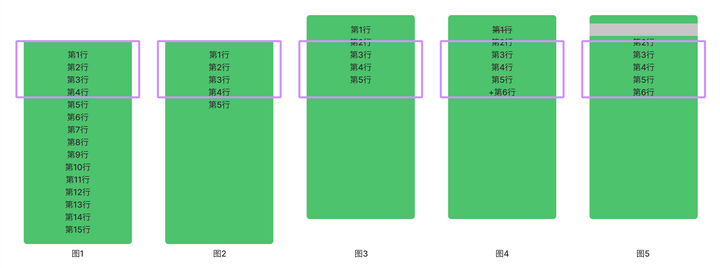

# 虚拟列表

## 原理



图1 展示了未使用虚拟长列表的原始状态。假设列表原始长度为15（也可能数十万），绿色区域为包裹列表的容器，紫色窗口为可视区域。不管列表实际有多少，用户能看到的只是紫色可视窗口透出的区域。

图2～图5 展示了使用虚拟长列后用户滚动的过程和效果。

- 在图2里，我们**设置列表容器的高度**（绿色背景）使其和图1（未使用虚拟列表）保持一致，但实际存放的DOM节点只有紫色窗口能容纳的个数(图中是4个)。
- 当用户滚动一小段距离（如图3所示）后，第1行和第2行的一半被遮盖，第5行之后后的空白漏出。此时，可**获取滚动的距离，根据滚动距离和每行的高度计算出被滚出可视区域的行数**。
- 如图4所示， 我们需要**删除被滚出可视区的DOM（第1行）**，同时**新增需要展现的DOM（第6行）**。
- 在删除隐藏的DOM后**设置绿色容器的上padding**，来填充删除DOM留下的空缺(图5灰色部分为新增的paddingTop)，来保证透过可是区域的DOM节点视觉上没有发生位置变动。

如果使用了Vue或者React，删除隐藏的DOM，同时新增需要展现的DOM 的操作只需要设置数据即可(如：`[1,2,3,4,5]` 换成 `[2,3,4,5,6]` )。

## vue3 实现

```vue
<template>
  <div class="container" @scroll="onScroll" ref="container">
    <div class="panel" ref="panel" :style="{ paddingTop: paddingTop + 'px' }">
      <div class="item" v-for="item in visibleList" :key="item">{{ item }}</div>
    </div>
  </div>
</template>

<script>
import { ref, computed, onMounted } from "vue";

export default {
  setup() {
    let container = ref(null),
      panel = ref(null); //列表容器DOM
    let buffTop = 10,
      buffBottom = 10,
      count = 0; //实际渲染DOM的列表数量
    
    // 构造的长列表原始数据  
    let raw = Array(100000)
      .fill(0)
      .map((v, i) => `item-${i}`);
    
    let start = ref(0), //从长列表数组总截取数据的起点 
      end = ref(1); //从长列表数组总截取数据的终点
    let itemHeight = 1; //单个列表项的高度
    let paddingTop = ref(0); //列表容器的上内边距
    let visibleList = computed(() => raw.slice(start.value, end.value)); //根据起点和终点获取要渲染的数据

    // 在mounted后设置列表容器的高度
    onMounted(() => {
      itemHeight = panel.value.firstElementChild.offsetHeight;
      panel.value.style.height = raw.length * itemHeight + "px";
      count = Math.floor(container.value.offsetHeight / itemHeight);
      end.value = count + buffBottom;
    });

    let timer = null;
    // 滚动-->根据滚动距离计算起点和终点的下标-->计算属性得到visibleList-->真实DOM被替换 同时设置paddingTop让元素视觉上没跳动
    const onScroll = function (e) {
      if (timer) clearTimeout(timer);
      timer = setTimeout(() => {
        let startValue = Math.floor(e.target.scrollTop / itemHeight);
        let buff = startValue > buffTop ? buffTop : startValue;
        start.value = startValue - buff;  //当滚动后，重新计算起点的位置
        end.value = startValue + count + buffBottom; // 设置终点的位置
        paddingTop.value = start.value * itemHeight;
      }, 200);
    };

    return {
      visibleList,
      paddingTop,
      container,
      panel,
      onScroll,
    };
  },
};
</script>

<style>
* {
  box-sizing: border-box;
  margin: 0;
}
.container {
  height: 100vh;
  overflow: scroll;
}
.panel {
  border: 1px solid red;
}
.item {
  border: 1px solid #eee;
  padding: 6px 10px;
  cursor: pointer;
}
</style>
```
