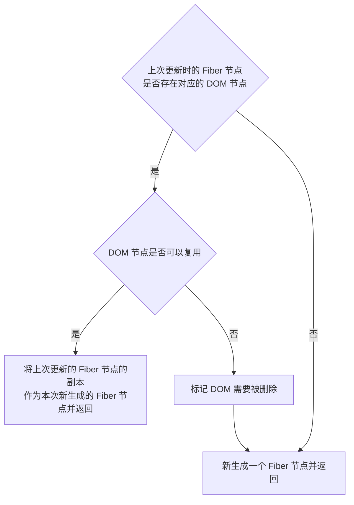

# 实现

- [实现](#实现)
  - [Diff 算法](#diff-算法)
    - [概览](#概览)
      - [Diff是如何实现的](#diff是如何实现的)
    - [单节点 Diff](#单节点-diff)
    - [多节点 Diff](#多节点-diff)

## Diff 算法

### 概览

在 `render` 阶段的 `beginWork` 阶段的 `reconcileChildren()` 方法里面，对于 `update` 的组件，他会将当前组件与该组件在上次更新时对应的 `Fiber` 节点比较（也就是俗称的 Diff算法），将比较的结果生成新 `Fiber` 节点。

> 一个DOM节点在某一时刻最多会有4个节点和他相关。  
> 1、`current Fiber`。如果该DOM节点已在页面中，current Fiber代表该DOM节点对应的Fiber节点。  
> 2、`workInProgress Fiber`。如果该DOM节点将在本次更新中渲染到页面中，workInProgress Fiber代表该DOM节点对应的Fiber节点。  
> 3、`DOM` 节点本身。  
> 4、`JSX` 对象。即 ClassComponent 的 render 方法的返回结果，或 FunctionComponent 的调用结果。JSX 对象中包含描述 DOM 节点的信息。  
> **Diff算法的本质是对比1和4，生成2**。

为了降低算法复杂度，**React的 diff 会预设三个限制（即 Diff 的规则）**：

1. 只对同级元素进行 `Diff` 。如果一个 `DOM` 节点在前后两次更新中跨越了层级，那么 `React` 不会尝试复用他。
2. 两个不同类型的元素会产生出不同的树。如果元素由 `div` 变为 `p` ， `React` 会销毁 `div` 及其子孙节点，并新建 `p` 及其子孙节点。
3. 开发者可以通过 `key prop` 来暗示哪些子元素在不同的渲染下能保持稳定。

#### Diff是如何实现的

我们从 `Diff` 的入口函数 `reconcileChildFibers` 出发，该函数会根据 `newChild` （即 JSX 对象）类型调用不同的处理函数，最后返回 `Fiber` 节点

``` js
// 根据newChild类型选择不同diff函数处理
function reconcileChildFibers(
  returnFiber: Fiber,
  currentFirstChild: Fiber | null,
  newChild: any, // 需要创建 Fiber 节点的 JSX
): Fiber | null {
  const isObject = typeof newChild === 'object' && newChild !== null;
  // 单节点处理
  if (isObject) {
    // object类型，可能是 REACT_ELEMENT_TYPE 或 REACT_PORTAL_TYPE
    switch (newChild.$$typeof) {
      case REACT_ELEMENT_TYPE:
        // 调用 reconcileSingleElement 处理
      // // ...省略其他case
    }
  }
  if (typeof newChild === 'string' || typeof newChild === 'number') {
    // 调用 reconcileSingleTextNode 处理
    // ...省略
  }
  // 多节点处理
  if (isArray(newChild)) {
    // 调用 reconcileChildrenArray 处理
    // ...省略
  }
  // ...省略
  // 以上都没有命中，删除节点
  return deleteRemainingChildren(returnFiber, currentFirstChild);
}
```

### 单节点 Diff

对于单个节点，我们以类型 `object` 为例，会进入 `reconcileSingleElement`，流程如下：



判断 `DOM` 节点是否可以复用的规则：

- 首先判断是否有对应的 `DOM` 节点，然后判断 `key` 是否相同，如果 `key` 相同则判断 `type` 是否相同，只有都相同时一个 `DOM` 节点才能复用。

标记 `DOM` 删除的条件（child 是 current Fiber 树的 Fiber 节点）：

- 当 `child !== null` 且 `key` 相同且 `type` 不同时执行 `deleteRemainingChildren` 将 `child` 及其兄弟 `fiber` 都标记删除。
  - （key 是唯一的，如果相同的话代表当前 DOM 节点就是当前更新节点对应的节点的位置，如果 type 不一样代表当前 DOM 节点不一样，需要删除。因为 key 是唯一的，所以当前 DOM 节点的兄弟节点不可能出现 key 一样的节点，所以兄弟节点都要删除）
- 当 `child !== null` 且 `key` 不同时仅将 `child` 标记删除。 `key` 不同就删除当前的节点

### 多节点 Diff

需要处理的情况：

1. 节点更新。节点属性变化、节点类型更新
2. 节点新增或减少
3. 节点位置变化
