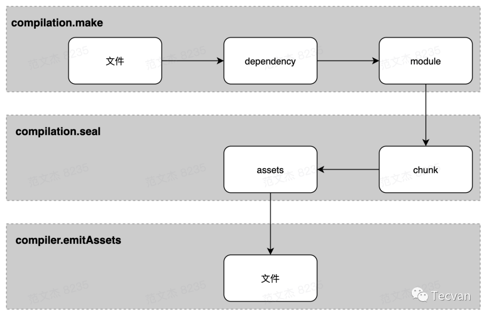

# webpack

- [webpack](#webpack)
  - [核心原理解析](#核心原理解析)
    - [资源形态流转](#资源形态流转)
  - [tree-shaking 的原理](#tree-shaking-的原理)
    - [收集模块导出](#收集模块导出)
    - [标记模块导出](#标记模块导出)
    - [生成代码](#生成代码)
    - [删除 Dead Code](#删除-dead-code)
  - [概念](#概念)
    - [`bundle` 通常与构建完成的 `chunk` 为一对一的关系](#bundle-通常与构建完成的-chunk-为一对一的关系)
    - [chunk](#chunk)
  - [工作流程](#工作流程)
    - [1. 初始化参数](#1-初始化参数)
    - [2. 开始编译](#2-开始编译)
    - [3. 确定入口](#3-确定入口)
    - [4. 编译模块](#4-编译模块)
    - [5. 完成模块编译](#5-完成模块编译)
    - [6. 输出资源](#6-输出资源)
    - [7. 输出完成](#7-输出完成)
  - [打包文件的整体分析。构建后的 JS 产物怎么处理模块导入和依赖关系](#打包文件的整体分析构建后的-js-产物怎么处理模块导入和依赖关系)

## 核心原理解析

webpack 工作流程包含三个阶段：

1. 初始化阶段：
   1. **初始化参数**：从配置文件、 配置对象、Shell 参数中读取，与默认配置结合得出最终的参数
   2. **创建编译器对象**：用上一步得到的参数创建 `Compiler` 对象
   3. **初始化编译环境**：包括注入内置插件、注册各种模块工厂、初始化 RuleSet 集合、加载配置的插件等
   4. **开始编译**：执行 `compiler` 对象的 `run` 方法
   5. **确定入口**：根据配置中的 `entry` 找出所有的入口文件，调用 `compilition.addEntry` 将入口文件转换为 `dependence` 对象
2. 构建阶段：
   1. **编译模块(make)**：根据 `entry` 对应的 `dependence` 创建 `module` 对象，调用 `loader` 将模块转译为标准 `JS` 内容，调用 `JS` 解释器将内容转换为 `AST` 对象，从中找出该模块依赖的模块，再 递归 本步骤直到所有入口依赖的文件都经过了本步骤的处
   2. **完成模块编译**：上一步递归处理所有能触达到的模块后，得到了每个模块被翻译后的内容以及它们之间的 依赖关系图
3. 生成阶段：
   1. **输出资源(seal)**：根据入口和模块之间的依赖关系，组装成一个个包含多个模块的 `Chunk`，再把每个 `Chunk` 转换成一个单独的文件加入到输出列表，这步是可以修改输出内容的最后机会
   2. **写入文件系统(emitAssets)**：在确定好输出内容后，根据配置确定输出的路径和文件名，把文件内容写入到文件系统

概念：

- `Entry`：编译入口，webpack 编译的起点
- `Compiler`：编译管理器，webpack 启动后会创建 compiler 对象，该对象一直存活知道结束退出
- `Compilation`：单次编辑过程的管理器，比如 watch = true 时，运行过程中只有一个 compiler 但每次文件变更触发重新编译时，都会创建一个新的 compilation 对象
- `Dependence`：依赖对象，webpack 基于该类型记录模块间依赖关系
- `Module`：webpack 内部所有资源都会以“module”对象形式存在，所有关于资源的操作、转译、合并都是以 “module” 为基本单位进行的
- `Chunk`：编译完成准备输出时，webpack 会将 module 按特定的规则组织成一个一个的 chunk，这些 chunk 某种程度上跟最终输出一一对应
- `Loader`：资源内容转换器，其实就是实现从内容 A 转换 B 的转换器
- `Plugin`：webpack构建过程中，会在特定的时机广播对应的事件，插件监听这些事件，在特定时间点介入编译过程

生成 chunk 的规则：

- entry 及entry触达到的模块，组合成一个 chunk
- 使用动态引入语句引入的模块，各自组合成一个 chunk

### 资源形态流转



- `compiler.make` 阶段：
  - `entry` 文件以 `dependence` 对象形式加入 `compilation` 的依赖列表，`dependence` 对象记录有 `entry` 的类型、路径等信息
  - 根据 `dependence` 调用对应的工厂函数创建 `module` 对象，之后读入 `module` 对应的文件内容，调用 `loader-runner` 对内容做转化，转化结果若有其它依赖则继续读入依赖资源，重复此过程直到所有依赖均被转化为 `module`
- `compilation.seal` 阶段：
  - 遍历 `module` 集合，根据 `entry` 配置及引入资源的方式，将 `module` 分配到不同的 `chunk`
  - 遍历 `chunk` 集合，调用 `compilation.emitAsset` 方法标记 `chunk` 的输出规则，即转化为 `assets` 集合
- `compiler.emitAssets` 阶段：
  - 将 `assets` 写入文件系统

## tree-shaking 的原理

`Tree-shaking` 是一种通过清除多余代码的方式来优化项目打包体积的技术。

`tree-shaking` 只能在静态 `modules` 下工作，`Es6` 模块的加载是静态的。因此整个依赖树可以被静态的推导出解析语法树.

Webpack 中，`Tree-shaking` 的实现一是先`「标记」`出模块导出值中哪些没有被用过，二是使用 `Terser` 删掉这些没被用到的导出语句。标记过程大致可划分为三个步骤：

- `Make` 阶段，收集模块导出变量并记录到模块依赖关系图 `ModuleGraph` 变量中
- `Seal` 阶段，遍历 `ModuleGraph` 标记模块导出变量有没有被使用
- 生成产物时，若变量没有被其它模块使用则删除对应的导出语句

**真正执行“「Shaking」”操作的是 Terser 插件。**

### 收集模块导出

1. 将模块的所有 `ESM` 导出语句转换为 `Dependency` 对象，并记录到 `module` 对象的 `dependencies` 集合，转换规则：
   - 具名导出转换为 `HarmonyExportSpecifierDependency` 对象
   - `default` 导出转换为 `HarmonyExportExpressionDependency` 对象
2. 所有模块都编译完毕后，触发 `compilation.hooks.finishModules` 钩子，开始执行 `FlagDependencyExportsPlugin` 插件回调
3. `FlagDependencyExportsPlugin` 插件从 `entry` 开始读取 `ModuleGraph` 中存储的模块信息，遍历所有 `module` 对象
4. 遍历 `module` 对象的 `dependencies` 数组，找到所有 `HarmonyExportXXXDependency` 类型的依赖对象，将其转换为 `ExportInfo` 对象并记录到 `ModuleGraph` 体系中

经过 `FlagDependencyExportsPlugin` 插件处理后，所有 `ESM` 风格的 `export` 语句都会记录在 `ModuleGraph` 体系内，后续操作就可以从 `ModuleGraph` 中直接读取出模块的导出值。

### 标记模块导出

模块导出信息收集完毕后，Webpack 需要标记出各个模块的导出列表中，哪些导出值有被其它模块用到，哪些没有，这一过程发生在 `Seal` 阶段，主流程：

1. 触发 `compilation.hooks.optimizeDependencies` 钩子，开始执行 `FlagDependencyUsagePlugin` 插件逻辑
2. 在 `FlagDependencyUsagePlugin` 插件中，从 `entry` 开始逐步遍历 `ModuleGraph` 存储的所有 `module` 对象
3. 遍历 `module` 对象对应的 `exportInfo` 数组
4. 为每一个 `exportInfo` 对象执行 `compilation.getDependencyReferencedExports` 方法，确定其对应的 `dependency` 对象有否被其它模块使用
5. 被任意模块使用到的导出值，调用 `exportInfo.setUsedConditionally` 方法将其标记为已被使用。
6. `exportInfo.setUsedConditionally` 内部修改 `exportInfo._usedInRuntime` 属性，记录该导出被如何使用

### 生成代码

用前面收集好的 `exportsInfo` 对象未模块的导出值分别生成导出语句。

1. 打包阶段，调用 `HarmonyExportXXXDependency.Template.apply` 方法生成代码
2. 在 `apply` 方法内，读取 `ModuleGraph` 中存储的 `exportsInfo` 信息，判断哪些导出值被使用，哪些未被使用
3. 对已经被使用及未被使用的导出值，分别创建对应的 `HarmonyExportInitFragment` 对象，保存到 `initFragments` 数组
4. 遍历 `initFragments` 数组，生成最终结果

### 删除 Dead Code

经过前面几步操作之后，模块导出列表中未被使用的值都不会定义在 `__webpack_exports__` 对象中，形成一段不可能被执行的 `Dead Code` 效果.

在此之后，将由 `Terser、UglifyJS` 等 DCE 工具“摇”掉这部分无效代码，构成完整的 `Tree Shaking` 操作。

## 概念

- `Module`：webpack 内部所有资源都会以“module”对象形式存在，所有关于资源的操作、转译、合并都是以 “module” 为基本单位进行的
- `Chunk`：编译完成准备输出时，webpack 会将 module 按特定的规则组织成一个一个的 chunk，这些 chunk 某种程度上跟最终输出一一对应
- `Bundle`：由许多不同的模块生成，包含已经经过加载和编译过程的源文件的最终版本。

总结：

- 我们开发的时候是 `module`，`webpack` 处理时是 `chunk`，最后生成浏览器可以直接运行的 `bundle`。
- `Chunk` 是过程中的代码块，`Bundle` 是结果的代码块。
- `webpack` 最终生成的是 `bundle` ，中间产物是 `chunk`

### `bundle` 通常与构建完成的 `chunk` 为一对一的关系

`bundle` 通常与 `chunk` 为一对一的关系，如下：

```text
// webpack 配置
module.exports = {
  entry: {
    app: './src/index.js',
  },
  // ...
}

此时生成的最终文件为一个 app.js 文件。那么 app 这个 chunk 和生成的 bundle 是一对一的
```

但是某些情况 `bundle` 与 `chunk` 为多对一的关系，如下：

```text
// a.js
import('./b.js').then(res => {...})

a.js 文件动态导入了 b.js 文件，那么最终生成的 bundle 有 0.bundle.js 和  bundle.js 两个文件。

其中一个文件对应 a.js ，另一个文件对应 b.js
```

### chunk

Webpack 内部包含三种类型的 Chunk：

- `Initial Chunk`：基于 `Entry` 配置项生成的 `Chunk`
- `Async Chunk`：异步模块引用，如 `import(xxx)` 语句对应的异步 `Chunk`
- `Runtime Chunk`：只包含运行时代码的 `Chunk`

chunk 对象，默认的分包规则有：

- 同一个 `entry` 下触达到的模块组织成一个 `chunk`
- 异步模块单独组织为一个 `chunk`
- `entry.runtime` 单独组织成一个 `chunk`

## 工作流程

最好理解的版本：

1. 初始化阶段：
   1. **初始化参数**：从配置文件、 配置对象、Shell 参数中读取，与默认配置结合得出最终的参数
   2. **创建编译器对象**：用上一步得到的参数创建 `Compiler` 对象
   3. **初始化编译环境**：包括注入内置插件、注册各种模块工厂、初始化 RuleSet 集合、加载配置的插件等
   4. **开始编译**：执行 `compiler` 对象的 `run` 方法
   5. **确定入口**：根据配置中的 `entry` 找出所有的入口文件，调用 `compilition.addEntry` 将入口文件转换为 `dependence` 对象
2. 构建阶段：
   1. **编译模块(make)**：根据 `entry` 对应的 `dependence` 创建 `module` 对象，调用 `loader` 将模块转译为标准 `JS` 内容，调用 `JS` 解释器将内容转换为 `AST` 对象，从中找出该模块依赖的模块，再 递归 本步骤直到所有入口依赖的文件都经过了本步骤的处
   2. **完成模块编译**：上一步递归处理所有能触达到的模块后，得到了每个模块被翻译后的内容以及它们之间的 依赖关系图
3. 生成阶段：
   1. **输出资源(seal)**：根据入口和模块之间的依赖关系，组装成一个个包含多个模块的 `Chunk`，再把每个 `Chunk` 转换成一个单独的文件加入到输出列表，这步是可以修改输出内容的最后机会
   2. **写入文件系统(emitAssets)**：在确定好输出内容后，根据配置确定输出的路径和文件名，把文件内容写入到文件系统

***
其他版本：

关键的 webpack 事件节点：

- compile 开始编译
- make 从入口点分析模块及其依赖的模块，创建这些模块对象
- build-module 构建模块
- after-compile 完成构建
- seal 封装构建结果
- emit 把各个chunk输出到结果文件
- after-emit 完成输出

### 1. 初始化参数

解析 `webpack` 配置参数，合并 `shell` 传入和 `webpack.config.js` 文件配置的参数，形成最后的配置结果。

### 2. 开始编译

上一步得到的参数初始化 `compiler` 对象，注册所有配置的插件，插件监听 `webpack` 构建生命周期的事件节点，做出相应的反应，执行 `compiler` 对象的 `run` 方法开始执行编译。

> webpack 的实际入口是 Compiler 中的 run 方法，run 一旦执行后，就开始了编译和构建流程
>
> compiler.run 后首先会触发 compile(compilation) ，这一步会构建出 Compilation 对象：
这个对象有两个作用 :
>
> - 一是负责组织整个打包过程，包含了每个构建环节及输出环节所对应的方法，可以从图中看到比较关键的步骤，如 `addEntry() , _addModuleChain() ,buildModule() , seal() , createChunkAssets()` (在每一个节点都会触发 webpack 事件去调用各插件)。
> - 二是该对象内部存放着所有 `module` ，`chunk`，生成的 `asset` 以及用来生成最后打包文件的 `template` 的信息。

### 3. 确定入口

根据配置中的 `entry` 找出所有的入口文件。

可以有多个入口，对应生成多个 `bundle`

> 在创建 module 之前，Compiler 会触发 make，并调用 Compilation.addEntry 方法，通过 options 对象的 entry 字段找到我们的入口js文件。

### 4. 编译模块

从入口文件出发，开始解析文件，找出依赖，递归下去。**递归中**根据文件类型和 `loader` 配置，调用所有配置的 `loader` 对文件进行转换，再找出该模块依赖的模块，再递归本步骤直到所有入口依赖的文件都经过了本步骤的处理。

### 5. 完成模块编译

递归结束后，得到每个文件结果，包含每个模块以及他们之间的**依赖关系**。

可以生成 `dependency graaph` （依赖图）

> 在所有模块及其依赖模块 `build` 完成后，webpack 会监听 `seal` 事件调用各插件对构建后的结果进行封装，要逐次对每个 `module` 和 `chunk` 进行整理，生成编译后的源码，合并，拆分，生成 hash 。 同时这是我们在开发时进行代码优化和功能添加的关键环节

### 6. 输出资源

根据入口 `entry` 和配置模块之间的依赖关系，组装成一个个包含多个模块的 `chunk` ，再将每个 chunk 转换成一个单独的文件加入输出列表中。

### 7. 输出完成

输出所有的chunk到文件系统。

> 最后一步，`webpack` 调用 `Compiler` 中的 `emitAssets()` ，按照 output 中的配置项将文件输出到了对应的 `path` 中

## 打包文件的整体分析。构建后的 JS 产物怎么处理模块导入和依赖关系

webpack require

是一个立即执行函数
